Spark Administration
=====================

We can set up and
launch a standalone cluster or set up on a single machine for the
personal development or testing purpose. In this lab, we will be
providing steps to configure spark on single node.


**Apache Spark Installation**

Make sure you have compatible java installed on your machine. You can verify it by typing command:

``` 
java -version
```

Apache spark setup has been downloaded on the following path and added to $PATH variable:

```
/headless/Downloads/spark-2.4.7-bin-hadoop2.7/
```


#### Start Master


```
cd /headless/Downloads/spark-2.4.7-bin-hadoop2.7/

./sbin/start-master.sh

```


Inspect the response:

``` 
starting org.apache.spark.deploy.master.Master, logging to /headless/Downloads/spark-2.4.7-bin-hadoop2.7/logs/spark--org.apache.spark.deploy.master.Master-1-SandboxHost-637493255759703205.out
```


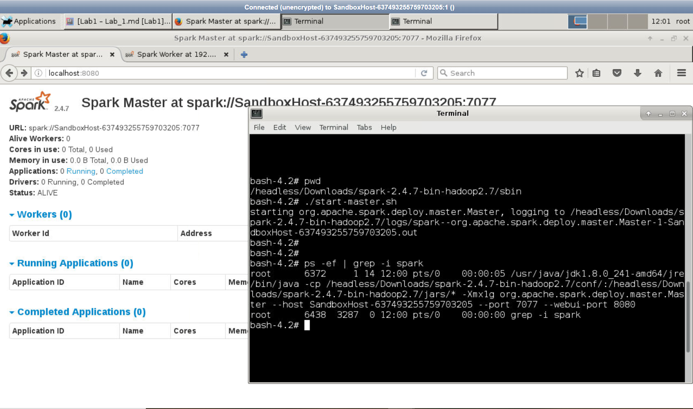


**Logs Path**

Now inspect the `.out` file


```
cd /headless/Downloads/spark-2.4.7-bin-hadoop2.7/logs/

ls -ltr

cat filename
```

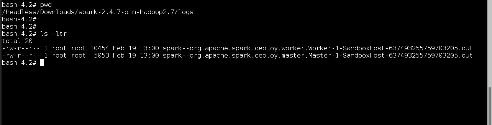


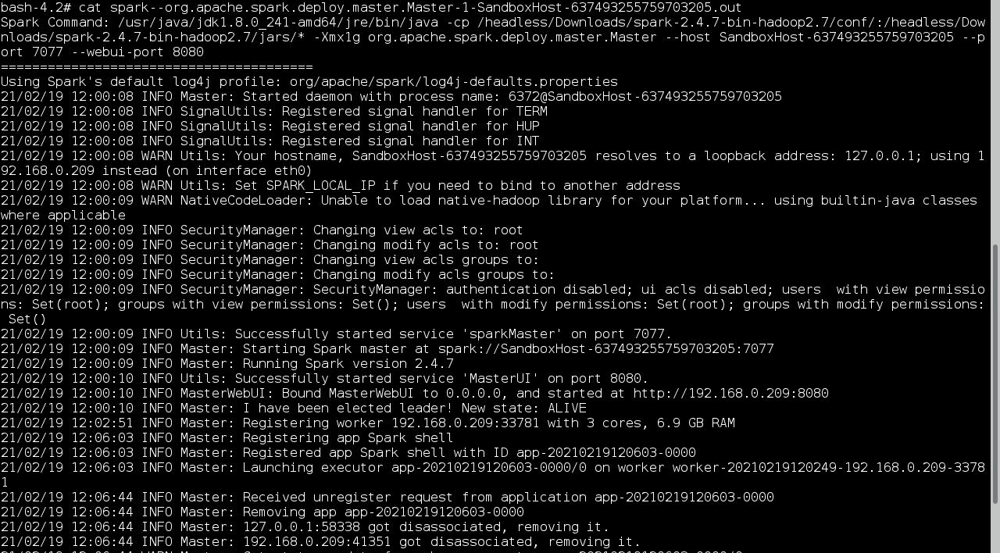


Once started, the master will print out a spark://HOST:PORT URL for itself, which you can use to connect workers to it, or pass as the “master” argument to SparkContext. You can also find this URL on the master’s web UI, which is http://localhost:8080 by default.

Similarly, you can start one or more workers and connect them to the master via:


#### Start Worker

Start Worker and register the worker with master


Open `http://localhost:8080/` in browser and copy the master url


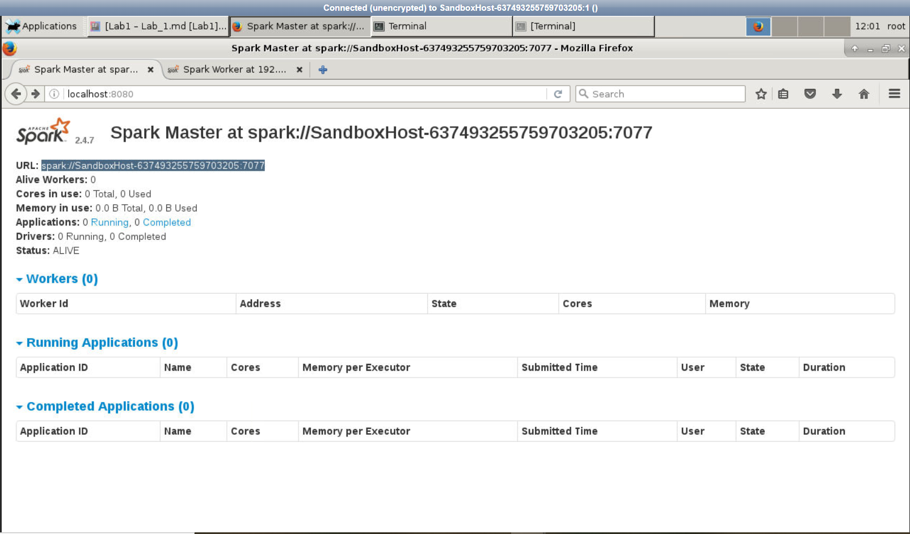


now start the worker and register it with master using following command

`./sbin/start-slave.sh spark://hostname:7077`


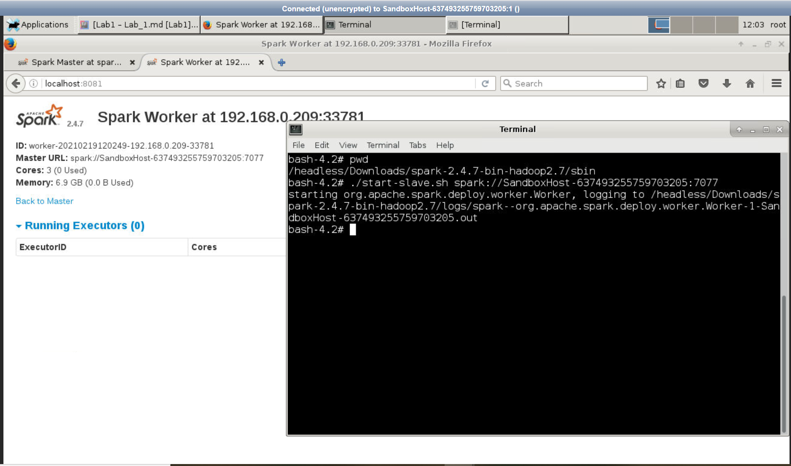


Worker webUI: `http://localhost:8081`

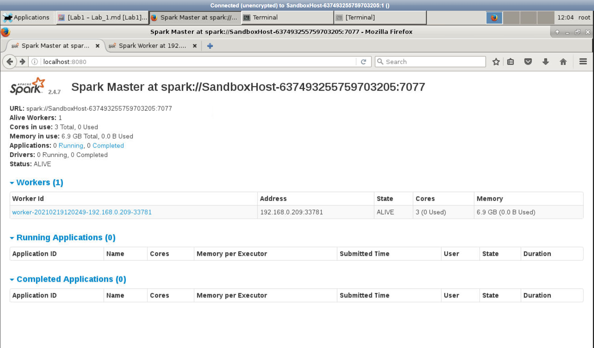


Once you have started a worker, look at the master’s web UI (http://localhost:8080 by default). You should see the new node listed there, along with its number of CPUs and memory (minus one gigabyte left for the OS).

Finally, the following configuration options can be passed to the master and worker:


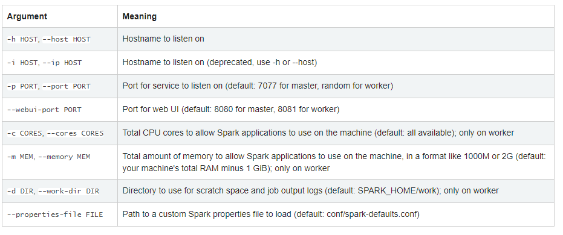


**Logs Path**

```
cd /headless/Downloads/spark-2.4.7-bin-hadoop2.7/logs/

ls -ltr

cat filename
```


Now inspect the `.out` file, you will see the log like this:

```
2019-09-12 13:41:07 INFO Worker:2612 - Started daemon with process name: 144697@hostname 2019-09-12 13:41:07 INFO SignalUtils:54 - Registered signal handler for TERM 2019-09-12 13:41:07 INFO SignalUtils:54 - Registered signal handler for HUP 2019-09-12 13:41:07 INFO SignalUtils:54 - Registered signal handler for INT 2019-09-12 13:41:08 WARN NativeCodeLoader:62 - Unable to load native-hadoop library for your platform... using builtin-java classes where applicable 2019-09-12 13:41:08 INFO SecurityManager:54 - Changing view acls to: user 2019-09-12 13:41:08 INFO SecurityManager:54 - Changing modify acls to: user 2019-09-12 13:41:08 INFO SecurityManager:54 - Changing view acls groups to: 2019-09-12 13:41:08 INFO SecurityManager:54 - Changing modify acls groups to: 2019-09-12 13:41:08 INFO SecurityManager:54 - SecurityManager: authentication disabled; ui acls disabled; users with view permissions: Set(user); groups with view permissions: Set(); users with modify permissions: Set(user); groups with modify permissions: Set() 2019-09-12 13:41:08 INFO Utils:54 - Successfully started service 'sparkWorker' on port 35633. 2019-09-12 13:41:08 INFO Worker:54 - Starting Spark worker 100.2.101.101:35633 with 32 cores, 124.6 GB RAM 2019-09-12 13:41:08 INFO Worker:54 - Running Spark version 2.3.4 2019-09-12 13:41:08 INFO Worker:54 - Spark home: /headless/Downloads/spark-2.4.7-bin-hadoop2.7 2019-09-12 13:41:08 INFO log:192 - Logging initialized @1510ms 2019-09-12 13:41:08 INFO Server:351 - jetty-9.3.z-SNAPSHOT, build timestamp: unknown, git hash: unknown 2019-09-12 13:41:08 INFO Server:419 - Started @1576ms 2019-09-12 13:41:08 INFO AbstractConnector:278 - Started ServerConnector@3f9e3902{HTTP/1.1,[http/1.1]}{0.0.0.0:8081} 2019-09-12 13:41:08 INFO Utils:54 - Successfully started service 'WorkerUI' on port 8081. 2019-09-12 13:41:08 INFO ContextHandler:781 - Started o.s.j.s.ServletContextHandler@1dc21140{/logPage,null,AVAILABLE,@Spark} 2019-09-12 13:41:08 INFO ContextHandler:781 - Started o.s.j.s.ServletContextHandler@5896ed4f{/logPage/json,null,AVAILABLE,@Spark} 2019-09-12 13:41:08 INFO ContextHandler:781 - Started o.s.j.s.ServletContextHandler@1d9a25f0{/,null,AVAILABLE,@Spark} 2019-09-12 13:41:08 INFO ContextHandler:781 - Started o.s.j.s.ServletContextHandler@1ad57f24{/json,null,AVAILABLE,@Spark} 2019-09-12 13:41:08 INFO ContextHandler:781 - Started o.s.j.s.ServletContextHandler@754605a4{/static,null,AVAILABLE,@Spark} 2019-09-12 13:41:08 INFO ContextHandler:781 - Started o.s.j.s.ServletContextHandler@c5e9251{/log,null,AVAILABLE,@Spark} 2019-09-12 13:41:08 INFO WorkerWebUI:54 - Bound WorkerWebUI to 0.0.0.0, and started athttp://hostname.com:8081 2019-09-12 13:41:08 INFO Worker:54 - Connecting to master hostname.com:7077... 2019-09-12 13:41:08 INFO ContextHandler:781 - Started o.s.j.s.ServletContextHandler@4ac9255f{/metrics/json,null,AVAILABLE,@Spark} 2019-09-12 13:41:08 INFO TransportClientFactory:267 - Successfully created connection to hostname.com/199.6.212.152:7077 after 40 ms (0 ms spent in bootstraps) 2019-09-12 13:41:09 INFO Worker:54 - Successfully registered with master spark://hostname.com:7077
```


Note that above scripts must be executed on the machine you want to run the Spark master on, not your local machine.

You can optionally configure the cluster further by setting environment variables in conf/spark-env.sh. Create this file by starting with the conf/spark-env.sh.template, and copy it to on your worker machine for the settings to take effect. The following settings are available:

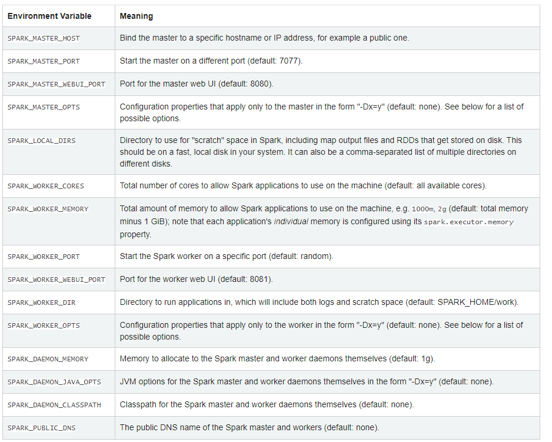


#### Spark Shell

Your cluster on single node is ready now, you can test it using running command **spark-shell**

```
[user@hostname ~]$ spark-shell --master spark://hostname:7077
```


Reload the master webui. You will get one running application:

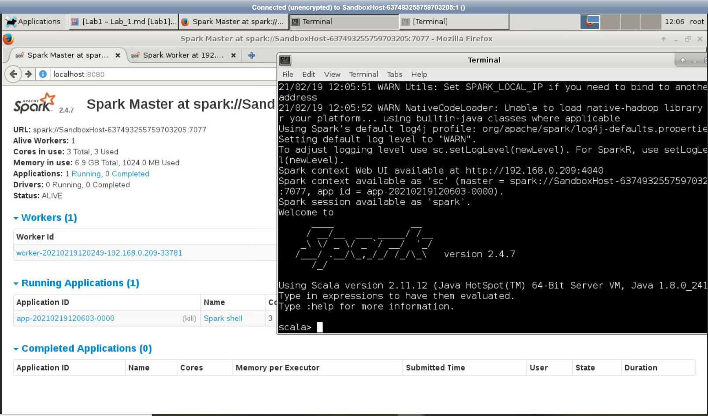


You can exit the spark shell using typing `:q`  then enter


**Task**

1) Run spark-shell command after removing `--master` parameter from the spark-shell command and verify that it does not appear in master or worker UI. Because we did not specify master url while running spark-shell command.

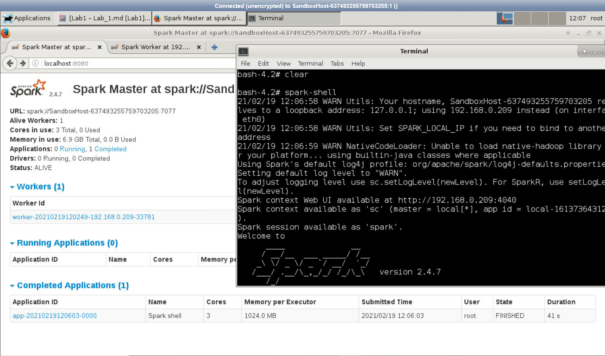


#### Spark Submit

Now submit example application using spark-submit. Replace `spark://hostname:7077` with hostname of master node first.


```
spark-submit --class org.apache.spark.examples.SparkPi --master spark://hostname:7077  /headless/Downloads/spark-2.4.7-bin-hadoop2.7/examples/jars/spark-examples_2.11-2.4.7.jar
```


If this example execute successfully, your spark installation is fine. You can see the results in console log

```
2019-09-12 13:53:27 INFO DAGScheduler:54 - Job 0 finished: reduce at SparkPi.scala:38, took 0.615754 sPi is roughly 3.1416557082785412 2019-09-12 13:53:27 INFO AbstractConnector:318 - Stopped Spark@6914bc2c{HTTP/1.1,[http/1.1]}{0.0.0.0:4040}
```


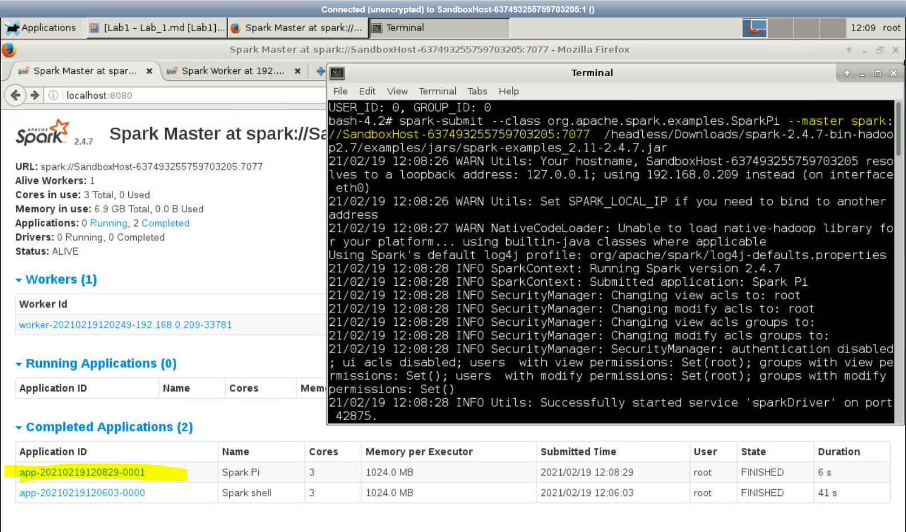


**Task**

1) Run above spark-submit command but assign '2g' memory. You will get output after running spark-submit command  as shown in the screenshot below:

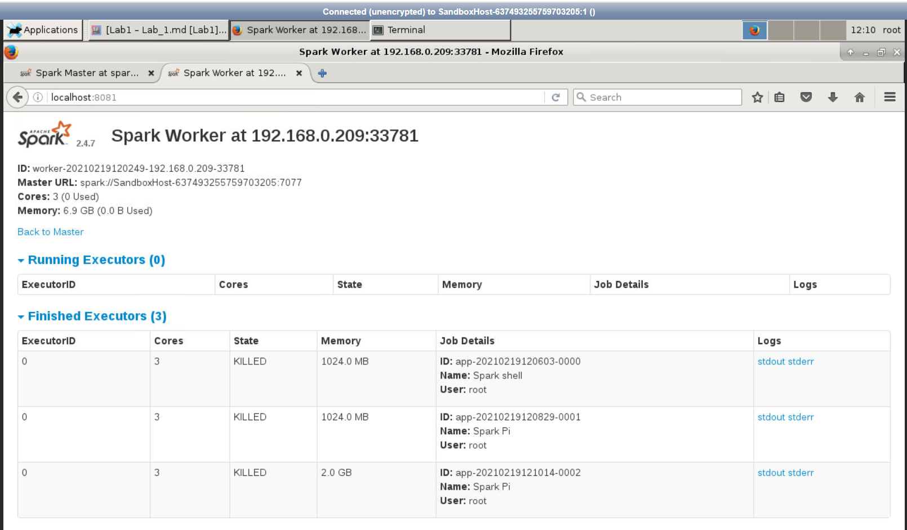


**Hint:** `spark-submit --help`. Solution is available in `solution.txt` file.


2) Run spark-submit command after removing `--master` parameter from the spark-submit command and verify that it does not appear in master or worker UI after refreshing the browser window.

