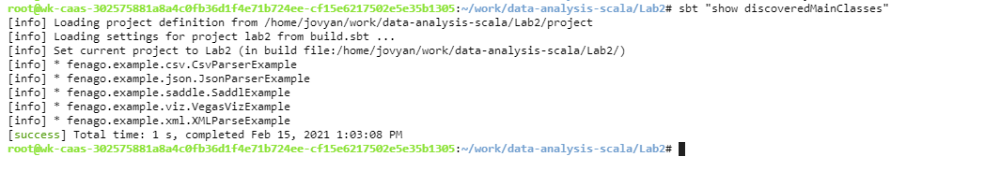
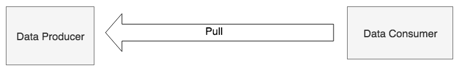
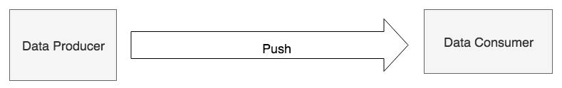
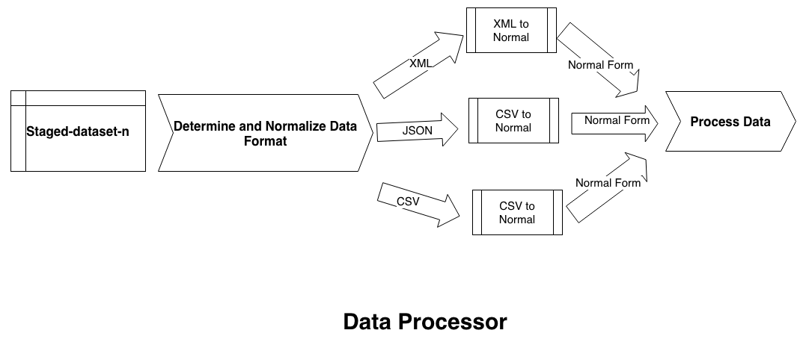

Lab 3. Data Ingestion
----------------------------------


In this lab, we will look into the data ingestion aspects of the
data life cycle. Data ingestion is a very broad term; however, we will
concentrate on some of the most important aspects of it. Data is
generally considered to be ingested when it is ready for usage in
enterprise systems. In reality, a significant amount of effort is
required to perform data ingestion effectively and efficiently.

Data ingestion typically involves the following key tasks, which are
also the topics that will be covered in this lab:


-   Data extraction
-   Data staging
-   Data cleaning
-   Data normalization
-   Data enrichment
-   Data organization and storage


#### Compile and Run using SBT

To run scala file with main function defined from the terminal, simply run the following commands. The program will the then be compiled and executed.


```
cd ~/Desktop/data-analysis-scala/Lab3

sbt "show discoveredMainClasses"

sbt "runMain fenago.example.<update>"
```




### Pull-oriented data extraction


This diagram illustrates how a
`Data Consumer` pulls data from the [`Data Producer`]:





 

Let\'s look at a simple and concrete example of pull-based data
extraction:


1.  Import the `BufferedReader` class from Java\'s
    `java.io` package. This class provides an efficient
    mechanism for reading text data by buffering the data.:


```
scala> import java.io.BufferedReader
import java.io.BufferedReader
```


2.  Import the `InputStreamReader`class from Java\'s
    `java.io` package. This class provides a bridge from the
    byte stream to the character stream.

```
scala> import java.io.InputStreamReader
import java.io.InputStreamReader
```


3.  Import URL class from Java\'s `java.net` package. The
    `URL` class represents a **uniform resource locator** reference to a resource on the internet.:


```
scala> import java.net.URL
import java.net.URL
```


4.  Import the `Consumer` interface from Java\'s
    `java.util.function` package. This interface represents an
    operation that accepts a single input argument and does not return a
    result:


```
scala> import java.util.function.Consumer
import java.util.function.Consumer
```


5.  Import `ListBuffer` from Scala\'s
    `scala.collection.mutable` package. `ListBuffer`
    is a buffered implementation backed by a list. It is to be noted
    that Scala\'s List is an immutable structure that, once created,
    cannot be changed. The `ListBuffer` class provides a
    convenient mechanism to append items to a buffer and turn it into a
    `List` object once the appends are completed. The
    specifications of Scala\'s `ListBuffer` can be found at
    [https://www.scala-lang.org/api/current/scala/collection/mutable/ListBuffer.html](https://www.scala-lang.org/api/current/scala/collection/mutable/ListBuffer.html.):


```
scala> import scala.collection.mutable.ListBuffer
import scala.collection.mutable.ListBuffer
```

 

 

 

 


6.  Define a Scala class called `DataConsumer`:
    
    -   This class extends `Consumer`, accepting
        `String` as input.
    -   The `class` constructor initializes a
        `ListBuffer` of `String` and overrides the
        `accept` method from `Consumer`.
    -   The `accept` method appends the incoming string to the
        buffer:
    


```
scala> class DataConsumer extends Consumer[String] {
     | val buf = ListBuffer[String]() // initialize list 
                                         buffer
     | override def accept(t: String): Unit = { // override 
                                //accept method of Consumer
     | buf += t // appends incoming string to list buffer
     | }
     | }
defined class DataConsumer
```


7.  Create a new instance of `BufferedReader`, that reads from
    an `InputStreamReader` pulling data
    from <https://data.lacity.org/api/views/nxs9-385f/rows.csv?accessType=DOWNLOAD>.
    This involves multiple steps in the following order:
    

The pattern being used here for instantiating the reader is known as a **decorator design pattern**. Each
class is adding additional functionality to the class it is wrapping:


-   `InputStreamReader` turns a byte-oriented
    `InputStream` to a character-oriented input stream.
-   `BufferedReader` turns a character-oriented input stream
    to an input stream that handles data buffering and provides an
    efficient mechanism with which to read text data.


The following is a complete code for instantiating the
`BufferedReader`:

```
scala> val reader = new BufferedReader(
     | new InputStreamReader(
     | new URL("https://data.lacity.org/api/views/nxs9-
           385f/rows.csv?accessType=DOWNLOAD").openStream()
     | )
     | )
reader: java.io.BufferedReader = java.io.BufferedReader@558ab02f
```


8.  Create a new instance of `DataConsumer`:


```
scala> val dataConsumer = new DataConsumer
dataConsumer: DataConsumer = DataConsumer@4616af54
```


9.  For each line in the `BufferedReader`, pass it through the
    `accept` method of `DataConsumer`. This will
    cause all of the lines to be collected inside the
    `ListBuffer` of `dataConsumer`:
    


```
scala> reader.lines().forEach(dataConsumer)
```


It is to be noted that the `forEach` construct used here is
Java-specific. Scala has something similar, called `foreach`,
which works quite differently from Java\'s `forEach`
construct. In a similar situation, with Scala, `foreach`, we
could have simply used the following:

```
reader.lines().foreach(i => buf += i) // buf is ListBuffer
```

Since we are using Java\'s `InputStream` family of classes
here, we are forced to use the `forEach` construct of Java.
Scala does not have equivalents of the Java Stream API.


10. Print out the first five elements of the
    `DataConsumer` class contained in `ListBuffer`:
    
    -   The `DataConsumer` class\'s `buf` is a
        `ListBuffer` object. The `toList` method of
        `ListBuffer` returns a new `List` object
        consisting of all the elements in the buffer.
    -   Take a convenient method of List to get the first specified
        number of elements as another List.
    -   The `foreach` construct of List provides a mechanism
        to perform an action on each element. We are printing the
        element here:
    


```
scala> dataConsumer.buf.toList.take(5).foreach(println)
Zip Code,Total Population,Median Age,Total Males,Total Females,Total Households,Average Household Size
91371,1,73.5,0,1,1,1
90001,57110,26.6,28468,28642,12971,4.4
90002,51223,25.5,24876,26347,11731,4.36
90003,66266,26.3,32631,33635,15642,4.22
```

In this example, the data producer has stored the data that can be
extracted using an HTTP request. The data consumer has to explicitly
issue the HTTP request in order to extract this data. This is a classic
example of pull-based data extraction.


### Push-oriented data delivery


This diagram illustrates how a [`Data Producer`] pushes
data to [`Data Consumer`]:





Let\'s look at a simple and concrete example of push-based data
delivery. We will follow the REST API example provided by Play Framework
(<https://github.com/playframework/play-scala-rest-api-example>). Play
Framework is a powerful tool for building Scala and Java web
applications. The documentation of this framework can be found
at <https://www.playframework.com/>:


1.  Clone the `play-scala-rest-api-example` repository
    (<https://github.com/playframework/play-scala-rest-api-example>)
    from GitHub. This needs to be cloned, because this project needs to
    be compiled. Run the `clone` command in a Terminal:


```
# clone from github
$ git clone https://github.com/playframework/play-scala-rest-api-example
Cloning into 'play-scala-rest-api-example'...
...
Resolving deltas: 100% (385/385), done.
```

 

 

 

 


2.  Change to the play example directory in the Terminal:


```
$ cd play-scala-rest-api-example
```


3.  Run `sbt` by typing the following command in the Terminal:


```
$ sbt run
[info] Loading settings for project global-plugins from idea.sbt ...
...
--- (Running the application, auto-reloading is enabled) ---

[info] p.c.s.AkkaHttpServer - Listening for HTTP on /0:0:0:0:0:0:0:0:9000

(Server started, use Enter to stop and go back to the console...)
```

HTTP REST services are now running
at `http://localhost:9000/`. Let this server keep running in a
Terminal while we explore further.


4.  The REST end-point is `http://localhost:9000/v1/posts`.
    You can open this link in a web browser or run the following
    `curl` command to check the service:


```
$ curl curl http://localhost:9000/v1/posts
[
  {
    "id": "1",
    "link": "/v1/posts/1",
    "title": "title 1",
    "body": "blog post 1"
  },
  {
    "id": "2",
    "link": "/v1/posts/2",
    "title": "title 2",
    "body": "blog post 2"
  },
  {
    "id": "3",
    "link": "/v1/posts/3",
    "title": "title 3",
    "body": "blog post 3"
  },
  {
    "id": "4",
    "link": "/v1/posts/4",
    "title": "title 4",
    "body": "blog post 4"
  },
  {
    "id": "5",
    "link": "/v1/posts/5",
    "title": "title 5",
    "body": "blog post 5"
  }
```

The REST server created five sample blog post entries. Each blog post
entry has the following attributes:


-   `id`
-   `link`
-   `title`
-   `body`


5.  We can now `POST` some data to this REST server using the
    following `curl` command. We will now add the following
    new blog post entry:
    
    -   `id` = `999`
    -   `link` = `/v1/posts/999`
    -   `title` = `mytitle`
    -   `body` = `mybody`
    


```
$ curl -d "title=mytitle&amp;amp;body=mybody" -X POST http://localhost:9000/v1/posts
{"id":"999","link":"/v1/posts/999","title":"mytitle","body":"mybody"}
```


6.  On the Terminal REST server, you should be seeing messages like
    these:


```
[trace] v.p.PostActionBuilder - invokeBlock:
 [trace] v.p.PostController - process:
       [trace] v.p.PostRepositoryImpl - create: data =   
               PostData(999,mytitle,mybody)
```

In this example, we have pushed the data to the REST server using the
`curl` command. The REST server, in this case, is the data
consumer, and the `curl` command is the data producer.

One of the biggest benefits of push-oriented data delivery is that data
is available to the consumer of the data in near real time. This is
important, as there are several categories of data whose value rapidly
diminishes with time and is generally of little value if not acted upon
almost immediately.


Cleaning and normalizing
------------------------------------------

To perform data cleaning, it is often necessary to convert received data
into an intermediate normal form first. The intermediate normal form is
not necessarily the same as the final normal form, and is typically
designed for efficient processing.

Let\'s consider a simple example of data related to persons in three
different formats, namely XML, JSON, and CSV:

```
// XML
<person>
 <fname>Jon</fname>
 <lname>Doe</lname>
 <phone>123-456-7890</phone>
 <zip>12345</zip>
 <state>NY</state>
</person>

// JSON
{
 "person": {
 "fname": "Jon",
 "lname": "Doe",
 "phone": "123-456-7890",
 "zip": "12345",
 "state": "NY"
 }
}

// CSV
Jon,Doe,123-456-7890,12345,NY
```


The following could be the data processing flow:


-   The staged dataset is one of three formats: XML, JSON, or CSV
-   There is an intermediate step to determine the format of the staged
    dataset
-   An appropriate data normalizer is selected based on the actual data
    format
-   The staged dataset is normalized using the selected data normalizer
-   The normalized data is processed by the data processor


The following diagram illustrates how all of this works together:





The core processing remains unchanged because it is dependent upon the
normal form only.

Let\'s explore this concept using a simple
hands-on example using the **Scala Build Tool**. Create a `build.sbt`
class with the following info:

```
libraryDependencies ++= Seq(
// Scala XML library
  "org.scala-lang.modules" %% "scala-xml" % "1.1.0", 
// Scala Lift JSON Library
  "org.json4s" %% "json4s-native" % "3.6.1" 
)
```

We are using two Scala libraries here:

- Scala XML
- Scala Lift JSON

We will explore how we can normalize XML, JSON, and CSV. For simplicity,
we will be parsing CSV data using Scala\'s built-in `split`
method of `String`:


1.  Now, run SBT and start a Scala console. In the console explore,
    convert data in different formats to a normal form. We are using a
    Scala `case` class to represent a normal form.
2.  Import `Elem` from Scala\'s `scala.xml` package:


```
scala> import scala.xml.Elem
import scala.xml.Elem
```


3.  Import the following, and set `implicit`, which is needed
    for working with the JSON format:


```
scala> import org.json4s._
import org.json4s._

scala> import org.json4s.native.JsonMethods._
import org.json4s.native.JsonMethods._

scala> implicit val formats = DefaultFormats
formats: org.json4s.DefaultFormats.type = 
             org.json4s.DefaultFormats$@6f13a14e
```

 


4.  Define a Scala `case` class called `Person` that
    will follow five attributes:
    
    -   `fname`: First name
    -   `lname`: Last name
    -   `phone`: Phone number
    -   `zip`: The ZIP code for where the person lives
    -   `state`: The state where the person lives
    


```
scala> case class Person(fname: String, lname: String, phone: 
                         String, 
                         zip: String, state: String)
defined class Person
```


5.  Create a `JSON` string that consists of the person\'s
    information, with all five attributes defined:


```
scala> // JSON

scala> val jsonStr = """
     | {
     | "fname": "Jon",
     | "lname": "Doe",
     | "phone": "123-456-7890",
     | "zip": "12345",
     | "state": "NY"
     | }
     | """
jsonStr: String =
"
{
    "fname": "Jon",
    "lname": "Doe",
    "phone": "123-456-7890",
    "zip": "12345",
    "state": "NY"
}
"
```


6.  Parse a `JSON` string into a `JSON` object
    first:


```
scala> val json = parse(jsonStr)
json: org.json4s.JValue = JObject(List((fname,JString(Jon)),   
      (lname,JString(Doe)), (phone,JString(123-456-7890)),    
      (zip,JString(12345)), (state,JString(NY))))
```

 

 

 

 


7.  Normalize the `JSON` object into `Person`:


```
scala> val normJson = json.extract[Person]
normJson: Person = Person(Jon,Doe,123-456-7890,12345,NY)
```


8.  Create a Scala `XML` object:


```
scala> // XML

scala> val xml = <person>
     | <fname>Jon</fname>
     | <lname>Doe</lname>
     | <phone>123-456-7890</phone>
     | <zip>12345</zip>
     | <state>NY</state>
     | </person>
xml: scala.xml.Elem =
<person>
    <fname>Jon</fname>
    <lname>Doe</lname>
    <phone>123-456-7890</phone>
    <zip>12345</zip>
    <state>NY</state>
</person>
```


### Note

Please note that Scala automatically recognizes XML syntax and creates a
`scala.xml.Elem` object.


9.  Normalize the `XML` object into `Person`:


```
scala> val normXml = Person(xml \ "fname" text, xml \ "lname" text, xml \ "phone" text, xml \ "zip" text, xml \ "state" text)

warning: there were 5 feature warnings; re-run with -feature for details

normXml: Person = Person(Jon,Doe,123-456-7890,12345,NY)
```


10. Create a `CSV` object:


```
scala> // CSV (for simplicity, we use split method of String to parse CSV)

scala> val csvStr = "Jon,Doe,123-456-7890,12345,NY"
csvStr: String = Jon,Doe,123-456-7890,12345,NY
```


11. Split the `CSV` object using the comma as a delimiter:


```
scala> val csvCols = csvStr.split(",")
csvCols: Array[String] = Array(Jon, Doe, 123-456-7890, 12345, NY)
```


12. Normalize `CSV` to `Person`:


```
scala> val normCsv = Person(csvCols(0), csvCols(1), csvCols(2), 
                     csvCols(3), csvCols(4))
normCsv: Person = Person(Jon,Doe,123-456-7890,12345,NY)
```


13. Ensure that all three forms are the same:


```
scala> // Let us make sure that all three normal objects are same

scala> normXml == normJson
res0: Boolean = true

scala> normXml == normCsv
res1: Boolean = true

scala> normJson == normCsv
res2: Boolean = true
```


In the preceding example, we assumed that the incoming data is perfectly
clean; however, real-world data often requires some cleaning before it
can be used. Let\'s assume that all of the data elements in
`Person` cannot have leading or trailing spaces, and state
must be capitalized. To perform this kind of data cleaning, we could do
something like this:


1.  Extend the functionality of the consumer case by adding a method
    called `cleanCopy`. This method returns a new
    `Person` instance with trimmed `fname`,
    `lname`, `phone`, `zip`,
    `state`, and `state` converted to upper case: 


```
scala> case class Person(fname: String, lname: String, phone: String, zip: String, state: String) {
     | def cleanCopy(): Person = {
     | this.copy(fname.trim, lname.trim, phone.trim, zip.trim, 
                 state.trim.toUpperCase)
     | }
     | }

defined class Person
```


2.  Create a CSV record that is not cleaned:


```
scala> val uncleanCsvStr = " Jon , Doe , 123-456-7890 , 12345 , ny "
   uncleanCsvStr: String = " Jon , Doe , 123-456-7890 , 12345 , ny "
```


3.  Split the CSV record with a comma as the delimiter:


```
scala> val uncleanCsvCols = uncleanCsvStr.split(",")
uncleanCsvCols: Array[String] = Array(" Jon ", " Doe ", " 123-456-
                                      7890 ", " 12345 ", " ny ")
```


4.  Create an unclean normalized `Person` object:


```
scala> val uncleanNormCsv = Person(uncleanCsvCols(0), uncleanCsvCols(1), uncleanCsvCols(2), uncleanCsvCols(3), uncleanCsvCols(4))
uncleanNormCsv: Person = Person( Jon , Doe , 123-456-7890 , 12345 , ny )
```


5.  Create a clean, normalized `Person` object from an unclean
    one:


```
scala> val cleanNormCsv = uncleanNormCsv.cleanCopy
cleanNormCsv: Person = Person(Jon,Doe,123-456-7890,12345,NY)
```

Let\'s revisit the `Person` case class and the
`cleanCopy` extension that was made earlier. Inside our
`Person` case class, we defined a new method that returns a
cleaned copy of the `Person` object. Scala case classes
provide a method called `copy`, which can be used to create a
copy of the same object, but optionally modifies a subset of attributes
as needed. In our case, we have modified all of the attributes of the
original. We could have constructed a new `Person` object
instead of using `copy`:

```
Person(fname.trim, lname.trim, phone.trim, zip.trim, 
       state.trim.toUpperCase)
```

 

 

 

 

 

 

The following `Person` case class implements the same
functionality as the earlier one:

```
case class Person(fname: String, lname: String, phone: String, zip: String, state: String) {
  def cleanCopy(): Person = {
    Person(fname.trim, lname.trim, phone.trim, zip.trim, state.trim.toUpperCase)
  }
}
```

The preceding example is quite simple, but illustrates that simple data
cleaning can be performed with ease using built-in Scala features, and
Scala case classes really come in handy when working with normal forms
of data.


Enriching
---------------------------


Data enrichment is the act of adding more
information to raw data. Some examples of the enrichments are as
follows:


-   Adding missing values
-   Adding lookup values
-   Joining with other datasets
-   Filtering
-   Aggregating


Continuing on the same example of using `Person`, let\'s say
that the `state` element is optional. Given the
`zip` information, we should be able to derive the value of
`state`. In this specific case, we are performing the
following two enrichments:


-   Looking up or deriving the value of `state` based on the
    `zip` value
-   Adding missing `state` value


Let\'s define a simple Scala function to map a US zip code to
`state`. Please refer to Wikipedia
(<https://en.wikipedia.org/wiki/List_of_ZIP_code_prefixes>) for more
info on US ZIP codes:


1.  Define a Scala case class called `Person` with a method
    called `cleanCopy` to provide a clean copy of the object:


```
scala> case class Person(fname: String, lname: String, phone: String, zip: String, state: String) {
     | def cleanCopy(): Person = {
     | this.copy(fname.trim, lname.trim, phone.trim, zip.trim, state.trim.toUpperCase)
     | }
     | }

defined class Person
```


2.  Define a function called `getState` that finds a US state
    when given a US ZIP code:
    
    - **Input**: `zip`
    - **Output**: `state`
    


Please note that this only a partial implementation of this function:

```
scala> def getState(zip: String): String = { // Partial implementation for simplicity
 | val zipPerfix = zip.substring(0, 3)
 | zipPerfix match {
 | case "006"|"007"|"009" => "PR" // PR is Puerto Rico
 | case "008" => "VI" // VI is Virgin Islands
 | case n if (n.toInt >= 10 &amp;amp;&amp;amp; n.toInt <= 27) => "MA" // 010 to 027 is MA
 | case "028" | "029" => "RI"
     | case n if (n.toInt >= 100 &amp;amp;&amp;amp; n.toInt <= 149) => "NY" // 010 to 027 is MA
     | case _ => "N/A"
     | }
     | }
getState: (zip: String)String
```


3.  Define a function called `populateStateIfNecessary` that
    populates the `state` attribute of `Person`, if
    it is not already populated. It makes use of `getState`
    function to find state based on the ZIP code:
    
    - **Input**: `Person`
    - **Output**: `Person`
    


```
scala> def populateStateIfNecessary(p: Person): Person = {
     | if (p.state == null || p.state.isEmpty)
     | p.copy(state=getState(p.zip))
     | else
     | p
     | }
populateStateIfNecessary: (p: Person)Person
```

 

 

 

 

Please note that preceding function returns the same `Person`
object of the `state` attribute if already populated. If it is
not populated, it creates a copy of the `Person` object, sets
the `state` attribute, of copy to the `state`
derived using the ZIP code, and then returns this copy of
the `Person` object.


### Note

Here is an important tip: creating unnecessary objects should be avoided
as far as possible. This is because these objects occupy memory space in
JVM\'s heap space. Another side effect of this could be that there are
frequent Java **Garbage Collection** (**GC**)
activities happening in JVM, which lead to degradation in the overall
performance of the application.


4.  Create an unclean CSV record with the
    missing`state` information:


```
scala> val uncleanCsvStr = " Jon , Doe , 123-456-7890 , 12345 , " // missing state
uncleanCsvStr: String = " Jon , Doe , 123-456-7890 , 12345 , "
```


5.  Split the unclean CSV record by using the comma as the delimiter:


```
scala> val uncleanCsvCols = uncleanCsvStr.split(",")
uncleanCsvCols: Array[String] = Array(" Jon ", " Doe ", " 123-456-7890 ", " 12345 ", " ")
```


6.  Create an unclean normal object from the unclean CSV record:


```
scala> val uncleanNormCsv = Person(uncleanCsvCols(0), uncleanCsvCols(1), uncleanCsvCols(2), uncleanCsvCols(3), uncleanCsvCols(4))
uncleanNormCsv: Person = Person( Jon , Doe , 123-456-7890 , 12345 , )
```


7.  Clean the unclean normal record:


```
scala> val cleanNormCsv = uncleanNormCsv.cleanCopy
cleanNormCsv: Person = Person(Jon,Doe,123-456-7890,12345,)
```


8.  Enrich the normal record:


```
scala> val enriched = populateStateIfNecessary(cleanNormCsv)
enriched: Person = Person(Jon,Doe,123-456-7890,12345,NY)
```

The preceding example illustrates how to enrich data. We can also think
of the aforementioned example, similar to value lookup, which can be
implemented as a dataset join operation with a lookup dataset. In this
case, the lookup data has a mapping from ZIP code to state. Every single
ZIP value needs to be mapped to the state for this to work.

 

There are times when incoming data has more data than the data consumer
is interested in.

We can filter out the unnecessary data and only keep that data we are
interested in:


1.  Create input data that has a mix of useful, as well as some
    unnecessary, records:


```
scala> val originalPersons = List(
     | Person("Jon","Doe","123-456-7890","12345","NY"),
     | Person("James","Smith","555-456-7890","00600","PR"),
     | Person("Don","Duck","777-456-7890","00800","VI"),
     | Person("Doug","Miller","444-456-7890","02800","RI"),
     | Person("Van","Peter","333-456-7890","02700","MA")
     | )
originalPersons: List[Person] = List(Person(Jon,Doe,123-456-7890,12345,NY), Person(James,Smith,555-456-7890,00600,PR), Person(Don,Duck,777-456-7890,00800,VI), Person(Doug,Miller,444-456-7890,02800,RI), Person(Van,Peter,333-456-7890,02700,MA))
```


2.  Define the exclusion states:


```
scala> val exclusionStates = Set("PR", "VI") // we want to exclude these states
exclusionStates: scala.collection.immutable.Set[String] = Set(PR, VI)
```


3.  Filter out the records belonging to exclusion states:


```
scala> val filteredPersons = originalPersons.filterNot(p => exclusionStates.contains(p.state))
filteredPersons: List[Person] = List(Person(Jon,Doe,123-456-7890,12345,NY), Person(Doug,Miller,444-456-7890,02800,RI), Person(Van,Peter,333-456-7890,02700,MA))
```


Alternatively, we could have used the `filter` API, which is
inverse of the `filterNot` API. Let\'s see this in action:


1.  Create a list of mixed records:


```
scala> val originalPersons = List(
     | Person("Jon","Doe","123-456-7890","12345","NY"),
     | Person("James","Smith","555-456-7890","00600","PR"),
     | Person("Don","Duck","777-456-7890","00800","VI"),
     | Person("Doug","Miller","444-456-7890","02800","RI"),
     | Person("Van","Peter","333-456-7890","02700","MA")
     | )
originalPersons: List[Person] = List(Person(Jon,Doe,123-456-7890,12345,NY), Person(James,Smith,555-456-7890,00600,PR), Person(Don,Duck,777-456-7890,00800,VI), Person(Doug,Miller,444-456-7890,02800,RI), Person(Van,Peter,333-456-7890,02700,MA))
```


2.  Define exclusion states:


```
scala> val exclusionStates = Set("PR", "VI") // we want to exclude these states
exclusionStates: scala.collection.immutable.Set[String] = Set(PR, VI)
```


3.  Use the `filterNot` API first to remove unwanted records:


```
scala> val filteredPersons1 = originalPersons.filterNot(p => exclusionStates.contains(p.state))
filteredPersons1: List[Person] = List(Person(Jon,Doe,123-456-7890,12345,NY), Person(Doug,Miller,444-456-7890,02800,RI), Person(Van,Peter,333-456-7890,02700,MA))
```


4.  Use the `filter` API next to remove unwanted records:


```
scala> val filteredPersons2 = originalPersons.filter(p => !exclusionStates.contains(p.state))
filteredPersons2: List[Person] = List(Person(Jon,Doe,123-456-7890,12345,NY), Person(Doug,Miller,444-456-7890,02800,RI), Person(Van,Peter,333-456-7890,02700,MA))
```


5.  Compare the two results:


```
scala> filteredPersons1 == filteredPersons2
res2: Boolean = true
```

You can see that we can produce identical outcomes using
the `filter` and `filterNot` APIs by just inverting
the test conditions.


Summary
-------------------------


In this lab, we looked at some of the key tasks associated with
aspects with data ingestion. In particular, we looked at data staging
and dealing with various data formats. We also got an understanding of
data cleaning and enrichment. We also looked at how to organize and
store data so that it can be used for data analysis. The end user\'s or
consumer\'s perspective is very important when it comes to defining an
appropriate data model, and all of the important use cases must be taken
into consideration. At times, there is a need to create multiple data
models to support use cases that have completely different needs.

In the next lab, we will look at exploring and visualizing data.
