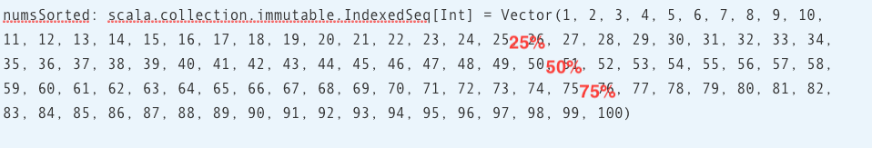
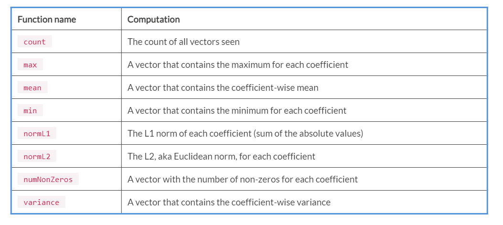

Lab 5. Applying Statistics and Hypothesis Testing
--------------------------------------------------------------


The following are the topics that we will be covering in this lab: 


-   Basics of statistics
-   Vector level statistics
-   Random data generation
-   Hypothesis testing


Basics of statistics
--------------------------------------


This section introduces the basics of using applied examples.


### Summary level statistics


Summary level statistics provide us
with such information as minimum, maximum,
and mean values of data.

The following is an example in Spark that looks at summarizing numbers
from 1 to 100:


1.  Start a Spark shell in your Terminal:


```
$ spark-shell
```


2.  Import `Random` from Scala\'s `util` package:


```
scala> import scala.util.Random
import scala.util.Random
```


3.  Generate integers from 1 to 100 (included) and use the
    `shuffle` method of Scala\'s `Random` utility
    class to randomize their positions:


```
scala> val nums = Random.shuffle(1 to 100) // 100 numbers randomized
nums: scala.collection.immutable.IndexedSeq[Int] = Vector(70, 63, 9, 80, 12, 49, 65, 95, 51, 66, 90, 53, 82, 97, 13, 30, 92, 69, 3, 7, 11, 72, 37, 16, 48, 75, 100, 88, 78, 38, 91, 35, 26, 56, 58, 47, 59, 71, 15, 57, 21, 1, 94, 27, 18, 8, 61, 44, 96, 2, 32, 62, 67, 24, 93, 40, 36, 99, 68, 17, 4, 77, 28, 25, 73, 42, 45, 39, 98, 43, 20, 41, 34, 33, 86, 84, 64, 31, 87, 29, 10, 81, 55, 52, 76, 89, 23, 54, 83, 22, 14, 79, 6, 74, 85, 5, 19, 50, 60, 46)
```


4.  Use Spark\'s implicit feature to convert the preceding  numbers into
    a Spark DataFrame:


```
scala> val df = nums.toDF()
df: org.apache.spark.sql.DataFrame = [value: int]
```


5.  Display the summary from the Spark DataFrame:


```
scala> df.summary().show()
+-------+------------------+
|summary| value|
+-------+------------------+
| count| 100|
| mean| 50.5|
| stddev|29.011491975882016|
| min| 1|
| 25%| 25|
| 50%| 50|
| 75%| 75|
| max| 100|
+-------+------------------+
```


Some additional statistics displayed in the previous example are:


-   Mean (average value)
-   Standard deviation
-   Percentiles (25%, 50%, and 75%)


Computing percentiles is relatively more expensive because it requires
data to be sorted.

We can also use Scala collection APIs to get some of this info:


1.  Count the numbers:


```
scala> val count = nums.size
count: Int = 100
```


2.  Compute the mean value of the numbers:


```
scala> val mean = nums.sum.toDouble / count
mean: Double = 50.5
```


3.  Compute the minimum value of the numbers:


```
scala> val min = nums.min
min: Int = 1
```


4.  Compute the maximum value of the numbers:


```
scala> val max = nums.max
max: Int = 100
```


5.  Sort the numbers in ascending order. This is needed to compute
    percentiles in the next steps:


```
scala> val numsSorted = nums.sorted // sorting is needed for computing percentiles
numsSorted: scala.collection.immutable.IndexedSeq[Int] = Vector(1, 2, 3, 4, 5, 6, 7, 8, 9, 10, 11, 12, 13, 14, 15, 16, 17, 18, 19, 20, 21, 22, 23, 24, 25, 26, 27, 28, 29, 30, 31, 32, 33, 34, 35, 36, 37, 38, 39, 40, 41, 42, 43, 44, 45, 46, 47, 48, 49, 50, 51, 52, 53, 54, 55, 56, 57, 58, 59, 60, 61, 62, 63, 64, 65, 66, 67, 68, 69, 70, 71, 72, 73, 74, 75, 76, 77, 78, 79, 80, 81, 82, 83, 84, 85, 86, 87, 88, 89, 90, 91, 92, 93, 94, 95, 96, 97, 98, 99, 100)
```


6.  Compute the `25` percentile:


```
scala> val percent25 = numsSorted(count/4-1)
percent25: Int = 25
```


7.  Compute the `50` percentile:


```
scala> val percent50 = numsSorted(count/2-1)
percent50: Int = 50
```


8.  Finally, compute the `75` percentile:


```
scala> val percent75 = numsSorted((3*count/4)-1)
percent75: Int = 75
```

Let\'s look at how percentiles are calculated
in the preceding example. The first step is to sort the data. Once the
data is sorted, we can visualize the
percentiles, as shown in the following screenshot:





-   The value at the 25% mark is the 25 percentile
-   At the 50% mark, it is the 50 percentile
-   At the 75% mark, it is the 75 percentile


The value at the 50% mark is also known as the **median
value**.

Percentiles help us in understanding data
skews to a fairly good degree. Sorting is generally a fairly expensive
operation with most sort algorithms requiring [*O(n log n)*]
compute times. This is why computing exact median and percentile values
for fairly large datasets is generally a slow
process. For many practical purposes, an approximate mean is generally
sufficient and there are many frameworks that are able to compute this value efficiently and quickly. 

We can certainly compute other statistical properties, such as standard
deviation using plain Scala code. However, Scala frameworks, such
as Saddle, Breeze, Scalalab, and Spark, have built-in support to easily
compute values. With a framework such as Spark, the true power comes
from computing these values at scale in a distributed computing
environment.

Let\'s look at another way to gather statistics using Spark\'s built-in
Statistics API:


1.  Try the following in your `spark-shell`:


```
$ spark-shell
```


2.  Import `Vectors` from Spark MLLib\'s `linalg`
    package:


```
scala> import org.apache.spark.mllib.linalg.Vectors
import org.apache.spark.mllib.linalg.Vectors
```


3.  Import the `Statistics` class from Spark MLLib\'s
    `stat` package:


```
scala> import org.apache.spark.mllib.stat.Statistics
import org.apache.spark.mllib.stat.Statistics
```


4.  Create a Spark RDD of vectors of size five `RDD`:


```
scala> val data = sc.parallelize(
 | Seq(
 | Vectors.dense(1.0, 0.0, 0.0, 1.0, 100.0),
 | Vectors.dense(2.0, 1.0, 10.0, 10.0, 200.0),
 | Vectors.dense(3.0, 2.0, 20.0, 100.0, 300.0),
 | Vectors.dense(4.0, 3.0, 30.0, 1000.0, 400.0),
 | Vectors.dense(5.0, 4.0, 40.0, 10000.0, 500.0),
 | Vectors.dense(6.0, 5.0, 50.0, 100000.0, 600.0),
 | Vectors.dense(7.0, 6.0, 60.0, 1000000.0, 700.0),
 | Vectors.dense(8.0, 7.0, 70.0, 10000000.0, 800.0),
 | Vectors.dense(9.0, 8.0, 80.0, 100000000.0, 900.0),
 | Vectors.dense(9.9, 9.0, 90.0, 1000000000.0, 1000.0)
 | )
 | )
data: org.apache.spark.rdd.RDD[org.apache.spark.mllib.linalg.Vector] = 
 ParallelCollectionRDD[0] at parallelize at <console>:26
```


5.  Compute the column summary statistics on Spark RDD, that we created
    previously:


```
// Compute column summary statistics
scala> val summary = Statistics.colStats(data) 
summary: org.apache.spark.mllib.stat.MultivariateStatisticalSummary = org.apache.spark.mllib.stat.MultivariateOnlineSummarizer@7b13ae73
```


6.  Get the number of records:


```
scala> summary.count // number of records
res0: Long = 10
```


7.  Get the mean value for each column:


```
scala> summary.mean // mean value for each column
res1: org.apache.spark.mllib.linalg.Vector = [5.489999999999999,4.5,45.0,1.111111111E8,550.0]
```


8.  Get the column-wise minimum:


```
scala> summary.min // column-wise min
res2: org.apache.spark.mllib.linalg.Vector = [1.0,0.0,0.0,1.0,100.0]
```


9.  Get the column-wise maximum:


```
scala> summary.max // column-wise max
res3: org.apache.spark.mllib.linalg.Vector = [9.9,9.0,90.0,1.0E9,1000.0]
```


10. Get the column-wise norm L1:


```
scala> summary.normL1 // column-wise norm L1
res4: org.apache.spark.mllib.linalg.Vector = [54.9,45.0,450.0,1.111111111E9,5500.0]
```


11. Get the column-wise L2, aka the Euclidean norm :


```
scala> summary.normL2 // column-wise Euclidean magnitude
res5: org.apache.spark.mllib.linalg.Vector = [19.570641277178424,16.881943016134134,168.81943016134133,1.005037815259212E9,1962.1416870348583]
```


12. Get the column-wise variance:


```
scala> summary.variance // column-wise variance
res6: org.apache.spark.mllib.linalg.Vector = [9.067666666666666,9.166666666666666,916.6666666666666,9.851602444469384E16,91666.66666666667]
```


13. Get the column-wise count of the number of non-zeros:


```
scala> summary.numNonzeros // column-wise count of non-zero values
res7: org.apache.spark.mllib.linalg.Vector = [10.0,9.0,9.0,10.0,10.0]
```

In the preceding example, we created an RDD consisting of 10 records and
five columns with all numerical values. As can be seen, the
`Statistics` API of Spark is another convenient
way to compute statistics. The
`Statistics` API has a few other useful functionalities, but
we will look at the correlation computation
API in particular.


### Correlation statistics


In the previous section, we have been looking at each column or variable
from the RDD in isolation. Statistical values, such as mean, median,
min, or max, for each column are completely independent
of any other column in the dataset. In this
section, we will look at a correlation where
we want to measure how strongly two columns or variables are related to
each other.

We will be using Spark\'s `Statistics` API to compute the
correlation. Try the following in `spark-shell`:


1.  Start a Spark shell in your Terminal:


```
$ spark-shell
...
```


2.  Import the `Vectors` class from Spark MLLib\'s
    `linalg` package:


```
scala> import org.apache.spark.mllib.linalg.Vectors
 import org.apache.spark.mllib.linalg.Vectors
```


3.  Import the `Statistics` class from Spark MLLib\'s
    `stat` package:


```
scala> import org.apache.spark.mllib.stat.Statistics
 import org.apache.spark.mllib.stat.Statistics
```


4.  Create a Spark RDD of vectors with three elements each:


```
scala> val data = sc.parallelize(
      | Seq(
      | Vectors.dense(0.0, 1.0, 100.0),
      | Vectors.dense(10.0, 10.0, 200.0),
      | Vectors.dense(20.0, 100.0, 300.0),
      | Vectors.dense(30.0, 1000.0, 400.0),
      | Vectors.dense(40.0, 10000.0, 500.0),
      | Vectors.dense(50.0, 100000.0, 600.0),
      | Vectors.dense(60.0, 1000000.0, 700.0),
      | Vectors.dense(70.0, 10000000.0, 800.0),
      | Vectors.dense(80.0, 100000000.0, 900.0),
      | Vectors.dense(90.0, 1000000000.0, 1000.0)
      | )
      | )
 data: org.apache.spark.rdd.RDD[org.apache.spark.mllib.linalg.Vector] = ParallelCollectionRDD[0] at parallelize at <console>:26
```


5.  Compute the pair-wise column correlation
    using the Statistics `.corr` method:


```
scala> val correlation = Statistics.corr(data) // Compute correlation
correlation: org.apache.spark.mllib.linalg.Matrix =
1.0 0.5701779377812776 1.0
0.5701779377812776 1.0 0.5701779377812777
1.0 0.5701779377812777 1.0
```


In the preceding example, we used Pearson\'s correlation method. This
method results in a value between +1 and -1. A value closer to +1
indicates a strong positive correlation between the pair, closer to 0
indicates no correlation, and closer to -1 indicates a strong negative
correlation. In fact, we use the following simple linear relationship
between column one and column three that has Pearson\'s correlation
values of 1:

```
y =  10x + 100
```

In this case, `x` represents column one and `y`
represents column three.

Now let\'s look at a negative correlation
example by changing column one values to all negative values:


1.  Start a Spark shell in your Terminal:


```
$ spark-shell
```


2.  Import the `Vectors` class from Spark MLLib\'s
    `linalg` package:


```
scala> import org.apache.spark.mllib.linalg.Vectors
import org.apache.spark.mllib.linalg.Vectors
```


3.  Import the `Statistics` class from Spark MLLib\'s
    `stat` package:


```
scala> import org.apache.spark.mllib.stat.Statistics
import org.apache.spark.mllib.stat.Statistics
```


4.  Create a Spark RDD consisting ofvectors[]{#id326150105
    .indexterm}with three elements each:


```
scala> val data = spark.sparkContext.parallelize(
 | Seq(
 | Vectors.dense(0.0, 1.0, 100.0),
 | Vectors.dense(-10.0, 10.0, 200.0),
 | Vectors.dense(-20.0, 100.0, 300.0),
 | Vectors.dense(-30.0, 1000.0, 400.0),
 | Vectors.dense(-40.0, 10000.0, 500.0),
 | Vectors.dense(-50.0, 100000.0, 600.0),
 | Vectors.dense(-60.0, 1000000.0, 700.0),
 | Vectors.dense(-70.0, 10000000.0, 800.0),
 | Vectors.dense(-80.0, 100000000.0, 900.0),
 | Vectors.dense(-90.0, 1000000000.0, 1000.0)
 | )
 | )
 data: org.apache.spark.rdd.RDD[org.apache.spark.mllib.linalg.Vector] = ParallelCollectionRDD[0] at parallelize at <console>:25
```


5.  Compute a pair-wise column correlation using the Statistics
    `.corr` method:


```
scala> Statistics.corr(data)
 res0: org.apache.spark.mllib.linalg.Matrix =
 1.0 -0.5701779377812776 -1.0
 -0.5701779377812776 1.0 0.5701779377812777
 -1.0 0.5701779377812777 1.0
```

 

As can be seen, the correlation value between column one and column
three has changed to -1 and this can be
represented using the following linear
relationship:

```
y = -10x + 100
```

Correlation statistics provide a powerful mechanism with which to
observe how strongly two variables are related to each other.


Vector level statistics
-----------------------------------------


In the previous section, we looked at statistics for columns containing
a single numeric value. It is often the case
that, for **machine learning** (**ML**), a more
common way to represent data is as vectors of multiple numeric values. A
vector is a generalized structure that
consists of one or more elements of the same data type. For example, the
following is an example of a vector of three elements of type double:

```
[2.0,3.0,5.0]
[4.0,6.0,7.0]
```

Computing statistics in the classic way won\'t work for vectors. It is
also quite common to have weights associated with these vectors. There
are times when the weights have to considered as well while computing
statistics on such a data type.

Spark MLLib\'s `Summarizer`
(<https://spark.apache.org/docs/latest/api/java/org/apache/spark/ml/stat/Summarizer.html>)
provides several convenient methods to compute stats on vector-based
data. Let\'s explore this in a Spark shell:


1.  Import the necessary classes from the Spark `ml` package:


```
scala> import org.apache.spark.ml.linalg.{Vector, Vectors}
import org.apache.spark.ml.linalg.{Vector, Vectors}
scala> import org.apache.spark.ml.stat.Summarizer
import org.apache.spark.ml.stat.Summarizer
```


2.  Create a Spark DataFrame, consisting of three feature vectors and
    the weight:


```
scala> val df = Seq(
|   (Vectors.dense(1.0, 2.0, 3.0), 9.0),
|   (Vectors.dense(4.0, 5.0, 6.0), 5.0),
|   (Vectors.dense(7.0, 8.0, 9.0), 1.0),
|   (Vectors.dense(0.0, 1.0, 2.0), 7.0)
| ).toDF("features", "weight")
df: org.apache.spark.sql.DataFrame = [features: vector, weight: double]
```


3.  Display the contents of the Spark DataFrame:


```
scala> df.show(truncate=false)
+-------------+------+
|features     |weight|
+-------------+------+
|[1.0,2.0,3.0]|9.0   |
|[4.0,5.0,6.0]|5.0   |
|[7.0,8.0,9.0]|1.0   |
|[0.0,1.0,2.0]|7.0   |
+-------------+------+
```


4.  Use `SummaryBuilder`
    (<https://spark.apache.org/docs/latest/api/java/org/apache/spark/ml/stat/Summarizer.html>)
    to build min, max, mean, and variance metrics, using
    `features` and `weight` columns. Summarizer\'s
    metrics return a `SummaryBuilder` object that
    provides summary
    statistics about a given column:


```
scala> val summarizer = Summarizer.metrics("min", "max", "mean", 
                        "variance").summary($"features", $"weight")
summarizer: org.apache.spark.sql.Column = aggregate_metrics(features, weight)
```


5.  Apply `summarizer` on the source DataFrame to create a
    Summary DataFrame:


```
scala> val summaryDF = df.select(summarizer.as("summary"))
summaryDF: org.apache.spark.sql.DataFrame = [summary: struct<min: vector, max: vector ... 2 more fields>]
```


6.  Display the contents of the Summary DataFrame:


```
scala> summaryDF.show(truncate=false)
+------------------------------------------------------------------+
|summary                                                                                                                                           |
+------------------------------------------------------------------+
|[[0.0,1.0,2.0], [7.0,8.0,9.0], [1.6363636363636362,2.6363636363636362,3.636363636363636], [5.304878048780488,5.304878048780488,5.304878048780487]]|
+------------------------------------------------------------------+
```


7.  Extract the `mean` and `variance` with weight
    from the Summary DataFrame:


```
scala> val (min1, max1, meanWithWeight1, varianceWithWeight1) = summaryDF.select("summary.min", "summary.max", "summary.mean", "summary.variance").as[(Vector, Vector, Vector, Vector)].first()
min1: org.apache.spark.ml.linalg.Vector = [0.0,1.0,2.0]
max1: org.apache.spark.ml.linalg.Vector = [7.0,8.0,9.0]
meanWithWeight1: org.apache.spark.ml.linalg.Vector = [1.6363636363636362,2.6363636363636362,3.636363636363636]
varianceWithWeight1: org.apache.spark.ml.linalg.Vector = [5.304878048780488,5.304878048780488,5.304878048780487]
```


8.  Compute the mean and variance with weight using another approach:


```
scala> val (min2, max2, meanWithWeight2, varianceWithWeight2) = df.select(Summarizer.min($"features"), Summarizer.max($"features"), Summarizer.mean($"features", $"weight"), Summarizer.variance($"features", $"weight")).as[(Vector, Vector, Vector, Vector)].first()
min2: org.apache.spark.ml.linalg.Vector = [0.0,1.0,2.0]
max2: org.apache.spark.ml.linalg.Vector = [7.0,8.0,9.0]
meanWithWeight2: org.apache.spark.ml.linalg.Vector = [1.6363636363636362,2.6363636363636362,3.636363636363636]
varianceWithWeight2: org.apache.spark.ml.linalg.Vector = [5.304878048780488,5.304878048780488,5.304878048780487]
```


9.  Compute a simple mean and variance without weight:


```
scala> val (min, max, mean, variance) = df.select(Summarizer.min($"features"), Summarizer.max($"features"), Summarizer.mean($"features"), Summarizer.variance($"features")).as[(Vector, Vector, Vector, Vector)].first()
min: org.apache.spark.ml.linalg.Vector = [0.0,1.0,2.0]
max: org.apache.spark.ml.linalg.Vector = [7.0,8.0,9.0]
mean: org.apache.spark.ml.linalg.Vector = [3.0,4.0,5.0]
variance: org.apache.spark.ml.linalg.Vector = [10.0,10.0,10.0]
```

In the preceding example, we computed the `min`,
`max`, `mean`, and `variance` of
vectorized data with and without weight. As
can be seen, the results are quite different for mean and variance
values when weights are used.

Spark MLLib\'s `Summarizer` tool
(<https://spark.apache.org/docs/latest/api/java/org/apache/spark/ml/stat/Summarizer.html>)
provides both variants of the statistical function, one
without weights and the other one with weights:





### Pseudorandom numbers


Scala provides built-in support to generate
pseudorandom numbers using the `scala.util.Random` class.
Let\'s explore some features of this class using Scala REPL:


1.  Import the `Random` class from the `scala.util`
    package:


```
scala> import scala.util.Random
import scala.util.Random
```


2.  Generate 10 random numbers:


```
scala> Range(0, 10).map(i => Random.nextDouble())
res0: scala.collection.immutable.IndexedSeq[Double] = Vector(0.5538242600417229, 0.5267086862614716, 0.4812270209045445, 0.008044846025885621, 0.48136489192085685, 0.1714965492674987, 0.9854714710135378, 0.2758151704280012, 0.23205567318485132, 0.42791101504509277)
```

In the preceding example, we generated 10 random double values using the
`nextDouble` API, which provides uniformly distributed
pseudorandom numbers between 0 and 1. 

The `scala.util.Random` class has several methods to provides
random values of different types:


1.  Generate a random integer:


```
scala> Random.nextInt() // Random Integer
res1: Int = -116922537
```


2.  Generate a random number with a Gaussian distribution property:


```
scala> Random.nextGaussian() // Random Gaussian (normally) distributed with a mean of 0.0 and standard deviation of 1.0
res2: Double = -1.1399390663617412
```


3.  Generate a random Boolean value:


```
scala> Random.nextBoolean() // Random true or false
res3: Boolean = true
```


4.  Generate a random printable character:


```
scala> Random.nextPrintableChar() // Random Char
res4: Char = i
```


5.  Generate a random string with 10 characters:


```
scala> Random.nextString(10) // Random String of size 10
res5: String = 
```

As can be seen, the Scala `Random` API is quite rich and handy
for working with random numbers. If you already have some data for which
you want to randomize the order, there is a shuffle API you can use to
perform precisely that operation. Let\'s explore
some features of `shuffle` using
Scala REPL:


1.  Randomize the position of numbers 0 to 9:


```
scala> Random.shuffle(Range(0,10).toList) // Randomize numbers 0 to 9
res7: List[Int] = List(2, 5, 4, 9, 8, 6, 3, 1, 7, 0)
```


2.  Randomize the positions of elements in a list of strings:


```
// Randomize list of currencies 
scala> Random.shuffle(List("USD", "INR", "EUR", "DKR", "CAD", "AUD")) 
res9: List[String] = List(AUD, INR, EUR, DKR, CAD, USD)
```


3.  Randomize the position of elements in a list consisting of mixed
    types:


```
// Randomize a list of mixed data types
scala> Random.shuffle(List(0, "Jon", 2, "Doe")) 
res10: List[Any] = List(2, Jon, 0, Doe)
```

The `shuffle` method provides a convenient way of randomizing
the order of elements in an existing collection.


### Random numbers with normal distribution


In a Gaussian or normal distribution, the data follows a bell-shaped
curve. A normally distributed random is quite useful in statistical
analysis because a lot of real-world data
exhibits this property.

Let\'s first re-explore `scala.util.Random` to generate a
series of normally distributed random numbers:


1.  Import the `Random` class from the `scala.util`
    package:


```
scala> import scala.util.Random
import scala.util.Random
```


2.  Generate 20 random numbers with a Gaussian distribution property:


```
scala> val num20 = Range(0, 20).map(i => Random.nextGaussian()) // Random Gaussian (normally) distributed with a mean of 0.0 and standard deviation of 1.0
num20: scala.collection.immutable.IndexedSeq[Double] = Vector(0.20633575917837435, 0.7856945092974417, 1.2432023260888005, -0.26028288029552493, -1.1672076588249276, -1.1057648961382314, -0.0024377048350471293, 0.18768703356333027, -0.25773643701036303, 0.6731493330185354, -0.5045811414092171, -1.9258127364625324, -1.5583448873537717, 0.13111785798881095, 0.16927327531581107, 0.6311168720217485, 0.3120733937326494, -1.0091494950203739, 1.500548733195163, 0.5424493305037464)
```


3.  Compute the mean of the random numbers generated previously:


```
scala> val mean = num20.sum/num20.size // Recompute mean
mean: Double = -0.07043347067227887
```

In the preceding example, we created a collection of 20 random numbers
with Gaussian distribution properties and recomputed the mean value. The
mean value is closer to 0.0; however, it is not exactly 0.

Let\'s explore another way to generate normally distributed random
numbers. This time, we will be using Spark for this purpose. The
following is an example of generating random numbers with normal
distribution in Spark:


1.  Start a Spark shell in a Terminal:


```
$ spark-shell
```


2.  Import `RandomRDD` from Spark MLLib\'s `random`
    package:


```
scala> import org.apache.spark.mllib.random.RandomRDDs._
import org.apache.spark.mllib.random.RandomRDDs._
```


3.  Create an RDD of 20 random numbers using `normalRDD` from
    the `RandomRDD` class imported previously:


```
scala> val norm20 = normalRDD(sc, 20)
norm20: org.apache.spark.rdd.RDD[Double] = RandomRDD[0] at RDD at RandomRDD.scala:42
```


4.  Collect the RDD data into a Spark driver:


```
scala> val data = norm20.collect
data: Array[Double] = Array(0.9002432879145585, 1.2017829268140054, 0.22138020379583687, 0.162056540782974, 0.08797635729660246, 0.7485504161725681, -1.4444317942193088, -1.2053105014796643, 1.4366170997899934, -1.1217899878597575, -0.5402419965639337, -0.39353597754494823, 1.2389234612716393, 0.48195007284822516, -1.5520071929920085, -0.8154961830848371, 0.7595546221214476, -0.6509633621290518, -0.020977133758767988, 0.4244958376997622)
```


5.  Compute the `mean` value using plain Scala code (without
    using Spark):


```
scala> val mean = data.sum/data.size // Recompute mean
mean: Double = -0.004061165156233221
```


6.  Use RDD\'s `stats` method to compute statistics, such as
    `count`, `mean`, `stdev`,
    `min`, and `max`:


```
scala> norm20.stats
res2: org.apache.spark.util.StatCounter = (count: 20, mean: -0.004061, stdev: 0.900782, max: 1.436617, min: -1.552007)
```

In the preceding example, we created a normally distributed collection
with 20 random values using Spark. We recomputed the mean and observed
that its value is a lot closer to 0.0 compared to the earlier method.
The biggest benefit of using a framework such as Spark is that it
provides higher-level APIs that are very suitable for data analysis. Yet
another benefit of Spark is its support for distributed computing at a
large scale.


### Random numbers with Poisson distribution


Poisson distributions are useful for modeling the occurrence frequency
of events within time intervals. Similar to normally distributed data,
Poisson distributed data is found quite a lot
in real-world scenarios.

The following is an example of generating random numbers with Poisson
distribution in Spark:


1.  Start a Spark shell in a Terminal:


```
$ spark-shell
```


2.  Import `RandomRDD` from Spark\'s MLLib\'s
    `random` package:


```
scala> import org.apache.spark.mllib.random.RandomRDDs._
import org.apache.spark.mllib.random.RandomRDDs._
```


3.  Set the desired mean value to `1.0`:


```
scala> val mean = 1.0 // desired mean
mean: Double = 1.0
```


4.  Create an RDD of 20 random numbers with a Poisson distribution
    property:


```
scala> val poi20 = poissonRDD(sc, mean, 20) // 20 values
poi20: org.apache.spark.rdd.RDD[Double] = RandomRDD[0] at RDD at RandomRDD.scala:42
```


5.  Insert the RDD created previously into the Spark driver:


```
scala> poi20.collect
res0: Array[Double] = Array(0.0, 0.0, 1.0, 0.0, 3.0, 0.0, 0.0, 0.0, 0.0, 2.0, 1.0, 0.0, 3.0, 1.0, 1.0, 0.0, 3.0, 1.0, 2.0, 0.0)
```


6.  Compute the mean of the numbers using regular Scala code:


```
scala> val actualMean = data.sum/data.size
actualMean: Double = 0.9
```


7.  Compute RDD stats:


```
scala> poi20.stats
res1: org.apache.spark.util.StatCounter = (count: 20, mean: 0.900000, stdev: 1.090871, max: 3.000000, min: 0.000000)
```

In the preceding example, we are easily able to create a random dataset
with Poisson distribution properties. The actual mean value of
`0.9` is close to the desired mean value of 1.0. The advantage
of using a framework such as Spark is that it provides a
higher-level abstraction that eases random
data generation with such properties and, because of its distributed
nature, Spark also provides the scale necessary to deal with large
datasets.


Hypothesis testing
------------------------------------


Let\'s look at an example in Spark using Pearson\'s chi-squared tests
for goodness of fit. We will be using Pearson\'s method:


1.  Start a Spark shell in a Terminal:


```
$ spark-shell
```


2.  Import the necessary classes from Spark\'s MLLib package:


```
scala> import org.apache.spark.mllib.linalg._
import org.apache.spark.mllib.linalg._

scala> import org.apache.spark.mllib.regression.LabeledPoint
import org.apache.spark.mllib.regression.LabeledPoint

scala> import org.apache.spark.mllib.stat.Statistics
import org.apache.spark.mllib.stat.Statistics

scala> import org.apache.spark.mllib.stat.test.ChiSqTestResult
import org.apache.spark.mllib.stat.test.ChiSqTestResult

scala> import org.apache.spark.rdd.RDD
import org.apache.spark.rdd.RDD
```


3.  Create a sample observation of vectors:


```
scala> val observations = Vectors.dense(0.9, 0.8, 0.7, 0.6, 0.5, 0.4, 0.3, 0.2, 0.1)
observations: org.apache.spark.mllib.linalg.Vector = [0.9,0.8,0.7,0.6,0.5,0.4,0.3,0.2,0.1]
```


4.  Run the chi-square test on the data:


```
scala> Statistics.chiSqTest(observations)
res0: org.apache.spark.mllib.stat.test.ChiSqTestResult =
Chi squared test summary:
method: pearson
degrees of freedom = 8
statistic = 1.2000000000000002
pValue = 0.996641931146752
No presumption against null hypothesis: observed follows the same distribution as expected..
```


Summary
-------------------------


Statistics play an important role in the data analysis life cycle. This
lab provided an overview of basic statistics. We also learned how to
extend basic statistical techniques and use them on data that is
represented as vectors. In the vector bases stats, we got some insights
into how weights could significantly alter statistical outcomes. We also
learned various techniques for random data generation, and, finally, we
took a high-level view of how to perform hypothesis testing.

In the next lab, we will focus on Spark, a distributed data analysis
and processing framework.
