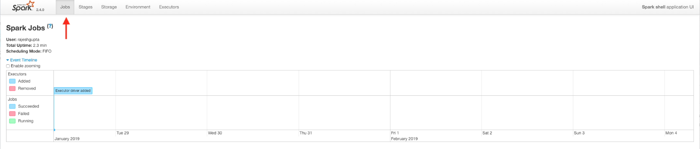
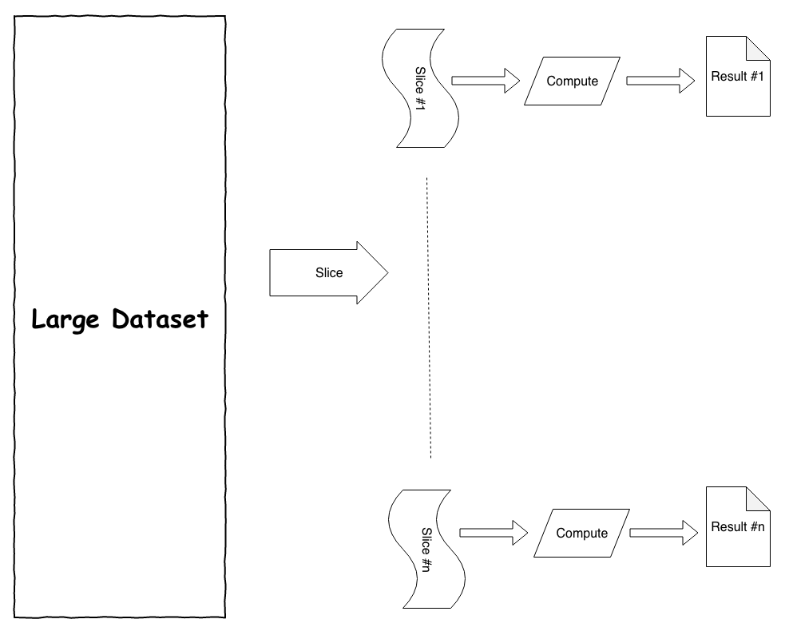
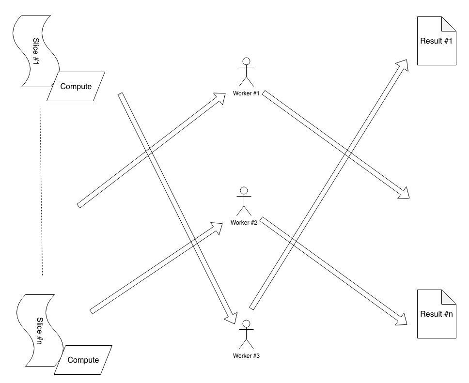
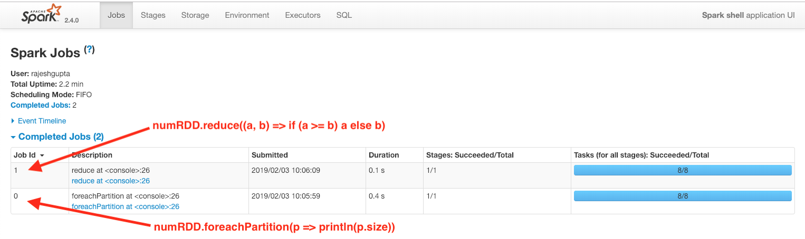
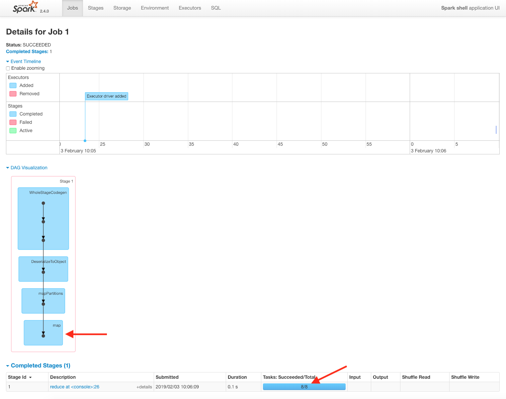
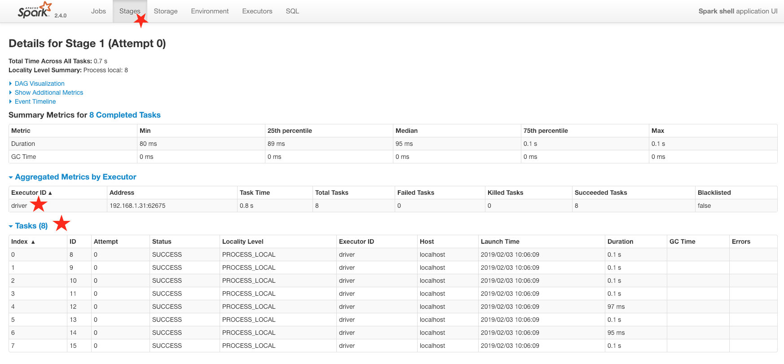

Lab 6. Introduction to Spark for Distributed Data Analysis
-----------------------------------------------------------------------


Spark provides APIs for batch as well as stream data processing in a distributed computing environment. Spark\'s
APIs could be broadly divided into the following five categories:


- **Core**: Resilient distributed datasets (RDD)
- **SQL**: DataFrames, dataset API
- **Streaming**: Structured Streaming and Discretized Stream (DStream)
- **MLlib**: ML
- **GraphX**: Graph processing


The following is Spark Core\'s **Scala build tool** dependency:

```
scalaVersion := "2.11.8"

libraryDependencies += "org.apache.spark" %% "spark-sql" % "2.4.0"
```


Spark setup and overview
------------------------------------------

Apache spark is already installed. Try the following command in your shell to launch the Spark shell:

```
$ spark-shell

2019-01-27 17:58:01 WARN NativeCodeLoader:62 - Unable to load native-hadoop library for your platform... using builtin-java classes where applicable
Setting default log level to "WARN".
To adjust logging level use sc.setLogLevel(newLevel). For SparkR, use setLogLevel(newLevel).
Spark context Web UI available at http://192.168.1.31:4040
Spark context available as 'sc' (master = local[*], app id = local-1548640692711).
Spark session available as 'spark'.
Welcome to
      ____ __
     / __/__ ___ _____/ /__
    _\ \/ _ \/ _ `/ __/ '_/
   /___/ .__/\_,_/_/ /_/\_\ version 2.4.7
      /_/

Using Scala version 2.11.12 (Java HotSpot(TM) 64-Bit Server VM, Java 1.8.0_181)
Type in expressions to have them evaluated.
Type :help for more information.

scala>
```

It is important that the preceding command line produces output that is
similar to this. The following are a few things to be noted:


-   The Spark context Web UI is available at
    `http://192.168.1.31:4040 =>` where this is an URL (same
    as `http://localhost:4040`) a web UI where we can get more
    details about the current Spark session.
-   The Spark context is available as `sc`
    (`master = local[*], app id = local-1548640692711`) =\> We
    are running Spark in local mode.
-   The Spark session is available as
    `'spark' => the variable 'spark'` and provides us access
    to the Spark session.


The following is a screenshot of the UI
(`http://localhost:4040`):





Spark UI is a powerful tool that helps us to understand how the Spark
job works, and you can use it to get very useful insights into the
different stages of execution. The landing page for this UI
is `http://localhost:4040/jobs/`. 

Please note that when you run the Spark
shell, the following is created for you
automatically:


-   `Spark`: A `SparkSession` object that provides
    an entry point for interacting with Spark
-   `sc`: A `SparkContext` object that provides an
    entry point for interacting with the Spark SQL


Let\'s see the features that are available in `SparkSession`
and `sparkContext` by going through the following steps:


1.  Start the Spark shell in your Terminal as follows:


```
$ spark-shell
```


2.  Inside the Spark shell, check the type of Spark object, which must
    be an instance `SparkSession` for
    the `org.pache.spark.sql` package, as follows:


```
scala> spark.getClass
res0: Class[_ <: org.apache.spark.sql.SparkSession] = class org.apache.spark.sql.SparkSession
```


3.  Inside the Spark shell, type `spark. <TAB>` to get an
    insight into the methods and attributes of
    the `SparkSession` object, as follows:


```
scala> spark.
baseRelationToDataFrame conf emptyDataFrame implicits range sessionState sql streams udf
catalog createDataFrame emptyDataset listenerManager read sharedState sqlContext table version
close createDataset experimental newSession readStream sparkContext stop time
```


4.  Import the Spark objects called `implicits`; these are
    automatically imported when a Spark shell is started. For a Spark
    session that is created by other mechanisms, these must be imported
    explicitly to take advantage of the implicit conversions, as
    follows:


```
scala> import spark.implicits._
import spark.implicits._
```


5.  Make use of the Spark session\'s `implicits` to turn a
    `List` of integers to a Spark `Dataset`, as
    follows:


```
scala> val ds = List(1, 2, 3).toDS
ds: org.apache.spark.sql.Dataset[Int] = [value: int]
```


6.  Check the `sc`type object. This must be an instance of
    `SparkContext` from the `org.apache.spark`
    package, as follows:


```
scala> sc.getClass
res1: Class[_ <: org.apache.spark.SparkContext] = class org.apache.spark.SparkContext
```


7.  Inside the Spark shell, type `sc. <TAB>` to get an insight
    into methods and attributes of `sparkContext` as follows:


```
scala> sc.
accumulable broadcast doubleAccumulator getSchedulingMode listJars requestExecutors sparkUser
accumulableCollection cancelAllJobs emptyRDD hadoopConfiguration longAccumulator requestTotalExecutors startTime
accumulator cancelJob files hadoopFile makeRDD runApproximateJob statusTracker
addFile cancelJobGroup getAllPools hadoopRDD master runJob stop
addJar cancelStage getCheckpointDir isLocal newAPIHadoopFile sequenceFile submitJob
addSparkListener clearCallSite getConf isStopped newAPIHadoopRDD setCallSite textFile
appName clearJobGroup getExecutorMemoryStatus jars objectFile setCheckpointDir uiWebUrl
applicationAttemptId collectionAccumulator getLocalProperty killExecutor parallelize setJobDescription union
applicationId defaultMinPartitions getPersistentRDDs killExecutors range setJobGroup version
binaryFiles defaultParallelism getPoolForName killTaskAttempt register setLocalProperty wholeTextFiles
binaryRecords deployMode getRDDStorageInfo listFiles removeSparkListener setLogLevel
```


8.  Create a Spark RDD using `SparkContext`, as follows:


```
scala> val rdd = sc.parallelize(List(1, 2, 3))
rdd: org.apache.spark.rdd.RDD[Int] = ParallelCollectionRDD[0] at parallelize at <console>:27
```


9.  Compare and contrast the range API available in both
    `SparkSession` and `SparkContext` as follows:


```
scala> val rangeDS = spark.range(0, 10)
rangeDS: org.apache.spark.sql.Dataset[Long] = [id: bigint]

scala> val rangeRDD = sc.range(0, 10)
rangeRDD: org.apache.spark.rdd.RDD[Long] = MapPartitionsRDD[2] at range at <console>:27
```

From `SparkSession`, we get a dataset of `Long`, whereas `SparkContext`
returns an RDD of `Long` when using the range API. The dataset
is a higher level Spark construct that is built on top of Spark\'s lower
level RDD construct.


10. Stop the Spark session as follows:


```
scala> spark.stop()

scala>
```


11. Cleanly exit the Spark shell as follows:


```
scala> :quit
```


### Spark core concepts


When our dataset is large, we can envision that there are multiple slices of data that make up the whole dataset.
If a unit of compute work can be performed on each slice of data
independently, then it is possible to parallelize this unit of
computation, as shown in the following illustration:





Once we have this model of RDD in place, we can think of a slice of data
and the computation together as one unit of work. This can be shipped to
any worker to perform the work as illustrated in the following diagram:





In the preceding example, we have three workers working on different
slices of data and applying the associated compute.

Let\'s look at a concrete example to understand this
concept further. Say we have a stack of cards
with each card containing a number, and we want to find the maximum
value from this stack of cards. In Scala REPL, we can solve this using
the following steps:


1.  Generate `20` random integers using Scala\'s random number
    generator, as follows:


```
// Generate 20 random ints
scala> val nums = for(i <- 1 to 20) yield scala.util.Random.nextInt 
nums: scala.collection.immutable.IndexedSeq[Int] = Vector(1701897084, -471839866, 289636030, -68368275, 1453521457, 1776989974, -333257299, 907038439, -157459682, 1279280488, 703554062, -658257712, 74262668, -2034769618, -1796054725, 1618075730, 642862982, 19687648, -1505425837, 1992429366)
```


2.  Apply the `reduce` API on random numbers so that it picks
    up the higher of two numbers and applies this repeatedly to provide
    the highest number, as follows:


```
scala> nums.reduce((a, b) => if (a >= b) a else b) // reduce by taking higher of the two values

res0: Int = 1992429366
```


3.  Find the highest number using an alternative method, as follows:


```
// for illustration purpose, we will use the reduce method instead
scala> nums.max 
res1: Int = 1992429366
```

In the preceding example, we used the `reduce` method from the
Scala collection API to get the maximum value. The `reduce`
method takes a function as an argument. The `supplied`
function must accept two arguments whose types are the same as the
element type of the collection. It must return a value that is also the
same kind of element type. We can explore this in Scala REPL:


1.  Define a Scala function that accepts two integers as input and
    returns an integer that is the higher of the two, as follows:


```
scala> val fun = (a: Int, b: Int) => if (a >= b) a else b
fun: (Int, Int) => Int = <function2>
```


2.  Use the aforementioned function as a parameter to the reduce API of
    the collection to get the maximum value, as follows:


```
scala> nums.reduce(fun)
res2: Int = 1992429366
```

In the preceding example, we worked with only 20 numbers. If this is
very large, a single-threaded operation would be quite slow to compute.
The Scala collection API has support for parallelizing this compute.
Let\'s explore this with one million numbers:


1.  Create a million random integers as follows:


```
scala> val nums = for(i <- 1 to 1024*1024) yield scala.util.Random.nextInt
nums: scala.collection.immutable.IndexedSeq[Int] = Vector(357619961, 1737020067, -469045738, -601249939, -403302690, -2066886866, -1785453571, -1547877670, -1485755408, 1037008188, 597778092, -11773505, -1087522271, -1065953174, -1910311733, 2031863519, -2077923104, 839563816, 1282957796, 674409356, 1813034923, -2070250813, -533697263, -1797217719, -751180312, -1115480418, 890799862, -1566443600, -940178443, 1942197186, 1208980209, -1936454251, -1233813123, 1696121754, 882872208, -1607840660, -1193358067, -249398026, 27578947, -1040824601, 62576870, 241072729, 914410066, -530844701, -1092314860, 1708591216, -2017362160, 1647649412, 1151979199, -197717793, 1392917841, -638219106, 2094838976, 567119171, 1904027672, -216847530, -310681225, 1126606452, 1440522388, -1249070584, 1334505947, -...
```


2.  Define the function that computes the higher of two integers as
    follows:


```
scala> val fun = (a: Int, b: Int) => if (a >= b) a else b
fun: (Int, Int) => Int = <function2>
```


3.  Turn the collection into a parallel one and then apply the
    `reduce` API using the preceding function as the
    parameter, as follows:


```
scala> nums.par.reduce(fun) // turns into parallel collection and then reduces
res4: Int = 2147483017
```

This worked for one million numbers. We can still go with a higher count
of numbers; however, at some point, we will start seeing errors like
those shown in the following code:

```
java.lang.OutOfMemoryError: GC overhead limit exceeded
  at java.lang.Integer.valueOf(Integer.java:832)
  at scala.runtime.BoxesRunTime.boxToInteger(BoxesRunTime.java:65)
  at $anonfun$1.apply(<console>:11)
  at scala.collection.TraversableLike$$anonfun$map$1.apply(TraversableLike.scala:234)
  at scala.collection.TraversableLike$$anonfun$map$1.apply(TraversableLike.scala:234)
  at scala.collection.immutable.Range.foreach(Range.scala:160)
  at scala.collection.TraversableLike$class.map(TraversableLike.scala:234)
  at scala.collection.AbstractTraversable.map(Traversable.scala:104)
  ... 24 elided
```

In the preceding example, we are reaching the resource
limits of a single machine. A machine has the
following two key resources that affect the overall compute:


- **RAM**: Random access memory, where data is stored for
    computation
- **CPU core**: This performs the compute 


For an approach that relies on a single machine for computations, the
only option is to add more resources as the data volume grows. This
approach reaches its limits fairly quickly,
and in fact, the cost of such an approach gets fairly high with the
addition of more resources.

Spark\'s RDD addresses this issue in a scalable way. At the core, RDD
has the following two salient features:


- **Resilient**: RDDs preserve the dataset\'s consistency
    in the event of failures.
- **Distributed**: RDDs overcome the limitations of a
    single machine by distributing the
    dataset in a cluster of nodes.


Let\'s look at the same example in the Spark shell by going through the
following steps:


1.  Start the Spark shell as follows:


```
$ spark-shell
```


2.  Create a Spark RDD of one million random integers as follows:


```
scala> val numRDD = spark.range(1024*1024).rdd.map(i => scala.util.Random.nextInt())
numRDD: org.apache.spark.rdd.RDD[Int] = MapPartitionsRDD[5] at map at <console>:23
```


3.  Get the number of partitions in RDD as follows:


```
scala> numRDD.getNumPartitions
res0: Int = 8
```


4.  Print the size of each partition as follows:


```
scala> numRDD.foreachPartition(p => println(p.size))
131072
131072
131072
131072
131072
131072
131072
131072
```


5.  Use the reduce API on the RDD compute maximum as follows:


```
scala> numRDD.reduce((a, b) => if (a >= b) a else b)
res2: Int = 2147483447
```

Let\'s look at what was being done here:


-   `spark.range(1024*1024).rdd.map(i => scala.util.Random.nextInt())`:
    
    -   We used Spark\'s `range` function to generate 1
        million numbers and convert them to an RDD
    -   We used RDD\'s `map` function to generate a random
        integer for each number
    
-   `numRDD.getNumPartitions`:
    
    -   There are eight partitions in this RDD
    
-   `numRDD.foreachPartition(p => println(p.size))`:
    
    -   Each partition of the RDD has 131,072 records
    
-   `numRDD.reduce((a, b) => if (a >= b) a else b)`:
    
    -   We used RDD\'s `reduce` function to get the maximum
        value
    -   RDD\'s reduce API is similar to Scala collection\'s reduce API;
        however, RDD\'s reduce works on distributed data
    


Let\'s look at this in more detail by going to the Spark UI at
`http://localhost:4040`:





We can see the following two jobs associated with the RDD:


- **Job \#0**: The `foreach` operation on RDD
    that prints the size of each partition
- **Job \#1**: The `reduce` operation on RDD that
    computes the maximum value


If we drill down further in **Job 1**, we can see the
following details:





There was a `map` operation performed to
randomize the numbers. As expected, there
were in total eight tasks, since there were eight partitions in the RDD.
The following are a few terms to note here:


- **Job**: A higher level unit of work that consists of one
    or more transformations and an action
- **Stage**: A series of transformations that happen within
    a job and are confined to a single partition
- **Task**: The work to be performed on a single partition
    of data


We can see more details about this in the `Stages` tab of the Spark
UI, as shown in the following screenshot:





Spark uses lazy evaluation to perform its work. Spark\'s operations can
be divided into the following two parts:


- **Transformations**: Operations that perform some data
    manipulations, data filtering
- **Actions**: Operations that materialize the results 


When we perform transformations on an RDD in Spark, we are essentially
building a recipe. When an action is performed, the recipe is
materialized and action results are produced.

In the following code, we have created an RDD and performed a map
transformation. At this point, RDD is defined; however, Spark has not
performed any work, as seen in the following:

```
val numRDD = spark.range(1024*1024).rdd.map(i => scala.util.Random.nextInt())
```

Once we run the `reduce` operation, which is a Spark action,
Spark starts to execute the following recipe that we defined earlier:

```
numRDD.reduce((a, b) => if (a >= b) a else b)
```

The reduce action creates a Spark job. This job consists of a single
stage. Within this stage, there are eight tasks, one for each partition.

This lazy evaluation approach offers the following benefits:


-   When a Spark action is executed, it looks at the entire execution
    graph that is needed to materialize the action. This provides
    opportunities for transformation optimization, such as eliminating
    redundant transformations and reordering operations that provide
    better overall performance while maintaining the overall consistency
    of the results produced.
-   It provides opportunities for caching only the results that are used
    repeatedly. This becomes important when data to be handled is large.


Next, we will look at Spark\'s datasets and DataFrames while still
exploring more details of Spark.


Spark Datasets and DataFrames
-----------------------------------------------


In the previous section, we looked at Spark\'s core functionality using RDDs. RDDs are powerful constructs;
however, there are still some low-level details that a Spark user
has to understand and master before making
use of it. Spark\'s Datasets and DataFrame constructs provide higher
level APIs for working with data.

Spark\'s Dataset brings a declarative style of programming along with
the functional programming style of RDD. **Structured Query
Language** (**SQL**) is a very
popular declarative language, and is
extremely popular among people who do not have a strong background in
functional programming. The Spark DataFrame is a special type of dataset
that provides the concepts of the row and column, as seen in the tradition **relational database**
(**RDBS**) work.

Let\'s explore the example we used earlier using RDD. We will use the
dataset and DataFrame constructs instead:


1.  Start a `spark-shell` as follows:


```
$ spark-shell
```


2.  Create a dataset of one million random integers, as follows:


```
scala> val numDS = spark.range(1024*1024).map(i => scala.util.Random.nextInt())
numDS: org.apache.spark.sql.Dataset[Int] = [value: int]
```


3.  Use the reduce API of the dataset to compute the maximum, as
    follows:


```
scala> numDS.reduce((a, b) => if (a >= b) a else b)
res4: Int = 2147478392
```


4.  Create a Spark DataFrame consisting of one million random
    integers, as follows:


```
scala> val numDF = spark.range(1024*1024).map(i => scala.util.Random.nextInt()).toDF
numDF: org.apache.spark.sql.DataFrame = [value: int]
```


5.  Try to perform reduce on the DataFrame; we should get an error, as
    follows:


```
scala> numDF.reduce((a, b) => if (a >= b) a else b) // DOES NOT WORK
<console>:26: error: value >= is not a member of org.apache.spark.sql.Row
       numDF.reduce((a, b) => if (a >= b) a else b)
```

We constructed a dataset and a DataFrame of random numbers instead of
the RDD. We are able to perform a `reduce` action on the
dataset to get the maximum value; however, the `reduce` action
of the DataFrame produces an error. This is because each element of the
DataFrame is of the `Row` type and so, the following operation
involving two elements is incorrect:

```
(a, b) => if (a >= b) a else b
```

We can make the following modifications to produce the desired results:

```
scala> numDF.reduce((a, b) => if (a(0).asInstanceOf[Int] >= b(0).asInstanceOf[Int]) a else b)
res8: org.apache.spark.sql.Row = [2147480464]
```

This DataFrame\'s `Row` has only one column, and it is of the
`Int` type. We take the first column (at index `0`)
and cast it as `Int` before comparing the two values, as
follows:

```
a(0).asInstanceOf[Int] // column at index 0 cast as an Int
```

Let\'s look at another concrete example to understand Spark\'s dataset
and DataFrame properties in a Spark shell:


1.  Start a Spark shell as follows:


```
$ spark-shell
```


2.  Define a Scala `case` class called `Person` as
    follows:


```
scala> case class Person(fname: String, lname: String, age: Int)
defined class Person
```


3.  Create a small `List` of `Person` objects as
    follows:


```
scala> val persons = List(Person("Jon", "Doe", 21), Person("Bob", "Smith", 25), Person("James", "Bond", 47))
persons: List[Person] = List(Person(Jon,Doe,21), Person(Bob,Smith,25), Person(James,Bond,47))
```


4.  Create a dataset of `Person` from the list of persons as
    follows:


```
scala> val ds = spark.createDataset(persons)
ds: org.apache.spark.sql.Dataset[Person] = [fname: string, lname: string ... 1 more field]
```


5.  Create a DataFrame from the list of persons as follows:


```
scala> val df = spark.createDataFrame(persons)
df: org.apache.spark.sql.DataFrame = [fname: string, lname: string ... 1 more field]
```


6.  Print a schema of the dataset as follows:


```
scala> ds.printSchema
root
 |-- fname: string (nullable = true)
 |-- lname: string (nullable = true)
 |-- age: integer (nullable = false)
```


7.  Print a schema of the DataFrame as follows:


```
scala> df.printSchema
root
 |-- fname: string (nullable = true)
 |-- lname: string (nullable = true)
 |-- age: integer (nullable = false)
```

In the preceding example, we did the
following:


-   Defined a case class called `Person` with three
    attributes:
    
    -   `fname`: String
    -   `lname`: String
    -   `age`: Int
    
-   Created a list of three persons
-   Created a dataset of persons
-   Created a DataFrame of persons
-   Printed a schema of the dataset and the DataFrame


Datasets provides a strong type safety that aids significantly in
building robust data pipelines. The type of dataset in the previous
example, it was `org.apache.spark.sql.Dataset[Person]`. This
implies that it is a dataset of  `Person`. When working with
DataFrames of this type, safety is not available because DataFrame is
a dataset of `Row`. We can confirm this in a Spark shell as
follows:

```
scala> df.getClass
res11: Class[_ <: org.apache.spark.sql.DataFrame] = class org.apache.spark.sql.Dataset

scala> df.isInstanceOf[org.apache.spark.sql.Dataset[org.apache.spark.sql.Row]]
res12: Boolean = true
```

Both dataset and DataFrame are very powerful constructs in Spark, each
with its own strengths. When both are used together, these become a
powerful means of working with data. Spark\'s Datasets are only
available in JVM programming languages. This means that datasets can be
used only in Scala and Java. Spark\'s DataFrames, on the other hand, are
supported in Scala, Java, Python, and R.

Let\'s look at some of the dataset APIs, continuing with the same
example:


1.  Show from rows from the dataset as follows:


```
scala> ds.show
+-----+-----+---+
|fname|lname|age|
+-----+-----+---+
| Jon| Doe| 21|
| Bob|Smith| 25|
|James| Bond| 47|
+-----+-----+---+
```


2.  Convert first name and last name to uppercase by applying a
    `map` operation to each element of the dataset, as
    follows:


```
scala> val dsUpper = ds.map(p => p.copy(p.fname.toUpperCase, p.lname.toUpperCase))
dsUpper: org.apache.spark.sql.Dataset[Person] = [fname: string, lname: string ... 1 more field]
```


3.  Show the row from the uppercase mapped dataset as follows:


```
scala> dsUpper.show
+-----+-----+---+
|fname|lname|age|
+-----+-----+---+
| JON| DOE| 21|
| BOB|SMITH| 25|
|JAMES| BOND| 47|
+-----+-----+---+
```

In the preceding example, we first displayed the contents of the dataset
using the `show` command, which typically displays up to 20
entries. We then performed a `map` operation on each
`Person` object by converting the first name and last name to
uppercase. Finally, we displayed the contents of the transformed
dataset.

Let\'s go through some similar steps with the DataFrame in the Spark
shell, as follows:


1.  Show some rows from DataFrame as follows:


```
scala> df.show
+-----+-----+---+
|fname|lname|age|
+-----+-----+---+
| Jon| Doe| 21|
| Bob|Smith| 25|
|James| Bond| 47|
+-----+-----+---+
```


2.  Perform a `map` operation on DataFrame to convert the
    first and last name to uppercase. This returns an instance of the
    dataset where the attributes are named `_1`,
    `_2`, and `_3`, as follows:


```
scala> val dfUpper = df.map(r => (r(0).asInstanceOf[String].toUpperCase, r(1).asInstanceOf[String].toUpperCase, r(2).asInstanceOf[Int]))
dfUpper: org.apache.spark.sql.Dataset[(String, String, Int)] = [_1: string, _2: string ... 1 more field]
```


3.  Fix the attribute name issue as follows:


```
scala> val dfUpperWithName = df.map(r => (r(0).asInstanceOf[String].toUpperCase, r(1).asInstanceOf[String].toUpperCase, r(2).asInstanceOf[Int])).toDF("fname", "lname", "age")
dfUpperWithName: org.apache.spark.sql.DataFrame = [fname: string, lname: string ... 1 more field]
```


4.  Show some rows from the mapped DataFrame as follows:


```
scala> dfUpperWithName.show
+-----+-----+---+
|fname|lname|age|
+-----+-----+---+
| JON| DOE| 21|
| BOB|SMITH| 25|
|JAMES| BOND| 47|
+-----+-----+---+
```

There are some key differences in how the DataFrame works compared to
the dataset. The `map` API on DataFrame converts it to a
dataset of (`String`, `String`, `Int`).
The other difference is that the object available to the `map`
function is of the `Row` type as opposed
to `Person`. Different parts of `Person` need to be
extracted from `Row` and type cast to their appropriate types.
There is also the following alternative way to achieve the same results
without the need for type casting:

```
scala> val dfUpperWithName = df.map(r => ((r.getString(0), r.getString(1), r.getInt(2)))).toDF("fname", "lname", "age")
dfUpperWithName: org.apache.spark.sql.DataFrame = [fname: string, lname: string ... 1 more field]
```

Filtering data on the dataset and DataFrame can be performed in the
following way:


1.  Filter the dataset for entries where the age is greater than
    `25` as follows:


```
scala> val dsAbove25 = ds.where($"age" > 25)
dsAbove25: org.apache.spark.sql.Dataset[Person] = [fname: string, lname: string ... 1 more field]
```


2.  Filter DataFrame for entries where the age is greater than
    `25` as follows:


```
scala> val dfAbove25 = df.where($"age" > 25)
dfAbove25: org.apache.spark.sql.Dataset[org.apache.spark.sql.Row] = [fname: string, lname: string ... 1 more field]
```


3.  Show the filtered dataset\'s contents as follows:


```
scala> dsAbove25.show
+-----+-----+---+
|fname|lname|age|
+-----+-----+---+
|James| Bond| 47|
+-----+-----+---+
```


4.  Show the filtered DataFrame\'s contents as follows:


```
scala> dfAbove24.show
+-----+-----+---+
|fname|lname|age|
+-----+-----+---+
|James| Bond| 47|
+-----+-----+---+
```

We used the `where` API by specifying a filter condition
`$"age" > 25` in both cases. In this context,
`$"age"` represents the column in the dataset or DataFrame. We
can add more conditions to the `where` clause using the
following steps:


1.  Use multiple conditions to filter the dataset as follows:


```
scala> val ds25Bob = ds.where($"age" === 25 && $"fname" === "Bob")
ds25Bob: org.apache.spark.sql.Dataset[Person] = [fname: string, lname: string ... 1 more field]
```


2.  Use multiple conditions to filter the DataFrame as follows:


```
scala> val df25Bob = df.where($"age" === 25 && $"fname" === "Bob")
df25Bob: org.apache.spark.sql.Dataset[org.apache.spark.sql.Row] = [fname: string, lname: string ... 1 more field]
```


3.  Show the filtered dataset\'s contents as follows:


```
scala> ds25Bob.show
+-----+-----+---+
|fname|lname|age|
+-----+-----+---+
| Bob|Smith| 25|
+-----+-----+---+
```


4.  Show the filtered DataFrame\'s contents as follows:


```
scala> df25Bob.show
+-----+-----+---+
|fname|lname|age|
+-----+-----+---+
| Bob|Smith| 25|
+-----+-----+---+
```

Please note the usage of the triple equals sign (`===`). This
is needed to indicate that it is a column
compare because the standard double equals (`==`) compares two
references and returns a Boolean value.

We can also use a free-form expression to
perform filtering in `where` clauses by using the following
steps:


1.  Apply multiple conditions on the dataset using the following
    expression:


```
scala> val dsWhereFF = ds.where("age = 25 and fname = 'Bob'")
dsWhereFF: org.apache.spark.sql.Dataset[Person] = [fname: string, lname: string ... 1 more field]
```


2.  Apply the same conditions to DataFrame using the following
    expression:


```
scala> val dfWhereFF = df.where("age = 25 and fname = 'Bob'")
dfWhereFF: org.apache.spark.sql.Dataset[org.apache.spark.sql.Row] = [fname: string, lname: string ... 1 more field]
```


3.  Show the filtered dataset\'s contents as follows:


```
scala> dsWhereFF.show
+-----+-----+---+
|fname|lname|age|
+-----+-----+---+
| Bob|Smith| 25|
+-----+-----+---+
```


4.  Show the filtered DataFrame\'s contents as follows:


```
scala> dfWhereFF.show
+-----+-----+---+
|fname|lname|age|
+-----+-----+---+
| Bob|Smith| 25|
+-----+-----+---+
```

In this example, we are able to achieve the same results by using an SQL
such as `where` condition.

Using the `select` API, we can select specific columns from
the dataset and DataFrame, as follows:

```
scala> ds.select("fname", "lname")
res34: org.apache.spark.sql.DataFrame = [fname: string, lname: string]

scala> df.select("fname", "lname")
res35: org.apache.spark.sql.DataFrame = [fname: string, lname: string]
```

Applying `select` to a dataset returns a DataFrame, whereas
applying `select` to DataFrame returns a DataFrame. It is an
important observation that some APIs on the dataset returns a DataFrame.
Similar to the `select` API, the `selectExpr` API
also returns a DataFrame. The `selectExpr` API is a powerful
API because it also allows transformations to be performed on the
dataset and DataFrame columns.


Sourcing data using Spark
-------------------------------------------

In this
section, we will focus on the variety of data sources and formats
supported by Spark.


#### Parquet file format


The Spark API commonly used to read and write a Parquet file is as
follows:

```
spark.read.parquet(sourceLocation)

dataframe.write.parquet(destinationLocation)
```


Both `DataFrameReader` and `DataFrameWriter` provide
fairly comprehensive APIs to read and write data in many different
formats. 


### Avro file format


Apache Avro (<https://avro.apache.org/>) is another data serialization format. This is a binary format that provides
a compact representation of underlying data.
Similar to Parquet, it is a structured data
format and has support for storing nested data. Spark has excellent
support for working with Avro.


### Spark JDBC integration


A significant amount of enterprise data is
stored in **relational database
systems** (**RDBMS**). The majority of the more
popular database systems support **Java Database
Connectivity** (**JDBC**) as a way of interacting
with these systems. Spark provides a convenient way to use JDBC for
integrating with these RDBMS systems. 


Using Spark to explore data
---------------------------------------------


Spark\'s SQL provides a convenient way to explore data and gain a deeper
understanding of the data. Spark\'s DataFrame construct can be
registered as temporary tables. It is possible to run SQL on these
registered tables by performing all of the normal operations, such as
joining tables and filtering data.

Let\'s look at an example Spark shell to learn how to explore data by
using the following steps:


1.  Start the Spark shell in a Terminal as follows:


```
$ spark-shell
```


2.  Define the following Scala case called `Person` with the
    following three attributes:
    
    -   `fname`: String
    -   `lname`: String
    -   `age`: Int
    


```
scala> case class Person(fname: String, lname: String, age: Int)
defined class Person
```


3.  Create a Scala list consisting of a few persons and put it into a
    Spark dataset of `Person` as follows:


```
scala> val personsDS = List(Person("Jon", "Doe", 22), Person("Jack", "Sparrow", 35), Person("James", "Bond", 47), Person("Mickey", "Mouse", 13)).toDS
personsDS: org.apache.spark.sql.Dataset[Person] = [fname: string, lname: string ... 1 more field]
```


4.  Create a Spark temporary view named `persons` with
    underlying coming from the dataset created in the previous step:


```
scala> personsDS.createOrReplaceTempView("persons")
```


5.  Run the SQL using the Spark session query in the temporary view
    created in the previous step. Limit the selection of persons to
    those aged 21 or older. This will return a new Spark DataFrame
    consisting of records that match the criteria. Please note that the
    object returned is a DataFrame, which is a special type of dataset
    of `Row` as follows:


```
scala> val personsAbove21 = spark.sql("select * from persons where age >= 21")
personsAbove21: org.apache.spark.sql.DataFrame = [fname: string, lname: string ... 1 more field]
```


6.  Show the contents of the DataFrame created in the previous step as
    follows:


```
scala> personsAbove21.show(truncate=false)
+-----+-------+---+
|fname|lname |age|
+-----+-------+---+
|Jon |Doe |22 |
|Jack |Sparrow|35 |
|James|Bond |47 |
+-----+-------+---+
```


7.  Run another SQL on the temporary view. Change the `fname`
    and `lname` fields to uppercase as follows:


```
scala> val personsUpperCase = spark.sql("select upper(fname) as ufname, upper(lname) ulname, age from persons")
personsUpperCase: org.apache.spark.sql.DataFrame = [ufname: string, ulname: string ... 1 more field]
```


8.  Show the DataFrame created in the previous step as follows:


```
scala> personsUpperCase.show(truncate=false)
+------+-------+---+
|ufname|ulname |age|
+------+-------+---+
|JON |DOE |22 |
|JACK |SPARROW|35 |
|JAMES |BOND |47 |
|MICKEY|MOUSE |13 |
+------+-------+---+
```


Summary
-------------------------


In this lab, we explored the Apache Spark open source distributed
data processing platform. We installed a copy of Apache Spark on our
local computer. First, we learned about of Spark\'s core API using
hands-on examples that explored Spark\'s **resilient distributed dataset** (RDD). Next, we explored the higher
level APIs of Spark using datasets and DataFrames.

In the next lab, we will look at traditional machine learning
concepts.
