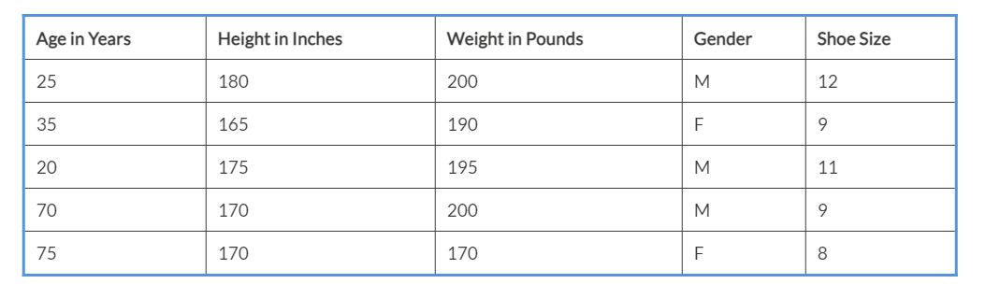

Lab 7. Traditional Machine Learning for Data Analysis
------------------------------------------------------------------


This lab provides an overview of **machine learning**
(**ML**) techniques for doing data analysis. In the previous
labs, we have explored some of the techniques that can be used by
human beings to analyze and understand data. In this lab, we look at
how ML techniques could be used for similar purposes.

At the heart of ML is a number of algorithms
that have proven to work for solving specific categories of problems
with a high degree of effectiveness. This lab covers the following
popular ML methods:


-   Decision trees
-   Random forests
-   Ridge and lasso regression
-   k-means cluster analysis


#### Implementing decision trees

Let\'s look at a simple example to understand and explore this concept. We have the following observations:


 

Our inputs, variables, or features are as follows:


-   `Age in Years`
-   `Height in Inches`
-   `Weight in Pounds`
-   `Gender`


The outcome or output is as follows:


-   `Shoe Size`


The aforementioned is an example of labeled data. We can envision
labeled data as a tuple of inputs and the corresponding output.


##### Implementing decision tree algorithms in our example


The example we are discussing here falls into
the category of regression because our output is Shoe Size, which has
multiple values.

If we ask a slightly different question, we could turn this into a
classification problem. For example, given the following input
variables, we can predict gender:


-   `Age in Years`
-   `Height in Inches`
-   `Weight in Pounds`
-   `Shoe Size`


In this simple example, we only have two possible values for this
answer.

Let\'s look at how to run a decision tree classifier using Spark and
Scala. The complete Spark example code is located here on GitHub:

<https://github.com/apache/spark/blob/master/examples/src/main/scala/org/apache/spark/examples/mllib/DecisionTreeClassificationExample.scala>

Additionally, the following Spark documentation provides a good overview
of the decision tree and the preceding example:

<https://spark.apache.org/docs/2.4.0/mllib-decision-tree.html>

The sample data for this example is located here:

<https://github.com/apache/spark/blob/master/data/mllib/sample_libsvm_data.txt>

For this exploration, it is best to download this file locally using the
following `curl` command:

```
$ curl "https://raw.githubusercontent.com/apache/spark/master/data/mllib/sample_libsvm_data.txt" -o sample_libsvm_data.txt
```


Run the following command in the shell to
make sure that the downloaded data is correct:

```
$ head -1 sample_libsvm_data.txt
0 128:51 129:159 130:253 131:159 132:50 155:48 156:238 157:252 158:252 159:252 160:237 182:54 183:227 184:253 185:252 186:239 187:233 188:252 189:57 190:6 208:10 209:60 210:224 211:252 212:253 213:252 214:202 215:84 216:252 217:253 218:122 236:163 237:252 238:252 239:252 240:253 241:252 242:252 243:96 244:189 245:253 246:167 263:51 264:238 265:253 266:253 267:190 268:114 269:253 270:228 271:47 272:79 273:255 274:168 290:48 291:238 292:252 293:252 294:179 295:12 296:75 297:121 298:21 301:253 302:243 303:50 317:38 318:165 319:253 320:233 321:208 322:84 329:253 330:252 331:165 344:7 345:178 346:252 347:240 348:71 349:19 350:28 357:253 358:252 359:195 372:57 373:252 374:252 375:63 385:253 386:252 387:195 400:198 401:253 402:190 413:255 414:253 415:196 427:76 428:246 429:252 430:112 441:253 442:252 443:148 455:85 456:252 457:230 458:25 467:7 468:135 469:253 470:186 471:12 483:85 484:252 485:223 494:7 495:131 496:252 497:225 498:71 511:85 512:252 513:145 521:48 522:165 523:252 524:173 539:86 540:253 541:225 548:114 549:238 550:253 551:162 567:85 568:252 569:249 570:146 571:48 572:29 573:85 574:178 575:225 576:253 577:223 578:167 579:56 595:85 596:252 597:252 598:252 599:229 600:215 601:252 602:252 603:252 604:196 605:130 623:28 624:199 625:252 626:252 627:253 628:252 629:252 630:233 631:145 652:25 653:128 654:252 655:253 656:252 657:141 658:37
```

This data is created as per **Library for Support Vector Machines** (**LIBSVM**) specifications and more
details about LIBSVM can be found
at [https://www.csie.ntu.edu.tw/\~cjlin/libsvmtools/datasets/.](https://www.csie.ntu.edu.tw/~cjlin/libsvmtools/datasets/)

Now, let\'s build a decision tree classifier
using this dataset in `spark-shell`:


1.  Start `spark-shell` in your Terminal:


```
$ spark-shell
```


2.  Import `DecisionTree` from Spark\'s MLLib\'s
    `tree` package. More information about this class can be
    found
    at <https://spark.apache.org/docs/2.4.1/api/java/index.html?org/apache/spark/mllib/tree/DecisionTree.html>.
    This class implements a decision tree learning algorithm for
    classification and regression:


```
scala> import org.apache.spark.mllib.tree.DecisionTree
import org.apache.spark.mllib.tree.DecisionTree
```

 


3.  Import `DecisionTreeModel` from Spark\'s MLLib\'s
    `tree.model` package. More information about this can be
    found
    at <https://spark.apache.org/docs/2.4.1/api/java/index.html?org/apache/spark/mllib/tree/DecisionTree.html>:


```
scala> import org.apache.spark.mllib.tree.model.DecisionTreeModel
import org.apache.spark.mllib.tree.model.DecisionTreeModel
```


4.  Import `MLUtils` from Spark\'s MLLib\'s `util`
    package. More information about this can be found
    at <https://spark.apache.org/docs/2.4.1/api/java/index.html?org/apache/spark/mllib/tree/DecisionTree.html>.
    `MLUtils` provides utility methods for loading, saving,
    and preprocessing data used in MLLib:


```
scala> import org.apache.spark.mllib.util.MLUtils
import org.apache.spark.mllib.util.MLUtils
```


5.  Using `MLUtils`, load the sample data in LIBSVM format.
    Note that doing so returns a Spark RDD of MLLib\'s
    `LabeledPoint`:


```
scala> val data = MLUtils.loadLibSVMFile(sc, "sample_libsvm_data.txt") // load data in LIBSVM format
data: org.apache.spark.rdd.RDD[org.apache.spark.mllib.regression.LabeledPoint] = MapPartitionsRDD[6] at map at MLUtils.scala:86
```


6.  Split the data randomly into two parts: one with 70% of the data and
    another one with the remaining 30%. Note that we are using Spark
    RDD\'s `randomSplit` API to do so. This provides us with
    an RDD array of `LabeledPoint`:


```
// 70/30 split
scala> val splits = data.randomSplit(Array(0.7, 0.3)) 
splits: Array[org.apache.spark.rdd.RDD[org.apache.spark.mllib.regression.LabeledPoint]] = Array(MapPartitionsRDD[7] at randomSplit at <console>:28, MapPartitionsRDD[8] at randomSplit at <console>:28)
```


7.  Designate the 70% split as training data and the 30% split as test
    data. This is a fairly standard practice
    to reserve 30% of the labeled data for testing. We now have two RDDs
    of `LabeledPoint`, training and test:


```
// 70% is training data and 30% test data
scala> val (trainingData, testData) = (splits(0), splits(1)) 
trainingData: org.apache.spark.rdd.RDD
               [org.apache.spark.mllib.regression.LabeledPoint] =   
                 MapPartitionsRDD[7] at randomSplit at <console>:28
testData: org.apache.spark.rdd.RDD[org.apache.spark.mllib.regression
 .LabeledPoint] = MapPartitionsRDD[8] at randomSplit at <console>:28
```


8.  Define the number of classes. In this case, the value is
    `2` because only two values are possible:


```
scala> val numClasses = 2 // two possible values (0 or 1)
numClasses: Int = 2
```


9.  Define an empty `Map` method for categorical features
    because there are no categorical features for this use case. Note
    that the key and value for the `Map` are both of type
    `Int`:


```
scala> val categoricalFeaturesInfo = Map[Int, Int]() // no categorical features
categoricalFeaturesInfo: scala.collection.immutable.Map[Int,Int] = Map()
```


10. Define the impurity as a `gini` impurity measure:


```
scala> val impurity = "gini"
impurity: String = gini
```


11. Define the maximum depth of the tree:


```
scala> val maxDepth = 5 // maximum depth of the tree
maxDepth: Int = 5
```


12. Define the maximum width of the tree:


```
scala> val maxBins = 32 // maximum with of the tree
maxBins: Int = 32
```


13. Create a decision tree model by training on the training data and
    using the parameter previously specified:


```
scala> val model = DecisionTree.trainClassifier(trainingData, numClasses, categoricalFeaturesInfo, impurity, maxDepth, maxBins)
model: org.apache.spark.mllib.tree.model.DecisionTreeModel = DecisionTreeModel classifier of depth 2 with 5 nodes
```


14. Output the model as follows:


```
scala> model.toDebugString
res0: String =
"DecisionTreeModel classifier of depth 2 with 5 nodes
  If (feature 351 <= 38.0)
   If (feature 125 <= 254.5)
    Predict: 0.0
   Else (feature 125 > 254.5)
    Predict: 1.0
  Else (feature 351 > 38.0)
   Predict: 1.0
"
```

Let\'s take a look at the data:

```
0 128:51 129:159 130:253 131:159 132:50 155:48 156:238 157:252 158:252 ....
```

Here is what we can see:


-   The first value is the outcome or result. This has two possible
    values: `0` or `1`.
-   Subsequent values are listed as
    `<feature id>:<associated value>`.


##### Evaluating the results

Let\'s evaluate how the model performs on the test data:


1.  For each record in `testData`, first, predict the results
    using the features of the record by applying the model. Record this
    as an observed value and a predicted value pair: 


```
scala> val labelAndPreds = testData.map { point =>
     | val prediction = model.predict(point.features)
     | (point.label, prediction)
     | }
labelAndPreds: org.apache.spark.rdd.RDD[(Double, Double)] = MapPartitionsRDD[24] at map at <console>:30
```


2.  Calculate how many records were incorrectly predicted:


```
scala> val testErr = labelAndPreds.filter(r => r._1 != r._2).count().toDouble / testData.count()
testErr: Double = 0.11764705882352941
```

We have a roughly 12% error in predicting the correct outcome.


3.  This model can be saved to a file using the following API:


```
scala> model.save(sc, "myDecisionTreeClassificationModel")
```

This saves the model to
the `myDecisionTreeClassificationModel` directory.


4.  Exit out of `spark-shell` as follows:


```
scala> spark.stop()

scala> :quit
```


### Using our model with a decision tree


Now the model is ready to use:


1.  Start the `spark-shell`:


```
$ spark-shell
```


2.  Import `DecisionTreeModel` from Spark\'s MLLib package:


```
scala> import org.apache.spark.mllib.tree.model.DecisionTreeModel
import org.apache.spark.mllib.tree.model.DecisionTreeModel
```


3.  Use `DecisionTreeModel` objects\' load API to load the
    model:


```
scala> val model = DecisionTreeModel.load(sc, "myDecisionTreeClassificationModel")
model: org.apache.spark.mllib.tree.model.DecisionTreeModel = DecisionTreeModel classifier of depth 2 with 5 nodes
```


4.  The output of the model is as follows:


```
scala> model.toDebugString
res0: String =
"DecisionTreeModel classifier of depth 2 with 5 nodes
  If (feature 351 <= 38.0)
   If (feature 125 <= 254.5)
    Predict: 0.0
   Else (feature 125 > 254.5)
    Predict: 1.0
  Else (feature 351 > 38.0)
   Predict: 1.0
"
```

We can see that the loaded model is the same one that we built earlier.
This model can be used to predict outcomes of unseen observations by
doing the following:

```
scala> model.predict(features) // features is a new observation
```

The model will output a value of `0` or `1`.


### Random forest algorithms

Let\'s explore the random forest algorithm using Spark ML. We will be
using the same `sample_libsvm_data.txt` data file from the
decision tree example:


1.  Run Spark shell from your Terminal:


```
$ spark-shell
```


2.  Import the required classes from Spark\'s ML package:


```
scala> import org.apache.spark.ml.Pipeline
import org.apache.spark.ml.Pipeline
scala> import org.apache.spark.ml.classification.{RandomForestClassificationModel, RandomForestClassifier}
import org.apache.spark.ml.classification.{RandomForestClassificationModel, RandomForestClassifier}
scala> import org.apache.spark.ml.evaluation.MulticlassClassificationEvaluator
import org.apache.spark.ml.evaluation.MulticlassClassificationEvaluator
scala> import org.apache.spark.ml.feature.{IndexToString, StringIndexer, VectorIndexer}
import org.apache.spark.ml.feature.{IndexToString, StringIndexer, VectorIndexer}
```


3.  Use SparkSession to read the `_libsvm_data.txt` file
    sample in `libsvm` format as a Spark DataFrame:


```
scala> val data = spark.read.format("libsvm").load("./sample_libsvm_data.txt")
2019-04-24 21:49:27 WARN LibSVMFileFormat:66 - 'numFeatures' option not specified, determining the number of features by going though the input. If you know the number in advance, please specify it via 'numFeatures' option to avoid the extra scan.
data: org.apache.spark.sql.DataFrame = [label: double, features: vector]
```


4.  Index the label column of the source DataFrame and create a new
    DataFrame with `indexedLabel` as an additional column:


```
scala> val labelIndexer = new StringIndexer().setInputCol("label").setOutputCol("indexedLabel").fit(data)
labelIndexer: org.apache.spark.ml.feature.StringIndexerModel = strIdx_484cb0e8e765
```


5.  Index the features column of the source DataFrame and create a new
    DataFrame with `indexedFeatures` as an additional column.
    Make sure that the features are treated as continuous variables if
    there are more than four distinct values, otherwise, they will be
    categorical:


```
scala> val featureIndexer = new VectorIndexer().setInputCol("features").setOutputCol("indexedFeatures").setMaxCategories(4).fit(data)
featureIndexer: org.apache.spark.ml.feature.VectorIndexerModel = vecIdx_07847af33557
```


6.  Randomly split the source DataFrame into two DataFrames using a 7:3
    ratio. The first DataFrame is to be used for training purposes. The
    second DataFrame is to be used for testing purposes:


```
scala> val Array(trainingData, testData) = data.randomSplit(Array(0.7, 0.3))
trainingData: org.apache.spark.sql.Dataset[org.apache.spark.sql.Row] = [label: double, features: vector]
testData: org.apache.spark.sql.Dataset[org.apache.spark.sql.Row] = [label: double, features: vector]
```


7.  Create `RandomForestClassifier` using the builder pattern.
    Set the label column name as `indexedLabel` and the
    features column name as `features column`. Allow 10
    decision trees to be used for arriving at a consensus:


```
scala> val randomForest = new RandomForestClassifier().setLabelCol("indexedLabel").setFeaturesCol("indexedFeatures").setNumTrees(10)
randomForest: org.apache.spark.ml.classification.RandomForestClassifier = rfc_954d41674853
```


8.  Create a label converter object that converts indexed labels back to
    the original labels:


```
scala> val labelConverter = new IndexToString().setInputCol("prediction").setOutputCol("predictedLabel").setLabels(labelIndexer.labels)
labelConverter: org.apache.spark.ml.feature.IndexToString = idxToStr_74f8a7c145d8
```


9.  Create a `Pipeline` object that
    chains the label indexer, feature indexer, random forest, and label
    converter:


```
scala> val pipeline = new Pipeline().setStages(Array(labelIndexer, featureIndexer, randomForest, labelConverter))
pipeline: org.apache.spark.ml.Pipeline = pipeline_8cd293d72ebd
```


10. Run the pipeline to fit training data and create a model. Doing so
    runs the label indexer, feature indexer, random forest, and label
    converter one after the other:


```
scala> val model = pipeline.fit(trainingData)
model: org.apache.spark.ml.PipelineModel = pipeline_8cd293d72ebd
```


11. Using the model, run `predictions` on the test data:


```
scala> val predictions = model.transform(testData)
predictions: org.apache.spark.sql.DataFrame = [label: double, features: vector ... 6 more fields]
```


12. Display five rows from the created `predictions`
    DataFrame:


```
scala> predictions.select("predictedLabel", "label", "features").show(5, true)
+--------------+-----+--------------------+
|predictedLabel|label| features|
+--------------+-----+--------------------+
| 0.0| 0.0|(692,[95,96,97,12...|
| 0.0| 0.0|(692,[100,101,102...|
| 0.0| 0.0|(692,[122,123,148...|
| 0.0| 0.0|(692,[123,124,125...|
| 0.0| 0.0|(692,[124,125,126...|
+--------------+-----+--------------------+
only showing top 5 rows
```


13. Evaluate the accuracy of the predicted
    label by comparing it against the original label:


```
scala> val evaluator = new MulticlassClassificationEvaluator().setLabelCol("indexedLabel").setPredictionCol("prediction").setMetricName("accuracy")
evaluator: org.apache.spark.ml.evaluation.MulticlassClassificationEvaluator = mcEval_4b737dba9096

scala> val accuracy = evaluator.evaluate(predictions)
accuracy: Double = 1.0

scala> println(s"Test Error = ${(1.0 - accuracy)}")
Test Error = 0.0
```


14. Extract the built model, getting the element at index `2`
    of the pipeline stages:


```
scala> val rfModel = model.stages(2).asInstanceOf[RandomForestClassificationModel]
rfModel: org.apache.spark.ml.classification.RandomForestClassificationModel = RandomForestClassificationModel (uid=rfc_954d41674853) with 10 trees
```

 


15. Print out the contents of the built
    model:


```
scala> println(s"Learned classification forest model:\n ${rfModel.toDebugString}")
```


Ridge and lasso regression
--------------------------------------------


Ridge and lasso regression are supervised
linear regression ML algorithms. Both of these algorithms aim at
reducing model complexity and prevent
overfitting. When there is a large number of features or variables in a
training dataset, the model built by ML generally tends to be complex.


### Characteristics of lasso regression


Let\'s look at running linear regression methods on Spark:


1.  Download the data file needed for exploration in your Terminal:


```
  $ curl https://raw.githubusercontent.com/apache/spark/master/data/mllib/ridge-data/lpsa.data -o lpsa.data
```


2.  Start a Spark shell in your Terminal:


```
$ spark-shell
```

 

 


3.  Import the necessary classes from the Spark MLLib package, which are
    needed for linear regression:


```
scala> import org.apache.spark.mllib.linalg.Vectors
import org.apache.spark.mllib.linalg.Vectors
scala> import org.apache.spark.mllib.regression.LabeledPoint
import org.apache.spark.mllib.regression.LabeledPoint
scala> import org.apache.spark.mllib.regression.LinearRegressionModel
import org.apache.spark.mllib.regression.LinearRegressionModel
scala> import org.apache.spark.mllib.regression.LinearRegressionWithSGD
import org.apache.spark.mllib.regression.LinearRegressionWithSGD
```


4.  Load the data as follows:


```
scala> val data = sc.textFile("./lpsa.data")
data: org.apache.spark.rdd.RDD[String] = ./lpsa.data MapPartitionsRDD[1] at textFile at <console>:28
```


5.  Parse the data into `LabeledPoint` and `cache`:


```
scala> val parsedData = data.map { line =>
     | val parts = line.split(',')
     | LabeledPoint(parts(0).toDouble, Vectors.dense(parts(1).split(' ').map(_.toDouble)))
     | }.cache()
parsedData: org.apache.spark.rdd.RDD[org.apache.spark.mllib.regression.LabeledPoint] = MapPartitionsRDD[2] at map at <console>:29
```


6.  Build the model by setting the number of
    step-size iterations:


```
scala> val numIterations = 100
numIterations: Int = 100

scala> val stepSize = 0.00000001
stepSize: Double = 1.0E-8
scala> val model = LinearRegressionWithSGD.train(parsedData, numIterations, stepSize)
model: org.apache.spark.mllib.regression.LinearRegressionModel = org.apache.spark.mllib.regression.LinearRegressionModel: intercept = 0.0, numFeatures = 8
```


7.  Evaluate the model on the training examples and compute the training
    errors, as follows:


```
scala> val valuesAndPreds = parsedData.map { point =>
     | val prediction = model.predict(point.features)
     | (point.label, prediction)
     | }
valuesAndPreds: org.apache.spark.rdd.RDD[(Double, Double)] = MapPartitionsRDD[9] at map at <console>:31

scala> val MSE = valuesAndPreds.map{ case(v, p) => math.pow((v - p), 2) }.mean()
MSE: Double = 7.4510328101026015
scala> println(s"training Mean Squared Error $MSE")
training Mean Squared Error 7.4510328101026015
```


8.  Save the model as follows:


```
scala> model.save(sc, "./LinearRegressionWithSGDModel")
```


9.  Load the saved model as follows:


```
scala> val sameModel = LinearRegressionModel.load(sc, "./LinearRegressionWithSGDModel")
sameModel: org.apache.spark.mllib.regression.LinearRegressionModel = org.apache.spark.mllib.regression.LinearRegressionModel: intercept = 0.0, numFeatures = 8
```


10. Output the model  as follows:


```
scala> sameModel
res2: org.apache.spark.mllib.regression.LinearRegressionModel = org.apache.spark.mllib.regression.LinearRegressionModel: intercept = 0.0, numFeatures = 8
scala> sameModel.toPMML
res3: String =
"<?xml version="1.0" encoding="UTF-8" standalone="yes"?>
<PMML version="4.2" xmlns="http://www.dmg.org/PMML-4_2">
    <Header description="linear regression">
        <Application name="Apache Spark MLlib" version="2.4.0"/>
        <Timestamp>2019-04-24T22:45:35</Timestamp>
    </Header>
    <DataDictionary numberOfFields="9">
        <DataField name="field_0" optype="continuous" dataType="double"/>
        <DataField name="field_1" optype="continuous" dataType="double"/>
        <DataField name="field_2" optype="continuous" dataType="double"/>
        <DataField name="field_3" optype="continuous" dataType="double"/>
        <DataField name="field_4" optype="continuous" dataType="double"/>
        <DataField name="field_5" optype="continuous" dataType="double"/>
        <...
```

In the preceding example, we used Spark MLLib\'s
`LinearRegressionWithSGD` class for building a linear
regression model. Spark MLLib has two other
classes; `RidgeRegressionWithSGD` and `LassoWithSGD`
can be used in a similar fashion to build linear models in Spark.


k-means cluster analysis
------------------------------------------


k-means is a clustering ML algorithm. This is a nonsupervised ML
algorithm. Its primary use is for clustering together closely related
data and gaining an understanding of the
structural properties of the data.

As the name suggests, this algorithm tries to form a [*k*]
number of clusters around [*k*]-mean values. How many
clusters are to be formed, that is, the value of [*k*], is
something a human being has to determine at the outset. This algorithm
relies on the Euclidean distance to calculate the distance between two
points. We can think of each observation as a point in
[*n*]-dimensional space, where [*n*] is the number
of features. The distance between two observations is the Euclidean
distance between these in [*n*]-dimensional space.

To begin with, the algorithm picks up [*k*] random records
from the dataset. These are the initial [*k*]-mean values. In
the next step, for each record in the set, it calculates the Euclidean
distance of this record from each [*k*]-mean record and
assigns the record to the [*k*]-mean record with the lowest
Euclidean distance. At the end of this, it has the first
[*k*] clusters. Now for each cluster, it computes the mean
value and thus has [*k*]-mean values. These
[*k*]-mean values are used for the next iteration of the
algorithm. It repeats these steps with these [*k*] values and
arrives at a new step of [*k*] values, which are used for the
next iteration of the algorithm. This gets repeated over and over again
until the [*k*]-mean values start to converge, that is,
[*k*] centroids are established around where the data is
concentrated. 

Let\'s explore [*k*]-means clustering using Spark\'s MLLib
library:


1.  Download the test data in your Terminal using the following command:


```
$ curl https://raw.githubusercontent.com/apache/spark/master/data/mllib/kmeans_data.txt -o kmeans_data.txt
```

 

 


2.  Start Spark shell in your Terminal:


```
$ spark-shell
```


3.  Import the necessary classes from Spark\'s MLLib package:


```
scala> import org.apache.spark.mllib.clustering.{KMeans, KMeansModel}
import org.apache.spark.mllib.clustering.{KMeans, KMeansModel}
scala> import org.apache.spark.mllib.linalg.Vectors
import org.apache.spark.mllib.linalg.Vectors
```


4.  Load and parse the data:


```
scala> val data = sc.textFile("./kmeans_data.txt")
data: org.apache.spark.rdd.RDD[String] = ./kmeans_data.txt MapPartitionsRDD[1] at textFile at <console>:26
scala> val parsedData = data.map(s => Vectors.dense(s.split(' ').map(_.toDouble))).cache()
parsedData: org.apache.spark.rdd.RDD[org.apache.spark.mllib.linalg.Vector] = MapPartitionsRDD[2] at map at <console>:27
```


5.  Cluster the data into two classes using
    `KMeans`:


```
scala> val numClusters = 2
numClusters: Int = 2
scala> val numIterations = 20
numIterations: Int = 20
scala> val clusters = KMeans.train(parsedData, numClusters, numIterations)
2019-04-24 22:24:17 WARN BLAS:61 - Failed to load implementation from: com.github.fommil.netlib.NativeSystemBLAS
2019-04-24 22:24:17 WARN BLAS:61 - Failed to load implementation from: com.github.fommil.netlib.NativeRefBLAS
clusters: org.apache.spark.mllib.clustering.KMeansModel = org.apache.spark.mllib.clustering.KMeansModel@77f43f3e
```


6.  Evaluate the clustering by computing
    `Within Set Sum of Squared Errors`:


```
scala> val WSSSE = clusters.computeCost(parsedData)
WSSSE: Double = 0.11999999999994547
scala> println(s"Within Set Sum of Squared Errors = $WSSSE")
Within Set Sum of Squared Errors = 0.11999999999994547
```


7.  Save the model:


```
scala> clusters.save(sc, "./KMeansModel")
```


8.  Load the saved model:


```
scala> val sameModel = KMeansModel.load(sc, "./KMeansModel")
sameModel: org.apache.spark.mllib.clustering.KMeansModel = org.apache.spark.mllib.clustering.KMeansModel@68efc9a2
```


9.  Output the loaded model:


```
scala> sameModel.toPMML
res3: String =
"<?xml version="1.0" encoding="UTF-8" standalone="yes"?>
<PMML version="4.2" xmlns="http://www.dmg.org/PMML-4_2">
    <Header description="k-means clustering">
        <Application name="Apache Spark MLlib" version="2.4.0"/>
        <Timestamp>2019-04-24T22:25:03</Timestamp>
    </Header>
    <DataDictionary numberOfFields="3">
        <DataField name="field_0" optype="continuous" dataType="double"/>
        <DataField name="field_1" optype="continuous" dataType="double"/>
        <DataField name="field_2" optype="continuous" dataType="double"/>
    </DataDictionary>
    <ClusteringModel modelName="k-means" functionName="clustering" modelClass="centerBased" numberOfClusters="2">
        <MiningSchema>
            <MiningField name="field_0" usageType="active"/>
```


Summary
-------------------------


In this lab, we learned about ML and some of the most popular ML
algorithms. The primary goal of ML is to build an analytical model using
historical data without much human intervention. ML algorithms can be
divided into two categories, namely, supervised learning and
unsupervised learning. The supervised learning algorithm relies on
labeled data to build models, whereas unsupervised learning uses data
that is not labeled. We looked at the k-means cluster
analysis algorithm, which is an unsupervised ML algorithm. Of the
supervised ML algorithms, we explored decision trees, random forests,
and ridge/lasso regression. We also got an overview of using NLP for
performing text data analysis.

In the next lab, we will examine the processing of data in real time
and perform data analysis as the data becomes available.
