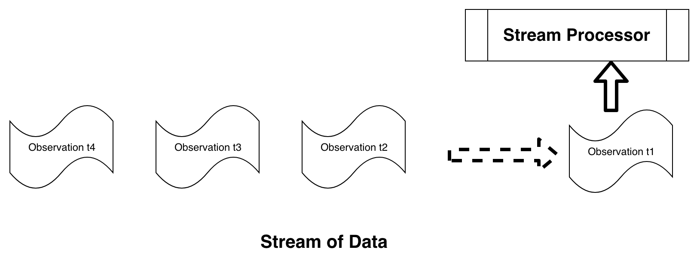
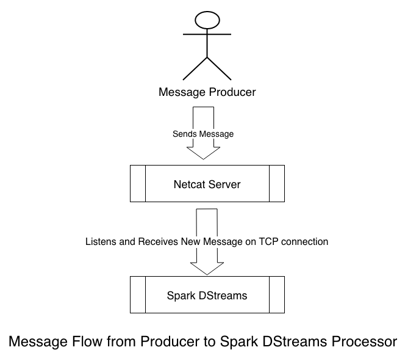
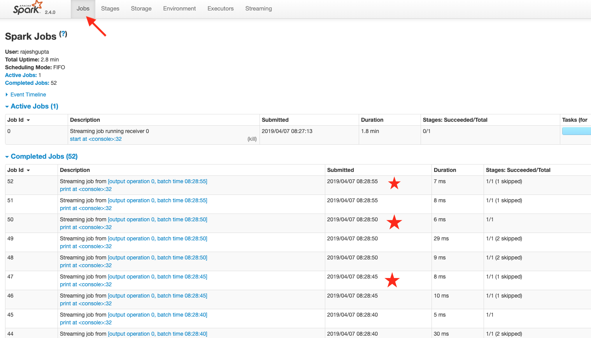
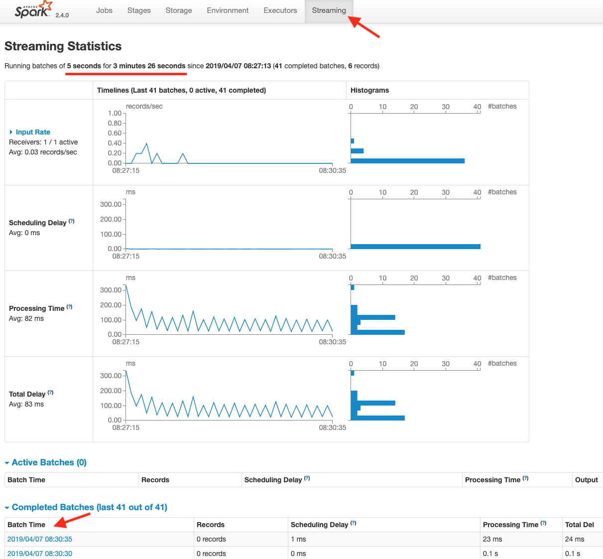

Lab 8. Near Real-Time Data Analysis Using Streaming
----------------------------------------------------------------


Stream processing is the act of continuously computing results as new data becomes available. A very simple example
of this is computing the average of some numbers in a
continuous fashion. To begin with, we start with the following
information:


-   Number of items = 0
-   Current average = 0


As a new number comes in, we perform the following steps:


1.  Compute a new total = Number of items x Current average + New number
2.  Increment the number of items by one
3.  Set the current average = New total / Number of items


As you can see, the continuous average computation algorithm is quite
different from the batch-oriented algorithm. It is important to bear in
mind the following facts when using this algorithm:


-   The average value gets updated as new numbers become available
-   The previously computed average value is reused to compute a new
    average


The following recipe using Scala code illustrates this:


1.  Define a Scala function called `runningAverage` that will
    be used to provide an updated running average based on the previous
    running average and new items received, as follows:


```
scala> def runningAverage(prevAvgCount: Tuple2[Double, Long], 
       newItems: Array[Int]): Tuple2[Double, Long] = {
     | val prevAverage = prevAvgCount._1
     | val prevItemCount = prevAvgCount._2
     | val newTotal = prevAverage * prevItemCount + newItems.sum
     | val newItemCount = prevItemCount + newItems.size
     | val newAverage = newTotal / newItemCount
     | Tuple2(newAverage, newItemCount)
     | }

runningAverage: (prevAvgCount: (Double, Long), newItems: Array[Int])    
                (Double, Long)
```


2.  Using the following code, initialize the current average count as
    `(0.0, 0)`, where `0.0` is the current average
    and `0` is the number of items:


```
scala> var currentAvgCount = Tuple2(0.0, 0L)

currentAvgCount: (Double, Long) = (0.0,0)
```


3.  Compute the initial running average for three new
    items, `(1, 2, 3)`, with the expected running average
    of `(2.0, 3)` using the following code:


```
scala> currentAvgCount = runningAverage(currentAvgCount, 
                                        Array(1,2,3))
currentAvgCount: (Double, Long) = (2.0,3)
```

 


4.  Using the following code, update the current running average by
    adding `4` as a new item, creating an expected running
    average of `(2.5, 4)`:


```
scala> currentAvgCount = runningAverage(currentAvgCount, Array(4))

currentAvgCount: (Double, Long) = (2.5,4)
```


5.  Using the following code, repeat the preceding step for
    `5`, creating the expected running average
    of `(3.0, 5)`:


```
scala> currentAvgCount = runningAverage(currentAvgCount, Array(5))

currentAvgCount: (Double, Long) = (3.0,5)
```


6.  Using the following code, repeat the preceding step for
    `6`, creating the expected running average
    of `(3.5, 6)`:


```
scala> currentAvgCount = runningAverage(currentAvgCount, Array(6))

currentAvgCount: (Double, Long) = (3.5,6)
```


7.  Using the following code, repeat the
    preceding step for `7`, creating the expected running
    average of `(4.0, 7)`:


```
scala> currentAvgCount = runningAverage(currentAvgCount, Array(7))

currentAvgCount: (Double, Long) = (4.0,7)
```

The previously mentioned `runningAverage` method is a Scala
function that is able to compute the new average given the following
information:


-   A tuple consisting of the previous average and previous item count
-   An array of integers consisting of new items


If we compare the aformentioned algorithm to a simple average
computation, we can observe some key differences:


1.  Define a Scala function called `simpleAverage` that takes
    an array of items as input, computes the average of all items in the
    input, and returns this average value, as follows:


```
scala> def simpleAverage(items: Array[Int]): Double = 
                          items.sum.toDouble / items.size

simpleAverage: (items: Array[Int])Double
```

 


2.  Compute the average of `(1, 2, 3)` using
    the `simpleAverage` function, as follows:


```
scala> simpleAverage(Array(1, 2, 3))
res0: Double = 2.0
```


3.  Repeat the average computation for arrays of different sizes, as
    follows:


```
scala> simpleAverage(Array(1, 2, 3, 4))
res1: Double = 2.5

scala> simpleAverage(Array(1, 2, 3, 4, 5))
res2: Double = 3.0

scala> simpleAverage(Array(1, 2, 3, 4, 5, 6))
res3: Double = 3.5

scala> simpleAverage(Array(1, 2, 3, 4, 5, 6, 7))
res4: Double = 4.0
```

Some of the key differences to be noted are as follows:


-   The `simpleAverage` function requires all of the input
    items to be provided in order to compute the average. In contrast,
    `runningAverage` only needs previously computed results
    and new items to perform computations.
-   `simpleAverage` does not hold and rely on any state
    information. On the other hand, `runningAverage` requires
    previously computed results to be preserved for the next iteration
    of computation.
-   `runningAverage` can potentially operate on a very large
    number of items by working incrementally on small batches of items.
    For `simpleAverage`, all of the items have to be present
    at the time of computation, and its functionality becomes limited
    for a large number of items.

 

The following diagram illustrates the general model of
stream processing, where a **stream
processor** is acting upon one or more observations at a time:





### Word count using pure Scala


Generating a word count is a classic problem that is widely
used to demonstrate some key concepts related
to solving problems involving a massive dataset. At a high level, the
objective of the word count problem is to count the frequencies of each
distinct word in a document.

First, let\'s look at solving this problem in Scala without using Spark.
For the sake of simplicity, we will treat the same word with different
cases as distinct words. Try using the following Scala REPL as follows:


1.  Create some sample text data using the following code:


```
scala> val text = "This is a sample for testing word count example   
       It should count the frequency of each distinct word"

text: String = This is a sample for testing word count example It   
               should count the frequency of each distinct word
```


2.  Split the data using white space as the delimiter, as follows. This
    provides us with an array of strings:


```
scala> val words = text.split("\\s+") // split on white spaces

words: Array[String] = Array(This, is, a, sample, for, testing, 
                             word, count, example, It, should,  
                             count, the, frequency, of, each,  
                             distinct, word)
```

 


3.  Group these same words together by using the `groupBy`
    method of the Scala array, as follows. We get a mapping from word to
    array, where the word is repeated as many times as it occurs in the
    data:


```
scala> val grouped = words.groupBy(w => w) // group same words together

grouped: scala.collection.immutable.Map[String,Array[String]] = Map(for -> Array(for), count -> Array(count, count), is -> Array(is), This -> Array(This), a -> Array(a), each -> Array(each), testing -> Array(testing), should -> Array(should), distinct -> Array(distinct), sample -> Array(sample), It -> Array(It), frequency -> Array(frequency), example -> Array(example), word -> Array(word, word), of -> Array(of), the -> Array(the))
```


4.  Count the number of words in each array by applying the
    `mapValues` method, as follows. This provides us with
    another map, where the key represents a distinct word and the value
    represents the number of occurrences of that word:


```
scala> val wordCount = grouped.mapValues(_.size) // count the number of elements for each key

wordCount: scala.collection.immutable.Map[String,Int] = Map(for -> 1, count -> 2, is -> 1, This -> 1, a -> 1, each -> 1, testing -> 1, should -> 1, distinct -> 1, sample -> 1, It -> 1, frequency -> 1, example -> 1, word -> 2, of -> 1, the -> 1)
```

There are multiple ways to solve the word count problem in Scala. The
preceding example is one such way. We performed the following actions:


1.  Split the text into an array of words by splitting it with white
    spaces.
2.  Grouped the same words together into a map whose key is the word and
    whose values are an array of the word repeated as the occurrence of
    that word.
3.  Next, we mapped the values of grouped results into the count of the
    number of elements. This gave us a map of the distinct word to the
    associated count.


 


### Word count using Scala and Spark


Next, let\'s look at solving the same
word count problem in Spark. Try going
through the following steps:


1.  Start a Spark shell session in your Terminal, as follows:


```
$ spark-shell
```


2.  Define the sample test data. We will use the same text as the
    previous example, as shown in the following code:


```
scala> val text = "This is a sample for testing word count example 
                   It should count the frequency of each distinct 
                   word"

text: String = This is a sample for testing word count example It 
               should count the frequency of each distinct word
```


3.  Convert the sample data into a Spark
    **resilient distributed dataset** (RDD) using
    `SparkContext`, given as the variable `sc` in
    the session, as shown in the following code:


```
scala> val rdd = sc.parallelize(Seq(text)) // convert to an RDD

rdd: org.apache.spark.rdd.RDD[String] = ParallelCollectionRDD[8] at parallelize at <console>:26
```


4.  Split the data using white spaces as the delimiter and map each word
    to a pair (word, 1) and sum the value according to distinct word, as
    follows:


```
// flat map of splits, word to count 1 and reduce by adding counts // of a word
scala> val wc = rdd.flatMap(_.split("\\s+")).map(w => (w, 
                            1)).reduceByKey(_+_) 

wc: org.apache.spark.rdd.RDD[(String, Int)] = ShuffledRDD[11] at reduceByKey at <console>:25
```

 


5.  Finally, collect the results to force Spark to execute the recipe we
    built earlier, as follows:


```
scala> wc.collect
res0: Array[(String, Int)] = Array((testing,1), (a,1), (each,1), 
                             (for,1), (the,1), (example,1), (is,1),  
                             (word,2), (sample,1), (should,1),  
                             (It,1), (frequency,1), (distinct,1),  
                             (This,1), (of,1), (count,2))
```

As we can see in the previous steps, we are able to produce the same
results using Spark; however, the recipe has the following important
differences compared to a pure Scala solution:


-   We had to create an RDD from the input text. At first, this might
    seem an inconvenient and unnecessary step; however, RDD is the
    feature of Spark that provides the foundation for distributed
    computing and performing data processing at scale.
-   We used the `flatMap` API of RDD to split each word as an
    individual item.
-   Next, we mapped each word as a tuple of the word and `1`
    as the count.
-   We used the `reduceByKey` API of RDD to sum the count of
    each word. This gave us a new RDD that had the desired results of
    the words and their associated counts.
-   We performed a collect operation on RDD to gather the results.
    Please note that Spark transformations, such as `flatMap`,
    `map`, and `reduceByKey`, are all lazily
    evaluated. An action such as collect materializes the results.


### Word count using Scala and Spark Streaming


As a next step, we will look at solving this problem in a streaming
fashion using Spark DStreams. We will use the **Transmission Control Protocol** (**TCP**) as a means of sending
data to the stream processor using a tool
called `netcat` (or `nc`). The `nc` tool
is a simple but powerful utility tool
available on most Linux distributions and
macOS. The recipe here uses macOS, as follows:


1.  Let\'s first start the `nc` server process on one
    Terminal, as follows:


```
$ nc -kl 12345 # 12345 is the port number server listens
```

 


2.  On another Terminal, start the `nc` client that connects
    to this server:


```
$ nc localhost 12345 # client connects to server on localhost at port 12345
```


3.  At this point, the client has established a connection. Now, enter
    some text on the server screen and hit [*Enter*]. This
    text should be displayed back on the client screen as well, showing
    text similar to the following:


```
$ nc -kl 12345 # Server
Here is some text
Here is some more text

$ nc localhost 12345 # Client
Here is some text
Here is some more text
```

This test is to make sure that the `nc` setup is working
correctly. For the Spark DStreams exercise, we just need the
`nc` server process to be running since the Spark DStreams
process will act as a client process. You can kill the client process
now by pressing [*Control*] + [*C*] on that
Terminal. Please make sure that the `nc` server process keeps
running. Here is an overview of data flow between the three
participants:





Now, we will set up a Spark Streaming context by going through the
following steps:


1.  Start the Spark shell, as follows:


```
$ spark-shell
```


2.  Using the following code, stop the current Spark session, because
    the default session does not support streaming:


```
scala> spark.stop() // stop the existing Spark session
```


3.  Import the `org.apache.spark` package using the following;
    this is needed for setting the Spark configuration for Spark
    Streaming:


```
scala> import org.apache.spark._import org.apache.spark._
```


4.  Import the `org.apache.spark.streaming` package using the
    following; this is needed for setting up the Spark Streaming
    session:


```
scala> import org.apache.spark.streaming.
                  _importorg.apache.spark.streaming._
```


5.  Create a new Spark configuration using the following code, making
    sure that at least two cores are reserved:


```
scala> val conf = new SparkConf().setMaster("local[2]").setAppName("HandsOnSparkStreaming") // least two cores are required to prevent a starvation scenario
conf: org.apache.spark.SparkConf = org.apache.spark.SparkConf@3031d9e9
```


6.  Create a Spark `StreamingContext` using the preceding
    Spark configuration, as follows:


```
scala> val ssc = new StreamingContext(conf, Seconds(5)) // 5 seconds: the time interval at which streaming data will be divided into batches

ssc: org.apache.spark.streaming.StreamingContext = org.apache.spark.streaming.StreamingContext@40874f54
```


7.  Set up a `.checkpoint` directory as follows:


```
scala> ssc.checkpoint(".") // use current directory for checkpoint
```

 

We have already done the following:


-   Stopped the existing Spark session because we needed a
    `StreamingContext` instead.
-   Set up a `StreamingContext` with two cores.
-   Set up the current directory as a checkpoint. This is needed for
    stateful stream processing.


Next, let\'s define the `RunningUpdate` Scala `case`
object and test it by going through the following steps:


1.  Define `RunningUpdate`, as follows:


```
scala> // Define a Serializeable running update function

scala> case object RunningUpdate { // this makes the object Serializeable
     | val updateCount = (newValues: Seq[Int], runningCount: 
       Option[Int]) => {
     | val newCount = runningCount.getOrElse(0) + newValues.sum
     | Some(newCount): Option[Int]
     | }
     | }

defined object RunningUpdate
```

The `RunningUpdate` object has the following properties:


-   It is a Scala `case` object, which makes this
    serializable. This is needed for it to work with Spark Streaming
    because of its distributed nature.
-   It holds a method, `updateCount`, which takes a sequence
    of new values and the running count. This method returns the new
    running count.


2.  Test the `RunningUpdate`, as follows:


```
scala> RunningUpdate.updateCount(Seq(1, 2, 3), Some(10)) // test update: expected 1+2+3+10 = 16

res2: Option[Int] = Some(16)
```

The Spark Streaming framework will invoke this
`updateCount`method automatically, as we will see:


1.  Set up a socket text stream on the localhost at port
    `12345` as follows. Please note the our `nc`
    server is running on the localhost at this port. By doing this, we
    can start receiving messages from the `nc` server in a
    streaming fashion:


```
scala> val lines = ssc.socketTextStream("localhost", 12345) // 12345 is the netcat server port

lines: org.apache.spark.streaming.dstream.ReceiverInputDStream[String] = org.apache.spark.streaming.dstream.SocketInputDStream@4bb05a4e
```


2.  Split each line in the stream into words, as follows:


```
scala> val words = lines.flatMap(_.split("\\s+"))
words: org.apache.spark.streaming.dstream.DStream[String] = org.apache.spark.streaming.dstream.FlatMappedDStream@60877629
```


3.  Map each word as a `(word, 1)` key--value pair, as
    follows:


```
scala> val pairs = words.map(word => (word, 1))

pairs: org.apache.spark.streaming.dstream.DStream[(String, Int)] = org.apache.spark.streaming.dstream.MappedDStream@531f6879
```


4.  Apply the `updateCount`
    function, `RunningUpdate`, in a stateful way, as follows:


```
scala> val runningCounts = pairs.updateStateByKey[Int](RunningUpdate.updateCount) // apply running update on stream

runningCounts: org.apache.spark.streaming.dstream.DStream[(String, Int)] = org.apache.spark.streaming.dstream.StateDStream@4819a11f
```


5.  Print out sample running counts, as follows:


```
scala> runningCounts.print()
```


6.  So far, we have built the recipe for streaming. The stream
    processing has not started as yet. Start stream processing now using
    the following code:


```
scala> ssc.start() // Start the computation
```

 


7.  Set up a reasonable timeout to receive the control back into the
    Spark shell, as follows:


```
scala> ssc.awaitTerminationOrTimeout(1000*60*5) // Wait for 5 minutes before timing out
```

We have done the following in the preceding code example:


-   Connected to our `nc` server running on the localhost at
    port `12345` to receive messages as single lines of text.
-   Applied a recipe similar to Spark on each line of text by using
    `flatMap` and map APIs.
-   Applied a running update state to each pair by running them through
    the `RunningUpdate.updateCount` function.
-   Printed running counts.
-   Started the Spark Streaming process. Work starts to get performed
    only after the invocation of this method.


On the netcat screen, input some text messages introducing some intermediate
delays between each message typing. The following code is an example of
this:

```
$ nc -kl 12345
hello world
hello
hello
world
how are you
hello again
```

On your Spark shell, you should see the counts being updated as this
happens, along with some debug information outputted by Spark Stream.
The following code is an example based on the input provided using the
preceding netcat example:

```
...
(hello,1)
(world,1)
...
(hello,2)
(world,1)
...
(hello,3)
(world,2)
...
(are,1)
(how,1)
(hello,4)
(again,1)
(world,2)
(you,1)
```

Run the following code to gracefully stop the Spark Streaming process
and quit Spark shell:

```
scala> ssc.stop()

scala> :quit
```

You can also terminate the netcat server process if required by pressing
[*Control*] + [*C*] on the Terminal.

You should now see that Spark Streaming provides a powerful framework
for performing continuous computations as new data arrives. It also
provides new UI-based tools to look at stream processing details and the
performance statistics of the job. This can be done by going to the
URL, `http://localhost:4040`, in your web browser. The first
set of interesting information is found under the `Jobs` tab, as
shown in the following screenshot:





 

The `Jobs` tab shows the overall progress of the job. You can see
that the work is being completed at intervals of five seconds, since we
defined our batch window as a five-second interval. Depending on the use
case, an appropriate value for the interval can be chosen. In an
application where the response time is
critical, a lower value can be selected. A higher value provides more
efficiency, since processing happens in bigger
batches; however, this comes at the cost of a
slower response time.

Another interesting tab to look at in this UI is the `Streaming`
tab, as shown in the following screenshot:





 

The `Streaming` tab provides performance statistics from several
different perspectives. This is a very useful tool for streaming jobs
that run in production because it provides a fairly good insight into
any potential delays with stream processing. One of the main reasons for
moving toward stream-oriented processing is that it performs
computations as new data arrives and provides insight based on the new
information. Any unexpected delays in processing data would be
undesirable, and this specific dashboard can act as a good tool to
determine whether delays are occurring.


### Deep dive into the Spark Streaming solution


Let\'s look at how the Spark Streaming solution was used to solve the word count problem. There are a few important
pieces of information that we need to take a look at in order to
understand this solution.

The first important piece is the `RunningUpdate` object, which
is a Scala case object. One important feature of the Scala
`case` object and objects created from the Scala
`case` class is that the objects are serializable. This object
holds a running update function that is assigned to
the `updateCount` Scala value, as follows:

```
case object RunningUpdate { // this makes the object serializable
  val updateCount = (newValues: Seq[Int], runningCount: Option[Int]) => {
    val newCount = runningCount.getOrElse(0) + newValues.sum
    Some(newCount): Option[Int]
  }
}
```

This object needs to be serializable because Spark is a distributed
system, and it ships the code to workers. The code shipped must be
serializable and a worker will receive this code. The worker
deserializes the code received and applies this code to a piece of data
it is working on.

The second important piece of information is the following code that
uses the `updateStateByKey` API of Spark Streaming:

```
val runningCounts = pairs.updateStateByKey[Int](RunningUpdate.updateCount)
```

 

We are passing the `RunningUpdate` object\'s
`updateCount` function as a parameter to
the `updateStateByKey` method on the pairs stream. We can
envision the pairs stream as a mapping from the word to the current
count, as follows:


-   The word is the key
-   The current count is the value


It is also not the signature of `updateCount`. The first
parameter is a sequence of integers, where the second parameter is an
optional parameter. The following list goes into more detail:


-   `newValues`: A sequence of integers containing newly
    observed counts for a specific word.
-   `runningCount`: The current running count for the same
    word. This value is `none` at the start of the stream and
    when a word is observed for the first time by the stream. Its value
    is `Some(newcount)` if the word has been seen earlier.


The final import part is the `flatMap` and `map`
APIs, as shown in the following code:

```
val ssc = new StreamingContext(conf, Seconds(5))
...
val lines = ssc.socketTextStream("localhost", 12345) // 12345 is the netcat server port
val words = lines.flatMap(_.split("\\s+"))
val pairs = words.map(word => (word, 1))
val runningCounts = pairs.updateStateByKey[Int](RunningUpdate.updateCount) // apply running update on stream
runningCounts.print()
ssc.start() // Start the computation
```

Even though `flatMap` and `map` seem to be working
like standard Spark APIs, they are working on Spark DStreams. They have
the following characteristics:


-   `lines` represent a minibatch of data received within the
    `5` second window
-   `flapMap` and `map` are applied to this
    minibatch
-   The same is true for `updateStateByKey`


 

The stream is started only when `ssc.start()` is executed, and
the following piece of the recipe is repeated
over and over again for each batch window until the stream is stopped:

```
val words = lines.flatMap(_.split("\\s+"))
val pairs = words.map(word => (word, 1))
val runningCounts = pairs.updateStateByKey[Int](RunningUpdate.updateCount) // apply running update on stream
runningCounts.print()
```

We can also rewrite the preceding code in the following way with
identical results:

```
ssc.socketTextStream("localhost", 12345).
  flatMap(_.split("\\s+")).
  map(word => (word, 1)).
  updateStateByKey[Int](RunningUpdate.updateCount).
  print()
```

Please note that `socketTextStream` is called only once;
however, the following are called for each minibatch, in this order:


-   `flatMap`
-   `map`
-   `updateStateByKey`
-   `print`


Since this is a stateful stream, we also need checkpointing to persist
states, as follows:

```
ssc.checkpoint(".") // use current directory for checkpoint
```

For more information on the checkpoint, please refer to the Apache Spark
documentation for Spark DStreams
at <https://spark.apache.org/documentation.html>.

Let\'s now put this all together in plain Scala to understand the flow
by going through the following steps. We will use the same inputs as we
provided to the netcat server:


1.  Define an `updateCount` method as follows:


```
scala> val updateCount = (newValues: Seq[Int], runningCount: Option[Int]) => {
     | val newCount = runningCount.getOrElse(0) + newValues.sum
     | Some(newCount): Option[Int]
     | }
updateCount: (Seq[Int], Option[Int]) => Option[Int] = $$Lambda$3671/605827193@2fdd23c1
```

 


2.  Create `inputs` as arrays of texts, as follows:


```
scala> val inputs = Array("hello world", "hello", "hello", "world", "how are you", "hello again")

inputs: Array[String] = Array(hello world, hello, hello, world, how are you, hello again)
```


3.  Import Scala\'s `mutable.Map`, as follows. This is needed
    because we will need a map that cannot be updated:


```
scala> import collection.mutable.Map
import collection.mutable.Map
```


4.  Create a `mutable.Map` as follows:


```
scala> val wordToCount = Map[String, Int]()
wordToCount: scala.collection.mutable.Map[String,Int] = Map()
```


5.  For each element in the inputs, process and apply the update as
    follows:


```
scala> inputs.foreach(i => {val words = i.split("\\s+").groupBy(w => w).mapValues(vs => vs.map(v => 1).toSeq).foreach(
     | wc => {
     | val word = wc._1
     | val newValues = wc._2
     | val runningCount = if (wordToCount.contains(word)) Some(wordToCount(word)) else None
     | val updatedCount = updateCount(newValues, runningCount)
     | wordToCount(word) = updatedCount.get
     | }); println(wordToCount);
     | })
Map(world -> 1, hello -> 1)
Map(world -> 1, hello -> 2)
Map(world -> 1, hello -> 3)
Map(world -> 2, hello -> 3)
Map(you -> 1, how -> 1, world -> 2, are -> 1, hello -> 3)
Map(again -> 1, you -> 1, how -> 1, world -> 2, are -> 1, hello -> 4)
```

We defined a `mutable.Map` that holds the running count for
each unique word. To begin with, the `Map` is empty. As we
iterate through each input record, the counts are updated for each
observed word. When we use Spark Streaming, this all happens under the
hood, and the streaming framework repeats the loop with each new batch
of data. It also keeps track of the state in a similar way to
the`mutable.Map `and `wordToCount` method that we
described previously.

The preceding illustration provides some insight into what Spark
Streaming does to process this data continuously. One of the biggest
advantages of using a framework such as Spark is that it also provides
stream processing with fault tolerance. Fault tolerance semantics can
become fairly complex in the case of stateful processing, such as the
example we just explored. Spark provides certain guarantees of how this
works. Please refer to the Apache Spark Streaming documentation for more
details on this at <https://spark.apache.org/documentation.html>.


Streaming a k-means clustering algorithm using Spark
----------------------------------------------------------------------


The k-means algorithm is an unsupervised **machine learning**
(**ML**) clustering algorithm. The objective of this
algorithm is to build [*k*] centers around which data points
are centered, thereby forming
clusters. The most common implementation of
this algorithm is generally done using
batch-oriented processing. Streaming-based clustering algorithms are
also available for this, with the following properties:


-   The [*k*] clusters are built using initial data
-   As new data arrives in minibatches, existing [*k*]
    clusters are updated to compute new [*k*] clusters
-   It also possible to control the decay or decrease in the
    significance of older data


At a high level, the preceding steps are quite similar to the word count
problem that we solved using the streaming solution. The goal of the
k-means algorithm is to partition the data into [*k*]
clusters. If the data is static and does not change,
then [*k*] clusters can be formed and will also remain
static. On the other hand, if new data is arriving, new [*k*]
clusters need to be computed, and these will change based on the
combined properties of old and new data. A streaming-based
[*k*]-means algorithm works on a minibatch of new data.

In Spark Streaming and Spark MLlib , the clusters can be computed
dynamically as the new data arrives as part of a data stream. The
Spark API is defined here
at <https://spark.apache.org/docs/2.4.1/api/java/index.html?org/apache/spark/mllib/clustering/StreamingKMeans.html>.

 

To initialize a `StreamingKMeans` object, the following needs
to be done using the builder pattern:


-   Instantiate the `StreamingKMeans`
    object---new `StreamingKMeans()`
-   Set the number of clusters as `setK(k)`
-   Set the decay factor using `setDecayFactor(decayFactor)`
-   Set initial random centers using
    `setRandomCenters(dimension, weight, seed)`
-   We finally get a model that can be trained in a streaming fashion
    and can be used to make predictions


Let\'s set this up in a Spark shell by going through the following
steps:


1.  Start a Spark shell on the Terminal, as follows:


```
$ spark-shell
```


2.  Using the following code, stop the current Spark session because it
    does not support Streaming. We need to explicitly create a Spark
    Streaming session:


```
scala> spark.stop() // stop current Spark session
```


3.  Import the Spark package using the following code. This is needed to
    configure Spark:


```
scala> import org.apache.spark._
import org.apache.spark._
```


4.  Using the following code, import the Spark Streaming package, which
    is needed to set up the Spark Streaming session:


```
scala> import org.apache.spark.streaming._
import org.apache.spark.streaming._
```


5.  Import the `StreamingKMeans` class from the Spark
    `MLlib` package, as follows:


```
scala> import org.apache.spark.mllib.clustering.StreamingKMeans
import org.apache.spark.mllib.clustering.StreamingKMeans
```

 


6.  Create a new Spark configuration as follows, making sure that at
    least two cores are allocated for processing:


```
scala> val conf = new SparkConf().setMaster("local[2]").setAppName("HandsOnKMeanStreaming")

conf: org.apache.spark.SparkConf = org.apache.spark.SparkConf@1483c738
```


7.  Create a Spark Streaming context as follows:


```
scala> val ssc = new StreamingContext(conf, Seconds(30))
ssc: org.apache.spark.streaming.StreamingContext = 
         org.apache.spark.streaming.StreamingContext@7a5a26b7
```


8.  Initialize the `StreamingKmeans` object:


```
scala> val model = new StreamingKMeans().
 | setK(4). // number of clusters
 | setDecayFactor(1.0). // decay
 | setRandomCenters(3, 0.0) // 3 dimensions and 0 weight
model: org.apache.spark.mllib.clustering.StreamingKMeans = 
       org.apache.spark.mllib.clustering.StreamingKMeans@2e1b1d22
```

The preceding code is quite similar to the one used for the word count,
with the following important properties:


-   We set the Spark Streaming context, `ssc`, in exactly the
    same way as the Streaming word count problem
-   We initialized a Spark Streaming k-means model with the desired set
    of parameters


The next steps are about creating a DStream that provides the input data
and trains the model using new batches of data coming on Spark DStreams,
and then finally starts the Streaming context. Look at the following
code:

```
...
model.trainOn(trainingData) // traningData is a Spark DStreams with data coming in mini batches
...
ssc.start()
...
```

 

To see this in action, let\'s start with some data preparation. Create a
new temporary directory in a suitable location for training and test
data. One good choice for such data is the `/tmp` directory on
Linux and macOS, as shown in the following code:

```
$ mkdir /tmp/k-means-train-data
$ mkdir /tmp/k-means-test-data
```

We will work with three-dimensional data to
explore and understand this. The format for
three-dimensional training data is as follows:

```
[n1, n2, n3]
```

The following is an example of training data:

```
[1000, 0, 0]
[1001, 0, 0]
[1002, 0, 0]
[1003, 0, 0]
[1004, 0, 0]
[1005, 0, 0]
[1006, 0, 0]
[1007, 0, 0]
[1008, 0, 0]
[1009, 0, 0]
[0, 1000, 0]
[0, 1001, 0]
[0, 1002, 0]
[0, 1003, 0]
[0, 1004, 0]
[0, 1005, 0]
[0, 1006, 0]
[0, 1007, 0]
[0, 1008, 0]
[0, 1009, 0]
[0, 0, 1000]
[0, 0, 1001]
[0, 0, 1002]
[0, 0, 1003]
[0, 0, 1004]
[0, 0, 1005]
[0, 0, 1006]
[0, 0, 1007]
[0, 0, 1008]
[0, 0, 1009]
```

 

The format of test data is as follows:

```
(num, [n1, n2, n3]) 
```

The following is an example of test data:

```
(1, [1002, 0, 0])
(1, [1001, 0, 0])
(2, [0, 1002, 0])
(2, [0, 1001, 0])
(3, [0, 0, 1002])
(3, [0, 0, 1001])
```

To start exploring this algorithm, start a Spark shell and go through
the following steps:


1.  Start a Spark shell using the following command:


```
$ spark-shell
```


2.  Stop the current Spark session using the following command:


```
spark.stop() // stop current Spark session
```


3.  Import the necessary packages and classes as follows:


```
import org.apache.spark._
import org.apache.spark.streaming._
import org.apache.spark.mllib.clustering.StreamingKMeans
```


4.  Set up the Spark configuration and streaming context as follows:


```
val conf = new SparkConf().setMaster("local[2]").setAppName("HandsOnKMeanStreaming")
val ssc = new StreamingContext(conf, Seconds(10))
```


5.  Create a `StreamingKMeans` method by initializing the
    parameters. The following code is the model:


```
val model = new StreamingKMeans().
 setK(4). // number of clusters is 4
 setDecayFactor(1.0). // decay factor (the forgetfulness of the previous centroids)
 setRandomCenters(3, 0.0) // 3 dimensions and 0 weight
```

 


6.  Set up the training data stream as follows:


```
import org.apache.spark.mllib.linalg.Vectors 
val trainingData = ssc.textFileStream("file:/tmp/k-means-train-data").map(Vectors.parse).cache()
trainingData.print() // to output training data for debug purpose
```


7.  Set up the test data stream as follows:


```
import org.apache.spark.mllib.regression.LabeledPoint
val testData = ssc.textFileStream("file:/tmp/k-means-test-data").map(LabeledPoint.parse)
```


8.  Train the model on the data from the training data stream as
    follows:


```
model.trainOn(trainingData)
```


9.  Use the model to predict how to use the data from the test data
    stream, as follows:


```
model.predictOnValues(testData.map(lp => (lp.label,  
                                          lp.features))).print()
```


10. Start the streaming processing, as follows:


```
ssc.start()
```


11. Set a timeout for streaming processing to run before getting control
    back in the shell, as follows:


```
ssc.awaitTerminationOrTimeout(1000*60*3) // Wait for the computation to terminate (3 minutes)
```


12. Remember to stop the streaming context
    cleanly and exit the Spark shell when it
    is finished, as follows:


```
scala> ssc.stop()

scala> :quit
```

Go through the following steps to see k-means streaming-based clustering
in action:


1.  Copy a text file containing some training data in the previously
    specified training data format to
    the `/tmp/k-means-train-data` directory.
2.  Copy a text file containing some test data in the  previously
    specified test data format to the `/tmp/k-means-test-data`
    directory.


 


3.  Repeat the preceding steps with new training and test data copied to
    the respective directories. You should now see the clusters being
    updated continuously.


In your Spark shell, you can also see some additional details pertaining
to the latest model, as shown in the following code:

```
...
scala> model.latestModel.clusterCenters
res15: Array[org.apache.spark.mllib.linalg.Vector] = Array([0.0,1004.5,0.0], [502.2500000000017,3.3333333333333336E-15,502.2500000000017], [502.249999999995,-1.0E-14,502.249999999995])
...
scala> model.latestModel.clusterWeights
res16: Array[Double] = Array(20.0, 30.0, 10.0)
```

We initially started with random centers and zero weights. As the
training data passes through the streaming k-means `trainOn`
API, it recomputes new centers and weights. Using the decay factor, the
significance of aged data can also be controlled.


Streaming linear regression using Spark
---------------------------------------------------------


Using Spark Streaming, it is possible to update the parameters of the linear
model online. In many ways, Spark Streaming\'s linear regression
solution works very similarly to the k-means streaming solution.

We will be using the `StreamingLinearRegressionWithSGD` class
that is provided as part of Spark MLlib. To initialize a
`StreamingLinearRegressionWithSGD` object, the following needs
to be done:


1.  Instantiate the `StreamingLinearRegressionWithSGD` object
    using the `new StreamingLinearRegressionWithSGD()` method
2.  Set the number of initial weights
3.  We should get a model that can be trained in a streaming fashion and
    can be used to make predictions


Let\'s explore this solution in a Spark shell by going through the
following steps:


1.  Start a Spark shell in your Terminal as follows:


```
$ spark-shell
```


2.  Stop the current Spark session using the following code, since we
    need to explicitly create a streaming session:


```
scala> spark.stop() // stop current Spark session
```


3.  Using the following code, import the `spark` package,
    which is required to configure Spark:


```
scala> import org.apache.spark._
import org.apache.spark._
```


4.  Use the following code to import the Spark Streaming package, which
    is needed for Spark Streaming:


```
scala> import org.apache.spark.streaming._
              import org.apache.spark.streaming._
```


5.  Use the following code to import the `Vectors` from Spark
    MLlib\'s linear algebra package:


```
scala> import org.apache.spark.mllib.linalg.Vectors
import org.apache.spark.mllib.linalg.Vectors 
```


6.  Use the following code to import `LabelPoint` from Spark
    MLlib\'s `regression` package:


```
scala> import org.apache.spark.mllib.regression.LabeledPoint
import org.apache.spark.mllib.regression.LabeledPoint
```


7.  Import the `StreamingLinearRegressionWithSGD` class from
    Spark MLlib\'s `regression` package using the following
    code:


```
scala> import   
  org.apache.spark.mllib.regression.StreamingLinearRegressionWithSGD
import 
  org.apache.spark.mllib.regression.StreamingLinearRegressionWithSGD
```

 

 

 

 


8.  Using the following code, set up Spark\'s configuration, making sure
    that there are at least two cores allocated for processing:


```
scala> val conf = new SparkConf().setMaster("local[2]").setAppName("HandsOnStreamingLinearReg")
conf: org.apache.spark.SparkConf = org.apache.spark.SparkConf@403b7be3
```


9.  Set up the Spark Streaming context using the following code:


```
scala> val ssc = new StreamingContext(conf, Seconds(10))
ssc: org.apache.spark.streaming.StreamingContext = org.apache.spark.streaming.StreamingContext@72bef795

scala> val numFeatures = 3
numFeatures: Int = 3

scala> val model = new StreamingLinearRegressionWithSGD().
 | setInitialWeights(Vectors.zeros(numFeatures))
model: org.apache.spark.mllib.regression.StreamingLinearRegressionWithSGD = org.apache.spark.mllib.regression.StreamingLinearRegressionWithSGD@5db6083b
```


10. Set the number of features to `3` (as we will be working
    with three-dimensional data) using the following code:


```
scala> val numFeatures = 3
numFeatures: Int = 3
```


11. Initialize the model, as follows:


```
scala> val model = new StreamingLinearRegressionWithSGD().
 | setInitialWeights(Vectors.zeros(numFeatures))
model: org.apache.spark.mllib.regression.StreamingLinearRegressionWithSGD = org.apache.spark.mllib.regression.StreamingLinearRegressionWithSGD@5db6083b
```

 


 

Just like the k-means streaming solution, the next step is to create a
DStreams that provides the input data and trains the model using new
batches of data coming on Spark DStreams. Then, we can finally start the
Streaming context. Let\'s set this up by going through the following
steps:


1.  Set up the training data stream as follows:


```
val trainingData = ssc.textFileStream("file:/tmp/lin-reg-train-
                       data").map(Vectors.parse).cache()
trainingData.print() // to output training data for debug purpose
```


2.  Set up the test data stream as follows:


```
val testData = ssc.textFileStream("file:/tmp/lin-reg-test-  
                   data").map(LabeledPoint.parse)
```


3.  Train the model on data from the training data stream, as follows:


```
model.trainOn(trainingData)
```


4.  Use the model to predict using data from the test data stream, as
    follows:


```
model.predictOnValues(testData.map(lp => (lp.label, lp.features))).print()
```


5.  Start the processing of streaming using the following command:


```
ssc.start()
```


6.  Set a timeout for the streaming processing to run before getting
    control back in the shell, as follows:


```
ssc.awaitTerminationOrTimeout(1000*60*3) // Wait for the computation to terminate (3 minutes)
```


7.  Remember to stop the streaming context cleanly and exit the Spark
    shell when finished, as follows:


```
scala> ssc.stop()

scala> :quit
```

To see this in action, let\'s start with some
data preparation. Create a new temporary directory in a suitable location for training and test data. One good
choice for this location is the `/tmp` directory on Linux and
macOS, as shown in the following code:

```
$ mkdir /tmp/lin-reg-train-data
$ mkdir /tmp/lin-reg-test-data
```

We will work with three-dimensional data to explore and understand this.
The format for three-dimensional training data is as follows:

```
(num, [n1, n2, n3])
```

Since linear regression is a supervised ML algorithm, we need to provide
labeled data for training. The following list shows the labels that are
used in detail:


-   `[n1, n2, n3]` represents a data point of three features
-   `num` represents the associated label or known observation


Summary
-------------------------


In this lab, we learned how to process data in near real time using
a streaming-based approach. Streaming processing is quite different from
traditional batch-oriented processing. Through a classic word count
example, we explored how streaming-oriented processing could be applied
to such problems to get near real-time updates. The streaming algorithm
is quite different from the classic solution to this problem, and
introduces a few complex concepts, such as state management. For all the
added complexity in the streaming solution, it is generally worth
employing because of the significantly improved response time in gaining
real-time details of the data that is being monitored.

We also looked at how to make use of the streaming-oriented approach for
ML. In the next lab, we will look at scalability concerns.
