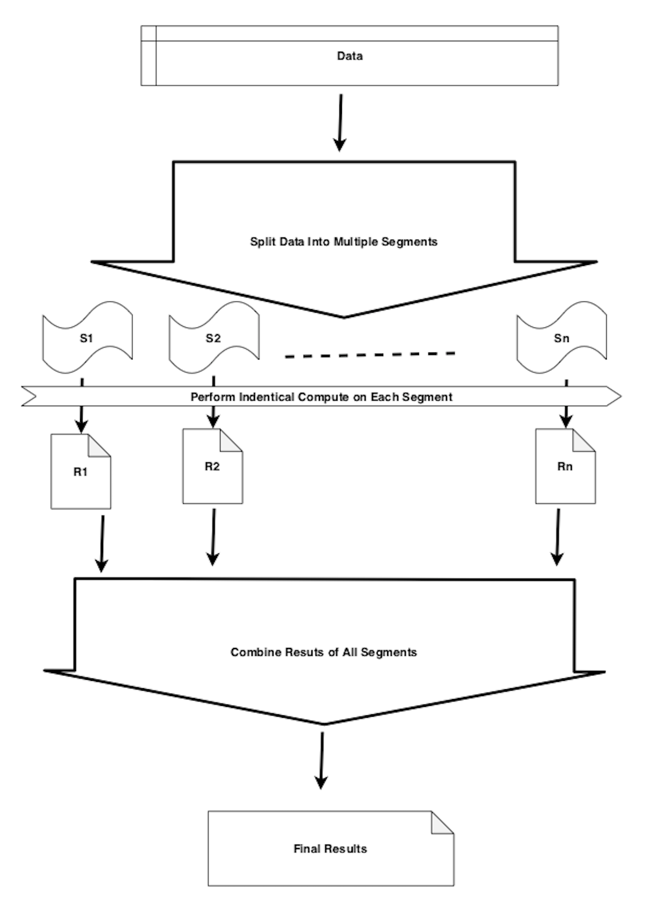
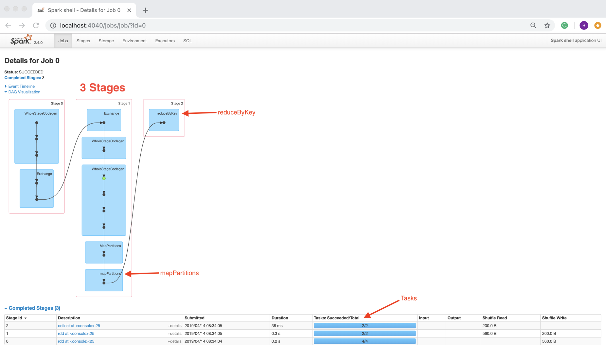
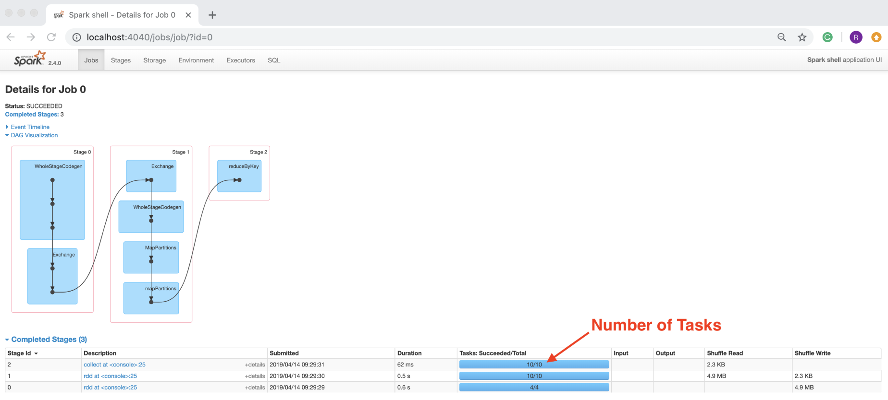

Lab 9. Working with Data at Scale
----------------------------------------------


In this lab, we will cover the following topics:


-   Working with data at scale
-   Cost considerations
-   Reliability considerations


Working with data at scale
--------------------------------------------


Working with data at scale and handling large data volumes significantly changes data analysis and processing.
To get an intuition for the problems with data at scale, let\'s look at
a simple problem of computing the median value of numbers. The median is
the mid-point that splits the data into two parts. Use the following
numbers as an example:

```
8 1 2 7 9 0 5 
```

We will first sort the numbers in ascending order:

```
0 1 2 5 7 8 9
```

The median value is `5`, because it splits the data into two
halves, where half of the values are below five and the another half are
above five.

Now, let\'s imagine that the count of these numbers was of the order of
billions. Let\'s explore a solution to this problem in Scala REPL.
Traditionally, we would need to do the following steps to compute the
median value:


1.  Load the data into memory on a single computer\'s process:


```
scala> val data = Array(8, 1, 2, 7, 9, 0, 5) // Step 1: set or load data
data: Array[Int] = Array(8, 1, 2, 7, 9, 0, 5)
```

We have used a very small sample of seven numbers. This is a good enough
size to understand the problem and appreciate the underlying issues with
the proposed solution.


2.  Sort the data in ascending order in the same process:


```
scala> val dataSorted = data.sorted // Step 2: sort the data
dataSorted: Array[Int] = Array(0, 1, 2, 5, 7, 8, 9)
```


3.  Extract the `median` value as a midpoint from the sorted
    data:


```
scala> val median = dataSorted(dataSorted.size/2) // Step 3: extract the median as midpoint from sorted data
median: Int = 5
```

This solution works well for small datasets, but it is unlikely to work
successfully for large datasets for the following reasons:

We are essentially facing two limitations of a single computer:


-   Limits on the total amount of main memory
-   Limits on the number of cores

 


Let\'s assume that the data in our current context has the following
properties:


-   All the records are integral numbers
-   The total count records are of the order of billions
-   The range of integral value is 1 to 1,000


1.  Create a dataset of 20 random integers in
    the`Range[0, 5)` class:


```
scala> val data = Range(0, 20).map(i => scala.util.Random.nextInt(5)) // Step 1: Create dataset of 20 random 
                                 integers in range [0, 5)
data: scala.collection.immutable.IndexedSeq[Int] = Vector(3, 2, 4, 2, 2, 3, 3, 1, 2, 4, 3, 3, 0, 0, 0, 1, 1, 4, 0, 3)
```

We used the Scala `Range` class to generate `20`
numbers from 0 to 19 and map each one of these to a random number from 0
to 4 using the `scala.util.Random` object\'s
`nextInt` method. We get a `Vector` object
consisting of 20 random numbers from 0 to 4.


### Note

Please note that each run of the preceding code would produce a
different result because of the randomizing involved.


2.  Get the `distinct` values from the dataset:


```
scala> data.distinct 
scala> val dataDist = data.distinct // Step 2: Get distinct values
dataDist: scala.collection.immutable.IndexedSeq[Int] = Vector(3, 2, 
                                                       4, 1, 0)
```

 

 

We use the `distinct` method of the `Vector` object
that returned a new vector consisting of the
five distinct values. We can indeed see that distinct
values are 0 through 4, as expected. This
kind of data analysis is sometimes known as **frequency analysis**.


3.  Get `counts` for each distinct value:


```
scala> val counts = data.map(i => (i, 1)).groupBy(_._1).mapValues(_.size) // Step 3: Get counts for each distinct value

counts: scala.collection.immutable.Map[Int,Int] = Map(0 -> 4, 1 -> 3, 2 -> 4, 3 -> 6, 4 -> 3)
```


Let\'s explore the algorithm in Scala REPL using a concrete example:


1.  Create a sample dataset of 20 random integers in `range(0, 5)`:


```
scala> val data = Range(0, 20).map(i => scala.util.Random.nextInt(5)) // Step 1: Create dataset of 20 random integers in range [0, 5)

data: scala.collection.immutable.IndexedSeq[Int] = Vector(3, 2, 4, 2, 2, 3, 3, 1, 2, 4, 3, 3, 0, 0, 0, 1, 1, 4, 0, 3)
```

This dataset is the same dataset that was used in the previous example.


2.  Count the number of occurrences for each distinct value:


```
scala> val counts = data.map(i => (i, 1)).groupBy(_._1).mapValues(_.size) // Count number of occurences for each distinct value

counts: scala.collection.immutable.Map[Int,Int] = Map(0 -> 4, 1 -> 3, 2 -> 4, 3 -> 6, 4 -> 3)
```

The counts a`Map` object and it has a mapping from the value
to the number of its occurrences.


3.  Sort the counts by the value part:


```
scala> val sortedCounts = counts.toArray.sortBy(_._1) // Sort by value

sortedCounts: Array[(Int, Int)] = Array((0,4), (1,3), (2,4), (3,6), (4,3))
```

 

We used the `sortBy` method array to perform the sort. The
method accepts an argument that defines the field to be used for
sorting. We used the value part by using the `_._1` Scala
notation. This is shorthand for indicating the first element of the
incoming object. In this case, the incoming object is a Scala tuple of
`[Int, Int]`.


4.  Compute the range index for each distinct value:


```
scala> val valuesWithIndex = {var currentTotal = 0; sortedCounts.map(kv => {val from = currentTotal; currentTotal += kv._2; val to = currentTotal -1; (kv._1, from, to)})} // Compute range index for each distinct value
valuesWithIndex: Array[(Int, Int, Int)] = Array((0,0,3), (1,4,6), (2,7,10), (3,11,16), (4,17,19))
```

This assigns an index range to each distinct value. The smallest value
starts with an index of zero. This concept is discussed in more detail
later in this lab.


5.  Compute the left index of the mid-point:


```
scala> val leftMidPointIdx = if (data.size % 2 == 0) data.size/2-1 else data.size/2 // left index of mid-point
leftMidPointIdx: Int = 9
```


For an odd number of records, the left and right mid-points are the
same.


6.  Compute the right index of the mid-point:


```
scala> val rightMidPointIdx = data.size/2 // right mid-point index
rightMidPointIdx: Int = 10
```

The right index does not depend upon whether a dataset has an even or an odd number of records.


7.  Filter out the entries that are not in the range of the left and
    right mid-points:


```
scala> val midPoints = valuesWithIndex.filter(v => (leftMidPointIdx >= v._2 && leftMidPointIdx <= v._3) || (rightMidPointIdx >= v._2 && rightMidPointIdx <= v._3)) // Filter out the relevant distinct values
midPoints: Array[(Int, Int, Int)] = Array((2,7,10))
```

 
From the `valuesWithIndex` method, we have filtered out all of
the entries that are not within the range of the left and right
mid-points. This must provide us with either one entry or two entries.
In this specific case, we got only one entry `(2, 7, 10)`
because of the left mid-point index 9 and right mid-point index 10. Both
are within the range of 7 to 10.


8.  Compute the `median` value from the mid-points:


```
scala> val median: Double = midPoints.map(_._1).sum/midPoints.size // Step 7: Compute median by taking average

median: Double = 2.0
```


We can easily represent the preceding median derivation logic as a
reusable Scala function by defining the following function:


-   `getMedian`:
    
    - **Input**: An array consisting of a pair of value and
        associated count
    - **Output**: Median value
    


```
def getMedian(counts: Array[(Int, Int)]): Double = {
  val totalCount = counts.map(_._2).sum // Total number of records
  val sortedCounts = counts.sortBy(_._1) // Sort by value
  // Compute range index for each distinct value
  val valuesWithIndex = {
    var currentTotal = 0
    sortedCounts.map(kv => { val from = currentTotal; currentTotal += kv._2; val to = currentTotal - 1; (kv._1, from, to) })
  }
  // left index of mid-point
  val leftMidPointIdx = if (totalCount % 2 == 0) totalCount / 2 - 1 else totalCount / 2
  val rightMidPointIdx = totalCount / 2 // right mid-point index
  // Filter out the relevant distinct values
  val midPoints = valuesWithIndex.filter(v => (leftMidPointIdx >= v._2 && leftMidPointIdx <= v._3) || (rightMidPointIdx >= v._2 && rightMidPointIdx <= v._3))
  midPoints.map(_._1).sum / midPoints.size // Compute median by taking average
}
```

 
 

The preceding Scala function is generalized enough, and can be reused
once we are able to count distinct values in our dataset. The function
should work on a single machine as long as the requirements for data
properties are met; that is, our dataset has few distinct values.

Let\'s look at what is going on here in more detail. We can envision our
dataset laid out in a linear fashion as follows:

```
// Sorted numbers
0, 0,  0,  0,  1,  1,  1,  2,  2,  2,  2,  3,  3,  3,  3,  3,  3,  4,  4,  4
// Corresponding index
0, 1,  2,  3,  4,  5,  6,  7,  8,  9, 10, 11, 12, 13, 14, 15, 16, 17, 18, 19
```

 

Once we have the aforementioned information, we can easily compute the
median value. This algorithm is significantly different from the
previously discussed simpler version. Now the question is, how able is
this new algorithm to scale for large datasets? This is primarily
because counting distinct values has two distinct properties that make
this algorithm parallelizable:


-   We can easily combine two or more such results into a single result
    if the individual results are computed from two mutually exclusive
    slices of the dataset.
-   The dataset can be sliced in any way and any number of pieces, we
    would still get the same computed final result.


To verify this hypothesis, let\'s perform the following in Scala REPL:


1.  Create a sample dataset of 20 random integers in
    `range [0, 5)`:


```
scala> val data = Range(0, 20).map(i => scala.util.Random.nextInt(5)) // Step 1: Create dataset of 20 random integers in range [0, 5)

data: scala.collection.immutable.IndexedSeq[Int] = Vector(3, 2, 4, 2, 2, 3, 3, 1, 2, 4, 3, 3, 0, 0, 0, 1, 1, 4, 0, 3)
```

This dataset is the same dataset that was used in the previous two
examples.


2.  Split our data into two parts, with even numbers in one part and odd
    numbers in the other part:


```
scala> val (evens, odds) = data.partition(_ % 2 == 0) // Split data into even and odd

evens: scala.collection.immutable.IndexedSeq[Int] = Vector(2, 4, 2, 2, 2, 4, 0, 0, 0, 4, 0)

odds: scala.collection.immutable.IndexedSeq[Int] = Vector(3, 3, 3, 1, 3, 3, 1, 1, 3)
```

We use the `partition` method of `Vector` to split
the data into two new vectors. The `evens` object contains all
even numbers, while the `odds` object contains all odd
numbers.


3.  Compute the distinct counts for even numbers:


```
scala> val evenCount = evens.map(i => (i, 1)).groupBy(_._1).mapValues(_.size) // Compute distinct value count for even

evenCount: scala.collection.immutable.Map[Int,Int] = Map(2 -> 4, 4 -> 3, 0 -> 4)
```


4.  Compute the distinct count for odd numbers:


```
scala> val oddCount = odds.map(i => (i, 1)).groupBy(_._1).mapValues(_.size) // Step 3: Compute distinct value count for odd

oddCount: scala.collection.immutable.Map[Int,Int] = Map(1 -> 3, 3 -> 6)
```


5.  Combine the two results to create the final result:


```
scala> val combined = evenCount.union(oddCount).map(kv => (kv._1, kv._2)).groupBy(_._1).mapValues(_.map(_._2).sum) // Step 4: Combine the results of even and odd

combined: scala.collection.immutable.Map[Int,Int] = Map(0 -> 4, 1 -> 3, 2 -> 4, 3 -> 6, 4 -> 3)
```

We first took a union of `odd` and `even` counts and
mapped each entry to a Scala tuple of `[Int, Int]` as
a `(value, count)` pair. We then performed a
`groupBy` method on the value part
and mapped the values summing the counts.

The preceding code example proves that our hypothesis is correct. This
can be confirmed by performing two or more random splits and by
repeating similar steps. Once we have this condensed information that
only consists of five entries, we can apply the previous algorithm,
defined in the `getMedian` function, to get the median value.
The main achievement of the aforementioned methodology is the ability to
work on multiple smaller segments of data, compute intermediate results,
and then combine these results to arrive at the same answer as when it
was done traditionally.

Let\'s re-examine at these steps at a broader level to get a complete
picture.

At a very high level, we are doing the following things:


1.  We start with the data to be processed.
2.  We then split the data into multiple segments or splits, S1 through
    Sn, where n is the number of segments. This assumes that data is
    splittable. An example of data that can be split easily is the CSV
    data format where a newline designates the start of a new record. A
    CSV format file of 10 million records can easily be split into 10
    segments, with each segment having approximately 1 million records.
    This is possible because of the newline character being the CSV
    record delimiter.
3.  Apply identical computation on each segment; the results of each
    individual segment are represented as R1 through Rn.
4.  Combine the results for R1 through Rn to produce the final results.


 

The following diagram is a visual representation of the outlined steps
and data flow:





 

Now, let\'s look at a complete example of solving this problem in Spark,
which can leverage a large cluster of nodes to solve this problem at a
massive scale. For demonstration purposes, we will use
small datasets of 20 numbers and 2 partitions to begin with:


1.  Start a new Spark shell at the command line:


```
$ spark-shell
```


2.  Generate 20 random numbers in `range [0, 5)` with two
    partitions:


```
scala> // Generate 20 random numbers in range [0, 5) with 2 partitions

scala> val ds = spark.range(20). // 20 numbers
     | repartition(2). // 2 Partitions
     | map(i => scala.util.Random.nextInt(5)). // Randomize
     | cache() // Preserve random values
ds: org.apache.spark.sql.Dataset[Int] = [value: int]
```

We utilized Spark\'s `Range` function to generate
`20 numbers`, instructed Spark to create two partitions, and then mapped each number to a random
number between 0 to 4. This produces a Spark dataset of `Int`.
Finally, we cached the dataset to preserve the values in the dataset
during the session.


3.  Map each partition to count distinct values:


```
scala> // Map each partition to count distinct values

scala> val dsWithCount = ds.mapPartitions(_.toArray.map(i => (i, 1)).groupBy(_._1).mapValues(_.size).toIterator)
dsWithCount: org.apache.spark.sql.Dataset[(Int, Int)] = [_1: int, _2: int]

scala> // Step 3: Combine the results

scala> val combined = dsWithCount.rdd.reduceByKey(_+_).collect
combined: Array[(Int, Int)] = Array((4,3), (0,4), (2,2), (1,5), (3,6))
```

 


4.  Combine the results of both partitions:


```
scala> // Combine the results

scala> val combined = dsWithCount.rdd.reduceByKey(_+_).collect
combined: Array[(Int, Int)] = Array((4,3), (0,4), (2,2), (1,5), (3,6))
```

Please note that Spark is lazily evaluated, and this required us to use
the cache API in step two. This is because of Spark\'s compute model,
where the entire DAG is re-evaluated whenever an action is performed on
the dataset. By caching this dataset, we are suggesting that Spark
should evaluate the DAG for this dataset only once during the
session. As we are generating random numbers, without the cache API
usage, each Spark action on the dataset will produce a different result.

Let\'s check whether the aforementioned computation was performed
correctly or not by examining the following data:

```
scala> ds.collect
res0: Array[Int] = Array(3, 1, 4, 0, 4, 1, 3, 2, 4, 0, 2, 3, 0, 1, 1, 3, 0, 3, 1, 3)
```

We can count manually to verify that the combined results are correctly
computed.

Although this example was demonstrated using small numbers of data
points and partitions, it can be made to work with massive datasets by
having a large enough Spark cluster of computer nodes and tuning some of
the parameters, such as the number of partitions. We can examine more
details in Spark\'s UI by going to `localhost:4040` and
looking at the [`Jobs`] tab:

 





Some of the key observations from the UI are as follows:


-   `Job 0` is the first `Job`.
-   `Job 0` consists of three stages: `Stage 0`, `Stage 1`,
    and `Stage 2`.
-   We can see the `mapParitions` and the
    `reduceByKey` transformations being performed on the
    dataset. This is triggered by the `collect` action.
-   `Stage 0` consists of four tasks, `Stage 1` and
    `Stage 2` have two tasks each.


Now, let\'s rerun the same Spark recipe with the following variations:


-   1,000,000 records
-   10 partitions (100,000 records in each partition)


We will then observe Spark\'s behavior:


1.  Start a new Spark shell at the command line:


```
$ spark-shell
```

 


2.  Generate 1 million random numbers in `range [0, 5)` with
    10 Spark partitions:


```
scala> // Generate 1,000,000 random numbers in range [0, 5) with 10 partitions

scala> val ds = spark.range(1000000). // 1,000,000 numbers
     | repartition(10). // Partitions
     | map(i => scala.util.Random.nextInt(5)) // Randomize
ds: org.apache.spark.sql.Dataset[Int] = [value: int]

scala> // Step 2: Map each partition to count distinct values

scala> val dsWithCount = ds.mapPartitions(_.toArray.map(i => (i, 1)).groupBy(_._1).mapValues(_.size).toIterator)
dsWithCount: org.apache.spark.sql.Dataset[(Int, Int)] = [_1: int, _2: int]

scala> // Step 3: Combine the results

scala> val combined = dsWithCount.rdd.reduceByKey(_+_).collect
combined: Array[(Int, Int)] = Array((0,199918), (1,200006), (2,199896), (3,199636), (4,200544))
```


3.  Map each partition to count distinct values:


```
scala> // Map each partition to count distinct values

scala> val dsWithCount = ds.mapPartitions(_.toArray.map(i => (i, 1)).groupBy(_._1).mapValues(_.size).toIterator)
dsWithCount: org.apache.spark.sql.Dataset[(Int, Int)] = [_1: int, _2: int]
```


4.  Combine the results from all partitions:


```
scala> // Combine the results

scala> val combined = dsWithCount.rdd.reduceByKey(_+_).collect
combined: Array[(Int, Int)] = Array((0,199918), (1,200006), (2,199896), (3,199636), (4,200544))
```


### Note

Please note that we intentionally removed the caching of data to avoid
memory issues.


Now, let\'s look in Spark UI again, at `localhost:4040`, and
look at the [`Jobs`] tab:





As a final review, let\'s look at a complete and simplified solution to
this problem using Spark, by simplifying the map partition step
significantly:


1.  Start a new Spark shell at the command line:


```
$ spark-shell
```


2.  Generate 1 million random numbers in `range [0, 5)` with
    10 partitions:


```
scala> // Generate 1,000,000 random numbers in range [0, 5) with 10 partitions

scala> val ds = spark.range(1000000). // 1a: 1,000,000 numbers
     | repartition(10). // 1b: 10 Partitions
     | map(i => scala.util.Random.nextInt(5)) // 1c: Randomize
ds: org.apache.spark.sql.Dataset[Int] = [value: int]
```

 


3.  Map each `num`as a key-value pair of
    `(num, count)`, where `count = 1`:


```
scala> // Map each num as key value pair of (num, count) where count = 1

scala> val dsWithCount = ds.rdd.map((_, 1))
dsWithCount: org.apache.spark.rdd.RDD[(Int, Int)] = MapPartitionsRDD[8] at map at <console>:25
```


4.  Combine the results:


```
scala> // Combine the results

scala> val combined = dsWithCount.reduceByKey(_+_).collect
combined: Array[(Int, Int)] = Array((0,199724), (1,199558), (2,199909), (3,200306), (4,200503))
```

Step three is simplified significantly, since we are mapping each number
to a key-value pair of number as the key and one as the value. Now, the
question is, how does it scale as the number records in the
`reduceByKey` step are exactly the same as the number of
original records? The answer to this lies in how Spark\'s
`reduceByKey` API works under the hood.
Spark\'s `reduceByKey` API does the following:


-   Apply `reduceByKey` for each partition locally and produce
    local results.
-   Combine all local results from every partition to produce an
    aggregate result.


In the previous solution, we had used Spark\'s `MapPartitions`
API to achieve this by computing results for each partition; however, we
needed to bring the complete data from the partition in memory to
compute that. We replaced them `MapPartitions` API with the
much simpler `map` API of Spark. We can rely on Spark to
perform all of the optimizations related to memory usage.

Let\'s see if we make this example work with a billion numbers in Spark.
We will do essentially the same steps, except for a small modification
in the usage of Spark\'s `range` API:

```
val ds = spark.range(0, 1000000000, 1, 1000). // 1,000,000,000 numbers starting with 0 with 1000 partitions
```

We removed the repartitioning in the preceding step to avoid memory
issues, because we are running Spark locally on a single machine.
Instead, we asked Spark to create 1,000 partitions implicitly for us
instead of using the `repartition` API explicitly. The
`repartition` operation, if done explicitly on a large
dataset, is a fairly expensive operation in terms of memory and network
usage.

 

Let\'s run the example in the Spark shell and see whether it works:


1.  Start a new Spark shell at the command line:


```
$ spark-shell
```


2.  Generate 1 billion random number in the range of `[0, 5)`
    with 1000 partitions:


```
scala> // Generate 1,000,000,000 random numbers in range [0, 5) 1000 partitions

scala> val ds = spark.range(0, 1000000000, 1, 1000). // 1,000,000,000 numbers starting with 0 with 1000 partitions
     | map(i => scala.util.Random.nextInt(5)) // Randomize
ds: org.apache.spark.sql.Dataset[Int] = [value: int]
```


3.  Map each `num` as a key-value pair of
    `(num, count)`, where `count = 1`:


```
scala> // Map each num as key value pair of (num, count) where count = 1

scala> val dsWithCount = ds.rdd.map((_, 1))
dsWithCount: org.apache.spark.rdd.RDD[(Int, Int)] = MapPartitionsRDD[4] at map at <console>:25
```


4.  Combine the results:


```
scala> // Combine the results

scala> val combined = dsWithCount.reduceByKey(_+_).collect
combined: Array[(Int, Int)] = Array((0,200012500), (1,199977942), (2,200005787), (3,199988344), (4,200015427))
```

This actually worked, although it took a few minutes to complete. We can
intuitively see that it correctly computed results, as we are generating
random numbers from 0 to 4. Assuming a nearly uniform distribution of
random numbers, each number should have occurred about 200 million
times.

You can experiment with different combinations of the number of records,
partitions, and range to get a good understanding of some of these
principles. The following is the output with a range of
`(0, 20]`, using 1 billion numbers and 1,000 partitions:

```
scala> val ds = spark.range(0, 1000000000, 1, 1000). // 1a: 1,000,000,000 numbers starting with 0 with 1000 partitions
     | map(i => scala.util.Random.nextInt(20)) // 1b: Randomize
...
scala> val combined = dsWithCount.reduceByKey(_+_).collect
combined: Array[(Int, Int)] = Array((0,49990682), (1,49996451), (2,50012140), (3,50004536), (4,49995865), (5,50006713), (6,50003562), (7,50006684), (8,50006651), (9,50011185), (10,49993332), (11,49993691), (12,50000625), (13,49989406), (14,49994246), (15,49994717), (16,50005893), (17,49996304), (18,49997009), (19,50000308))
```

As can be seen in the preceding code, each number has roughly 50 million
counts. From these experimentations, we can conclude that this solution
is scalable, however, we need to realize that context is very important.
In this case, our dataset is very large, however, the number of distinct
values is relatively small. If the dataset
had mostly unique values, this solution would not work and would run
into the memory limitations of a single computer. With mostly unique
values, the `reduceByKey` step would produce nearly the same
number of records as the original dataset, and that is unlikely to fit
into the memory on a single computer.
 


### Input data errors


Processing this corrupted data can have unintended consequences. One way
to protect against such data corruption is to have an associated
checksum file and ensure that the data file has the expected checksum.

It is also possible that some of the records in the input dataset might
have missing values or incorrect data types.

Let\'s look at an example in Spark on how to handle and measure  data errors:


1.  Start a new Spark shell at the command line:


```
$ spark-shell
```


2.  Import Spark\'s `functions` package:


```
scala> import org.apache.spark.sql.functions._
import org.apache.spark.sql.functions._
```


3.  Import Spark\'s `types` package:


```
scala> import org.apache.spark.sql.types._
import org.apache.spark.sql.types._
```


4.  Create a dummy dataset with good and bad records:


```
scala> val df = List("1", "one", "2", "3", "4").toDF // Create a dummy dataset of records with one column called value. Some records have a valid number while a few have an invalid string.
df: org.apache.spark.sql.DataFrame = [value: string]
```

 

 

 

We will get a Spark DataFrame here that has only one field. The field
name is `value` and the datatype is `string`.


5.  Add a new `int_value` column to the dataset by casting the
    original value to the integer type:


```
scala> val dfWithInt = df.withColumn("int_value", col("value").cast(IntegerType)) // Create a new dataset by adding int_value column that converts value column to int.
dfWithInt: org.apache.spark.sql.DataFrame = [value: string, int_value: int]
```

The `cast` function is defined in Spark\'s functions package,
while `IntegerType` is defined in Spark\'s `types`
package.


6.  Add a new Boolean column called `has_error` to indicate
    whether there was an error in casting from `string` to
    `integer`:


```
scala> val dfWithError = dfWithInt.selectExpr("value", "int_value", "(value is not null and int_value is null) has_error") // Add a new column called has_error which set to true if invalid data type.
dfWithError: org.apache.spark.sql.DataFrame = [value: string, int_value: int ... 1 more field]
```

Spark DataFrame\'s `selectExpr` method lets us use a SQL-like
expression as the parameters. This produces a new DataFrame by applying
each of the supplied expressions.


7.  Display the contents of the new dataset:


```
scala> dfWithError.show // Show the dataset
+-----+---------+---------+
|value|int_value|has_error|
+-----+---------+---------+
| 1| 1| false|
| one| null| true|
| 2| 2| false|
| 3| 3| false|
| 4| 4| false|
+-----+---------+---------+
```

In the preceding example, we created a new indicative column that can
represent whether an error occurred during conversion from string to
integer. Please note that Spark silently set the value of the row in
error to a null value. We can easily count the number of records in
error:

```
scala> dfWithError.where("has_error").count
res4: Long = 1
```

 

Although the preceding example is fairly simple, it demonstrates how to
measure errors using a few lines of code. This principle can easily be
applied while processing large datasets where errors are tracked. In
fact, in many cases, it is worthwhile storing such information along
with processed data, so that the user of this data can make a decision
on whether to use this dataset or discard a subset of records with bad
data.


Summary
-------------------------


In this lab, we looked at working with data at scale. Working with
large datasets requires a paradigm shift in how the data is processed.
Traditional methods that work with smaller datasets generally don\'t
work well with large datasets, because these are designed to work on a
single computer. These methods need to be re-engineered to work
effectively with large datasets. For scalability, we need to turn to
distributed computing; however, this introduces significant additional
complexity because of the network being involved, where failures are
more common. Using good, time-tested frameworks, such as Apache Spark,
is the key to addressing these concerns.
