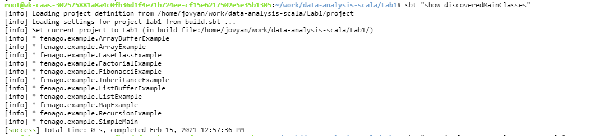

Lab 1. Scala Overview
----------------------------------


The following topics will be covered in this lab:


- Installing and getting started with Scala
- Object-oriented and functional programming overview
- Scala case classes and the collection API
- Overview of Scala libraries for data analysis


#### Lab Environment
All packages have been installed. There is no requirement for any setup.

**Note:** Labs will be accessible at the port given to you by your instructor. Password for jupyterLab : `1234`

Lab instructions and scala examples are present in `~/work/data-analysis-scala` folder. To copy and paste: use **Control-C** and to paste inside of a terminal, use **Control-V**

There should be terminal(s) opened already. You can also open New terminal by Clicking `File` > `New` > `Terminal` from the top menu.

Now, move in the directory which contains the scala source code by running following command in the terminal.

`cd ~/work/data-analysis-scala/Lab1`

You can access jupyter lab at `http://<lab-environment>/lab/workspaces/lab1_Scala`


**Note:**
- The supplied commands in the next steps MUST be run from your `~/work/data-analysis-scala/Lab1` directory. 
- Final code was already cloned from github for this scenario. You can just understand the application code in the next steps and run it using the instructions.
- Click **File Browser** tab on the top left and open `~/work/data-analysis-scala/Lab1/src/main/scala/fenago/example` to view scala files.


#### Java and SBT

A successfully installed JDK should output something similar to the
following code:

```
$ java -version
openjdk version "1.8.0_242"
OpenJDK Runtime Environment (build 1.8.0_242-8u242-b08-0ubuntu3~18.04-b08)
OpenJDK 64-Bit Server VM (build 25.242-b08, mixed mode)

$ javac -version
javac 1.8.0_242
```


The [**Scala Build Tool**] ([**SBT**]) is a
command-line tool that is very popular for
building Scala projects. It also provides a
Scala console that can be used for exploring
Scala language features and its API.


To verify that SBT and Scala are installed correctly on your machine, go
through the following steps:


1.  Run the `sbt` command and then run the `console`
    command inside `sbt` to get access to the Scala console,
    as follows:


```
$ sbt
[info] Loading project definition from /home/jovyan/project
[info] Set current project to jovyan (in build file:/home/jovyan/)
[info] sbt server started at local:///root/.sbt/1.0/server/0f3384ff9655b6db4a75/sock

sbt:jovyan> console
[info] Starting scala interpreter...
Welcome to Scala 2.12.10 (OpenJDK 64-Bit Server VM, Java 1.8.0_242).
Type in expressions for evaluation. Or try :help.

scala>
```

2.  Run `:quit` to exit the Scala console. To exit
    `sbt`, run the `exit` command:


```
scala> :quit

[success] Total time: 6 s, completed Sep 16, 2018 11:29:24 AM

sbt:jovyan> exit
[info] shutting down server
$
```

Explore Scala from SBT by performing some of the popular Scala
`List` operations. To do this, go through the following steps:


1.  Start `sbt` and get access to the Scala console, as
    follows:


```
$ sbt

[info] Loading project definition from /home/jovyan/project
[info] Set current project to jovyan (in build file:/home/jovyan/)
[info] sbt server started at local:///root/.sbt/1.0/server/0f3384ff9655b6db4a75/sock


scala> 
```

2.  Create a Scala `List` of US states using the following
    code:


```
scala> val someStates = List("NJ", "CA", "IN", "MA", "NY", "AZ",       
                             "PA")
someStates: List[String] = List(NJ, CA, IN, MA, NY, AZ, PA)
```

3.  Examine the size of the `List` as follows:


```
scala> someStates.size
res0: Int = 7
```

4.  Sort the `List` in ascending order as follows:


```
scala> someStates.sorted
res1: List[String] = List(AZ, CA, IN, MA, NJ, NY, PA)
```

5.  Reverse the `List` as follows:


```
scala> someStates.reverse
res2: List[String] = List(PA, AZ, NY, MA, IN, CA, NJ)
```

6.  Join the elements of the list using a comma (`,`) as a
    separator, as shown in the following code:


```
scala> someStates.mkString(",")
res3: String = NJ,CA,IN,MA,NY,AZ,PA
```

7.  Perform sort and join operations as a chain, as shown in the
    following code:


```
scala> someStates.sorted.mkString(",")
res4: String = AZ,CA,IN,MA,NJ,NY,PA
```

8.  Finally, exit the Scala console and quit `sbt` once you
    are done exploring, as shown in the following code:


```
scala> :quit

[success] Total time: 17 s, completed Sep 16, 2018 11:22:41 AM
sbt:someuser> exit
[info] shutting down server
```


Overview of object-oriented and functional programming 
------------------------------------------------------------------------


Scala supports object-oriented and functional
styles of programming. Both of these 
programming paradigms have been proven to help model and solve
real-world problems. In this section, we will explore both of these
styles of programming using Scala.


#### Compile and Run  using SBT

To run scala file with main function defined from the terminal, simply run the following commands. The program will the then be compiled and executed.


```
cd ~/work/data-analysis-scala/Lab1

rm -rf ~/work/data-analysis-scala/Lab1/src/main/scala/fenago/example/.ipynb_checkpoints/

sbt "show discoveredMainClasses"

sbt "runMain fenago.example.<update>"
```




**Note:** Run `sbt run` instead of sbt "runMain fenago.example.`<update>`" command to choose which file to run.


### Object-oriented programming using Scala


Go to the Scala/SBT console and write the following lines of code:


1.  Define `Vehicle` Scala class as per the preceding
    specifications:


```
scala> class Vehicle(vin: String, manufacturer: String, model:     
                     String, 
                     modelYear: Int, finalAssemblyCountry: String)
defined class Vehicle
```

2.  Create an instance of `Vehicle` class:


```
scala> val theAuto = new Vehicle("WAUZZZ8K6AA123456", "Audi", "A4",  
                                  2009, "Germany")
theAuto: Vehicle = Vehicle@7c6c2822
```


1.  Let us define `Vehicle` class, this is an example of
    abstraction because we are taking real-world complex entities and
    defining a simple model to represent them. When internals of
    implementations is hidden then it is an example of encapsulation.
    Publicly visible methods define behavior:


```
scala> class Vehicle(vin: String, manufacturer: String, model: String, modelYear: Int, finalAssemblyCountry: String) { // class is an example of abstraction
     | private val createTs = System.currentTimeMillis() // example of encapsulation (hiding internals)
     | def start(): Unit = { println("Starting...") } // behavior
     | def stop(): Unit = { println("Stopping...") } // behavior
     | }
defined class Vehicle
```

2.  Now let create an instance of `Vehicle`. This is also an
    abstraction because `Vehicle` class is a template
    representing a simplified model of real-world vehicles. An instance
    of `Vehicle` represents a very specific vehicle but it is
    still a model:


```
scala> val theAuto = new Vehicle("WAUZZZ8K6AA123456", "Audi", "A4", 
     2009, "Germany") // object creation is an example of abstraction
theAuto: Vehicle = Vehicle@2688b2be
```

3.  Perform `start` behavior on the object:


```
scala> theAuto.start()
Starting...
```

4.  Perform `stop` behavior on the object:


```
scala> theAuto.stop()
Stopping...
```


Now let\'s look at inheritance and polymorphism in Scala REPL. We\'ll
define a new class called `SportsUtilityVehicle` by extending
the `Vehicle` class, as shown in the following code:


1.  Define `SportsUtilityVehicle` class that provides an
    extension to `Vehicle` class:


```
scala> class SportsUtilityVehicle(vin: String, manufacturer: String, model: String, modelYear: Int, finalAssemblyCountry: String, fourWheelDrive: Boolean) extends Vehicle(vin, manufacturer, model, modelYear, finalAssemblyCountry) { // inheritance example
     | def enableFourWheelDrive(): Unit = { if (fourWheelDrive) println("Enabling 4 wheel drive") }
     | override def start(): Unit = {
     | enableFourWheelDrive()
     | println("Starting SUV...")
     | }
     | }
defined class SportsUtilityVehicle
```

2.  Create an instance of `SUV` object but assign to
    `Vehicle` type object, this is permissible because every
    SUV object is also a `Vehicle`:


```
scala> val anotherAuto: Vehicle = new SportsUtilityVehicle("WAUZZZ8K6A654321", "Audi", "Q7", 2019, 
                     "Germany", true)
anotherAuto: Vehicle = SportsUtilityVehicle@3c2406dd
```

3.  Perform start behavior on the object, on doing so the object
    exhibits the behavior of an SUV class. This is the polymorphism
    property facilitated by the object-oriented paradigm:


```
scala> anotherAuto.start() // polymorphism example
Enabling 4 wheel drive
Starting SUV...
```


The following is a UML diagram with a more formal representation of the
inheritance relationship:


 It captures the following important properties:


- The [**Vehicle**] is a super-class or base-class 
- [**SportsUtilityVehicle**] is a sub-class that extends the
    [**Vehicle**] base-class
- This relationship can be envisioned as a parent-child relationship


### Functional programming using Scala


To illustrate this concept, let\'s define a function in Scala that
accepts two sets of integer input and returns the sum of two integers
plus one, as shown in the following code:

```
scala> val addAndInc = (a: Int, b: Int) => a + b + 1
addAndInc: (Int, Int) => Int = <function2>

scala> addAndInc(5, 10)
res0: Int = 16
```

In the preceding example, we have created an anonymous function that
takes two sets of integer input and returns an integer output. This
function increments the sum of two input numbers and returns the result.
There is another way of defining a function in Scala as a named method.
Let\'s look at that in the Scala REPL:

```
scala> def addAndIncMethod(a: Int, b: Int) = a + b + 1
addAndIncMethod: (a: Int, b: Int)Int

scala> addAndIncMethod(5, 10)
res1: Int = 16

scala> val methodAsFunc = addAndIncMethod
<console>:12: error: missing argument list for method addAndIncMethod
Unapplied methods are only converted to functions when a function type is expected.
You can make this conversion explicit by writing `addAndIncMethod _` or `addAndIncMethod(_,_)` instead of `addAndIncMethod`.
       val methodAsFunc = addAndIncMethod
```

In the preceding example, we have defined a method that is bound to a
name. The usage of the anonymous function and the named method is
identical; however, there are some subtle differences between the two,
as shown in the following list:


- The signature of the anonymous function
    is `(Int, Int) => Int` and the signature of the named
    method is `(a: Int, b: Int)Int`
- When we try to assign a method to a variable, we get an error


A method can be easily converted into an anonymous function in Scala by
doing the following:

```
scala> val methodAsFunc = addAndIncMethod _ // turns method into function
methodAsFunc: (Int, Int) => Int = <function2>

scala> methodAsFunc(5, 10)
res2: Int = 16
```

As can be seen, after conversion, the signature changes
to `(Int, Int) => Int`. 


Functions can be defined within a function. Let\'s look at the following
concrete example using Scala REPL to see why this is useful:

```
scala> def factorial(n: Int): Long = if (n <= 1) 1 else n * factorial(n-1)
factorial: (n: Int)Int

scala> factorial(5)
res0: Long = 120
```

The preceding code is an example of the `factorial` function,
and it uses recursion to compute this value. We know that classic
recursion requires a stack size proportional to the number of
iterations. Scala provides tail recursion optimization to address this
problem, and we can make use of an inner function to optimize this
problem. In the following code, we\'ll define a function inside a
function:

```
scala> import scala.annotation.tailrec
import scala.annotation.tailrec

scala> def optimizedFactorial(n: Int): Long = {
     | @tailrec
     | def factorialAcc(acc: Long, i: Int): Long = {
     | if (i <= 1) acc else factorialAcc(acc * i, i -1)
     | }
     | factorialAcc(1, n)
     | }
optimizedFactorial: (n: Int)Long

scala> optimizedFactorial(5)
res1: Long = 120
```


Recursion is a very useful programming construct and tail recursion is a
special type of recursion that can be optimized at compile time. Let us
first try to understand what recursion really is and what type of
recursion is considered tail recursive. In simple terms, any function
that calls or invokes itself one or more times is considered recursive.
Our factorial examples in both forms are recursive. Let us look at the
execution of the first version for a value of `5`:

```
factorial(5)
5 * factorial(4)
5 * 4 * factorial(3)
5 * 4 * 3 * factorial(2)
5 * 4 * 3 * 2 * factorial(1)
5 * 4 * 3 * 2 * 1
120
```

For the second version:

```
optimizedFactorial(5)
factorialAcc(1, 5)
factorialAcc(1*5, 4)
factorialAcc(1*5*4, 3)
factorialAcc(1*5*4*3, 2)
factorialAcc(1*5*4*3*2, 1)
1*5*4*3*2
120
```

The most important difference between the two versions is in the last
return statement of the function:

```
// output of next invocation must be multiplied to current number, so // the state (current number) has to preserved on stack frame
n * factorial(n-1)

// function being called already knows the current state being passed // as the first argument so it does not need preserved on stack frame
factorialAcc(acc * i, i -1) 
```


Let\'s use the following code to see whether we are able to apply tail
recursion optimization to the original factorial function in Scala REPL:

```
scala> @tailrec
     | def factorial(n: Int): Long = if (n <= 1) 1 else n * factorial(n-1)
<console>:14: error: could not optimize @tailrec annotated method factorial: it contains a recursive call not in tail position
       def factorial(n: Int): Long = if (n <= 1) 1 else n * factorial(n-1)
```


#### Scala case classes


Scala case classes provide a convenient mechanism to work with objects that hold values. Let\'s look at an example in
Scala REPL. The `case` class defined in the following code
will be used in other example codes in this lab:

```
scala> case class Person(fname: String, lname: String, age: Int)
defined class Person

scala> val jon = Person("Jon", "Doe", 21)
jon: Person = Person(Jon,Doe,21)
```


Let\'s look at another convenient feature of Scala case classes, namely
the `copy `object. We\'ll copy a Scala `case` class
object by updating only the `fname` attribute using the
following code:

```
scala> case class Person(fname: String, lname: String, age: Int)
defined class Person

scala> val jon = Person("Jon", "Doe", 21)
jon: Person = Person(Jon,Doe,21)

scala> val jonNew = jon.copy(fname="John")
jonNew: Person = Person(John,Doe,21)
```


Another great feature of case classes is pattern matching, which helps
in writing flexible code that is easier to work with. Let\'s look at an
example of pattern matching in Scala REPL, as shown in the following
code:

```
scala> def isJon(p: Person) = {
     | p match {
     | case Person("Jon", _, _) => {println("I am Jon"); true}
     | case Person(n,_,_) => {println(s"I am not Jon but I am ${n}"); false}
     | case _ => {println("I am not Jon but I am something other than Person"); false}
     | }
     | }
isJon: (p: Person)Boolean

scala> val jon = Person("Jon", "Doe", 25)
jon: Person = Person(Jon,Doe,25)

scala> isJon(jon)
I am Jon
res13: Boolean = true

scala> val bob = Person("Bob", "Crew", 27)
bob: Person = Person(Bob,Crew,27)

scala> isJon(bob)
I am not Jon but I am Bob
res14: Boolean = false

scala> isJon(null)
I am not Jon but I am something other than Person
res16: Boolean = false
```


#### Array


The following is an example run execution in Scala REPL to demonstrate
the Scala array and some of its functionality:

```
scala> val persons = Array(Person("Jon", "Doe", 21), Person("Alice", "Smith", 20), Person("Bob", "Crew", 27)) // construct a Array of Person objects
persons: Array[Person] = Array(Person(Jon,Doe,21), Person(Alice,Smith,20), Person(Bob,Crew,27))

scala> val personHead = persons.head // first person in the collection
personHead: Person = Person(Jon,Doe,21)

scala> val personAtTwo = persons(2) // person at index 2 (this is same as apply operation)
personAtTwo: Person = Person(Bob,Crew,27)

scala> val personsTail = persons.tail // collection without the first person
personsTail: Array[Person] = Array(Person(Alice,Smith,20), Person(Bob,Crew,27))

scala> val personsByAge = persons.sortBy(p => p.age) // sort persons by age
personsByAge: Array[Person] = Array(Person(Alice,Smith,20), Person(Jon,Doe,21), Person(Bob,Crew,27))

scala> val personsByFname = persons.sortBy(p => p.fname) // sort persons by first name
personsByFname: Array[Person] = Array(Person(Alice,Smith,20), Person(Bob,Crew,27), Person(Jon,Doe,21))

scala> val (below25, above25) = persons.partition(p => p.age <= 25) // split persons by age
below25: Array[Person] = Array(Person(Jon,Doe,21), Person(Alice,Smith,20))
above25: Array[Person] = Array(Person(Bob,Crew,27))

scala> val updatePersons = persons.updated(0, Person("Jon", "Doe", 20)) // update first element
updatePersons: Array[Person] = Array(Person(Jon,Doe,20), Person(Alice,Smith,20), Person(Bob,Crew,27))
```

The following is a summary of the array operations and their associated
performance characteristics:


 

The `ArrayBuffer` is
designed to help in the construction of the array with support for the
commonly desired build operations. Let\'s look at
the `ArrayBuffer` functionality using Scala REPL, as shown in
the following code:

```
scala> import scala.collection.mutable.ArrayBuffer
import scala.collection.mutable.ArrayBuffer

scala> val personsBuf = ArrayBuffer[Person]() // create ArrayBuffer of Person
personsBuf: scala.collection.mutable.ArrayBuffer[Person] = ArrayBuffer()
scala> personsBuf.append(Person("Jon", "Doe", 21)) // append a Person object at the end
scala> personsBuf.prepend(Person("Alice", "Smith", 20)) // prepend a Person object at head
scala> personsBuf.insert(1, Person("Bob", "Crew", 27)) // insert a Person object at index 1
scala> val persons = personsBuf.toArray // materialize into an Array of Person
persons: Array[Person] = Array(Person(Alice,Smith,20), Person(Bob,Crew,27), Person(Jon,Doe,21))
scala> val personRemoved = personsBuf.remove(1) // remove Person object at index 1
personRemoved: Person = Person(Bob,Crew,27)

scala> val personsUpdated = personsBuf.toArray // materialize into an Array of Person
personsUpdated: Array[Person] = Array(Person(Alice,Smith,20), Person(Jon,Doe,21))
```

As can be seen in the preceding code, `ArrayBuffer` provides a
comprehensive set of functionalities to construct a collection and
provides a convenient mechanism to materialize it into an array once
construction is complete.


#### List


A `List` provides fast and constant time performance
for`head` and `tail`
operations in a collection. We can visualize a List as a collection of
elements that are connected by some kind of link. Let\'s look at the
Scala `List` functionality using Scala REPL, as shown in the
following code:

```
scala> val persons = List(Person("Jon", "Doe", 21), Person("Alice", "Smith", 20), Person("Bob", "Crew", 27)) // construct a List of Person objects
persons: List[Person] = List(Person(Jon,Doe,21), Person(Alice,Smith,20), Person(Bob,Crew,27))

scala> val personHead = persons.head // first person in the collection
personHead: Person = Person(Jon,Doe,21)

scala> val personAtTwo = persons(2) // person at index 2 (this is same as apply operation)
personAtTwo: Person = Person(Bob,Crew,27)

scala> val personsTail = persons.tail // collection without the first person
personsTail: List[Person] = List(Person(Alice,Smith,20), Person(Bob,Crew,27))

scala> val personsByAge = persons.sortBy(p => p.age) // sort persons by age
personsByAge: List[Person] = List(Person(Alice,Smith,20), Person(Jon,Doe,21), Person(Bob,Crew,27))

scala> val personsByFname = persons.sortBy(p => p.fname) // sort persons by first name
personsByFname: List[Person] = List(Person(Alice,Smith,20), Person(Bob,Crew,27), Person(Jon,Doe,21))

scala> val (below25, above25) = persons.partition(p => p.age <= 25) // split persons by age
below25: List[Person] = List(Person(Jon,Doe,21), Person(Alice,Smith,20))
above25: List[Person] = List(Person(Bob,Crew,27))

scala> val updatePersons = persons.updated(0, Person("Jon", "Doe", 20)) // update first element
updatePersons: List[Person] = List(Person(Jon,Doe,20), Person(Alice,Smith,20), Person(Bob,Crew,27))
```


Let\'s now look at `ListBuffer`, which can be used for
constructing a list more efficiently. This will be very useful, given
that the `append` operation has significant performance
overheads. As mentioned earlier, datasets are generally constructed once
but are used multiple times during data analysis processes. Let\'s look
at the following code:

```
scala> import scala.collection.mutable.ListBuffer
import scala.collection.mutable.ListBuffer

scala> val personsBuf = ListBuffer[Person]() // create ListBuffer of Person
personsBuf: scala.collection.mutable.ListBuffer[Person] = ListBuffer()

scala> personsBuf.append(Person("Jon", "Doe", 21)) // append a Person object at end

scala> personsBuf.prepend(Person("Alice", "Smith", 20)) // prepend a Person object at head

scala> personsBuf.insert(1, Person("Bob", "Crew", 27)) // insert a Person object at index 1

scala> val persons = personsBuf.toList // materialize into a List of Person
persons: List[Person] = List(Person(Alice,Smith,20), Person(Bob,Crew,27), Person(Jon,Doe,21))

scala> val personRemoved = personsBuf.remove(1) // remove Person object at index 1
personRemoved: Person = Person(Bob,Crew,27)

scala> val personsUpdated = personsBuf.toList // materialize into a List of Person
personsUpdated: List[Person] = List(Person(Alice,Smith,20), Person(Jon,Doe,21))
```


Recursive algorithms play a central role in functional programming. In
fact, Scala supports tail-recursion optimization out of the box, which
facilitates practical usage of recursive algorithms with large datasets.
With classic recursion, a significant amount of stack space is required,
making it impractical to use on large datasets. With tail-recursion
optimization, the Scala compiler eliminates the stack growth under the
hood. Let\'s look at a classic recursion and tail-recursion example:

```
scala> import annotation.tailrec
import annotation.tailrec

scala> @tailrec def classicFactorial(n: Int): Int = { require(n > 0); if (n == 1) n else n * classicFactorial(n-1) } // this should fail
<console>:14: error: could not optimize @tailrec annotated method classicFactorial: it contains a recursive call not in tail position
       @tailrec def classicFactorial(n: Int): Int = { require(n > 0); if (n == 1) n else n * classicFactorial(n-1) }

scala> def classicFactorial(n: Int): Int = { require(n > 0, "n must be non-zero and positive"); if (n == 1) n else n * classicFactorial(n-1) } // this should work
classicFactorial: (n: Int)Int

scala> val classicResult = classicFactorial(5)
classicResult: Int = 120
scala> def tailRecFactorial(n: Int): Int = {
     | require(n > 0, "n must be non-zero and positive")
     | @tailrec def factorial(acc: Int, m: Int): Int = if (m == 1) acc else factorial(acc * m, m-1) // this should work as this recursive algorithm meets tail recursion requirements
     | factorial(1, n)
     | }
tailRecFactorial: (n: Int)Int

scala> val tailRecResult = tailRecFactorial(5)
tailRecResult: Int = 120
```

The preceding examples provides insight into recursive functions, and in
particular demonstrates a tail-recursion variant. Let\'s look at the
following example of a tail-recursion algorithm using `List`:

```
scala> val persons = List(Person("Jon", "Doe", 21), Person("Alice", "Smith", 20), Person("Bob", "Crew", 27))
persons: List[Person] = List(Person(Jon,Doe,21), Person(Alice,Smith,20), Person(Bob,Crew,27))

scala> @tailrec def minAgePerson(acc: Option[Person], lst: List[Person]): Option[Person] = {
     | if (lst.isEmpty) acc
     | else if (acc.isEmpty) minAgePerson(Some(lst.head), lst.tail)
     | else if (acc.get.age <= lst.head.age) minAgePerson(acc, lst.tail)
     | else minAgePerson(Some(lst.head), lst.tail)
     | }
minAgePerson: (acc: Option[Person], lst: List[Person])Option[Person]

scala> val youngest = minAgePerson(None, persons) // Person with minimum age
youngest: Option[Person] = Some(Person(Alice,Smith,20))

scala> val youngestEmpty = minAgePerson(None, Nil) // Nil == List(), an empty list
youngestEmpty: Option[Person] = None
```

The preceding code is a very simple example of finding a
`Person` with the minimum age from a list of
`Person` objects.


#### Map


A Map provides a mapping from a key to the 
associated value. Lookups into a Map based on a key have a generally
constant time of [*O(1)*]{.emphasis}. A Map is an important data
structure that has many applications in the real world.

Let\'s look at some simple Map usage using Scala REPL:

```
scala> val countryToCurrency = Map(("US" -> "USD"), ("DE" -> "EUR"), ("FR" -> "EUR"), ("IN" -> "INR")) // Mapping from country code to currency code
countryToCurrency: scala.collection.immutable.Map[String,String] = Map(US -> USD, DE -> EUR, FR -> EUR, IN -> INR)

scala> countryToCurrency.keys // country codes
res4: Iterable[String] = Set(US, DE, FR, IN)

scala> countryToCurrency.values // currency codes
res5: Iterable[String] = MapLike.DefaultValuesIterable(USD, EUR, EUR, INR)

scala> countryToCurrency("US") // lookup currency code for US
res6: String = USD
```

In Scala, there are many different types of map, each with its own set
of characteristics. We will cover the following three:


 


Let\'s explore some of these map types in Scala REPL using the following
code:


1.  Import `HashMap`, `TreeMap`, and
    `LinkedHashMap` from Scala\'s
    `collection.mutable` package. Each represents Map type but
    with a slightly different flavor:


```
scala> import collection.mutable.{HashMap,TreeMap,LinkedHashMap}
import collection.mutable.{HashMap, TreeMap, LinkedHashMap}
```

2.  Create a `HashMap` that maps a number to its English word
    equivalent. Notice that the order of keys is not preserved. The
    number `8` was at position `8` in our
    constructor however in the object created it is at the first
    position:


```
scala> val numHashMap = HashMap((1->"one"), (2->"two"), (3->"three"), (4->"four"), (5->"five"), (6->"six"), (7->"seven"), (8->"eight"), (9->"nine")) // keys can be in any order
numHashMap: scala.collection.mutable.HashMap[Int,String] = Map(8 -> eight, 2 -> two, 5 -> five, 4 -> four, 7 -> seven, 1 -> one, 9 -> nine, 3 -> three, 6 -> six)
```

3.  Add a new entry of `0`. This got added at the very end
    however this is just a coincidence, it could have been anywhere:


```
// add new mapping, keys can be any order
scala> numHashMap += (0->"zero") 
res5: numHashMap.type = Map(8 -> eight, 2 -> two, 5 -> five, 4 -> four, 7 -> seven, 1 -> one, 9 -> nine, 3 -> three, 6 -> six, 0 -> zero)
```

4.  Create a `TreeMap` similar to `HashMap`. Note
    that the order of keys is preserved. In fact, this is due to keys
    automatically being sorted by `TreeMap`. Our object
    construction had provided the keys in ascending order:


```
// keys must be sorted
scala> val numTreeMap = TreeMap((1->"one"), (2->"two"), (3->"three"), (4->"four"), (5->"five"), (6->"six"), (7->"seven"), (8->"eight"), (9->"nine")) 
numTreeMap: scala.collection.mutable.TreeMap[Int,String] = TreeMap(1 -> one, 2 -> two, 3 -> three, 4 -> four, 5 -> five, 6 -> six, 7 -> seven, 8 -> eight, 9 -> nine)
```

5.  Add a new entry to `TreeMap` with key as `0`.
    This gets added to the beginning because of key sorting in a
    `TreeMap`:


```
// add a new mapping, keys must get sorted
scala> numTreeMap += (0->"zero") 
res6: numTreeMap.type = TreeMap(0 -> zero, 1 -> one, 2 -> two, 3 -> three, 4 -> four, 5 -> five, 6 -> six, 7 -> seven, 8 -> eight, 9 -> nine)
```

6.  Create a `LinkedHashMap` similar to `HashMap`
    and `TreeMap`. Note that keys appear exactly as it was
    specified in the constructor:


```
// order must be preserved
scala> val numLinkedHMap = LinkedHashMap((1->"one"), (2->"two"), (3->"three"), (4->"four"), (5->"five"), (6->"six"), (7->"seven"), (8->"eight"), (9->"nine")) 
numLinkedHMap: scala.collection.mutable.LinkedHashMap[Int,String] = Map(1 -> one, 2 -> two, 3 -> three, 4 -> four, 5 -> five, 6 -> six, 7 -> seven, 8 -> eight, 9 -> nine)
```

7.  Add new entry to `LinkedHashMap` with key as
    `0`. This gets added at the very end because
    `LinkedHashMap` preserves the order of key insertion:


```
// this must be the last element
scala> numLinkedHMap += (0->"zero") 
res17: numLinkedHMap.type = Map(1 -> one, 2 -> two, 3 -> three, 4 -> four, 5 -> five, 6 -> six, 7 -> seven, 8 -> eight, 9 -> nine, 0 -> zero)
```

Scala offers a good number of choices in terms of Map implementation.
You can choose the best option based on the usage pattern.


Summary 
-------------------------


This lab provided a high-level overview of the Scala programming
language. We looked at some of the object-oriented and functional
programming aspects of Scala using applied examples. This lab
touched upon the array, list, and map functionalities of the Scala
collection API. These data structures have numerous uses in the data
analysis life cycle. The lab also provided the necessary information
to set up and install the Scala tools that are essential for
understanding and applying the topics covered in subsequent labs.
Finally, a quick overview of the data-centric Scala libraries was
provided. We will be making use of these libraries in the next few
labs to solve specific data life cycle problems.

In the next lab, we will look at the data analysis life cycle and
associated tasks.
