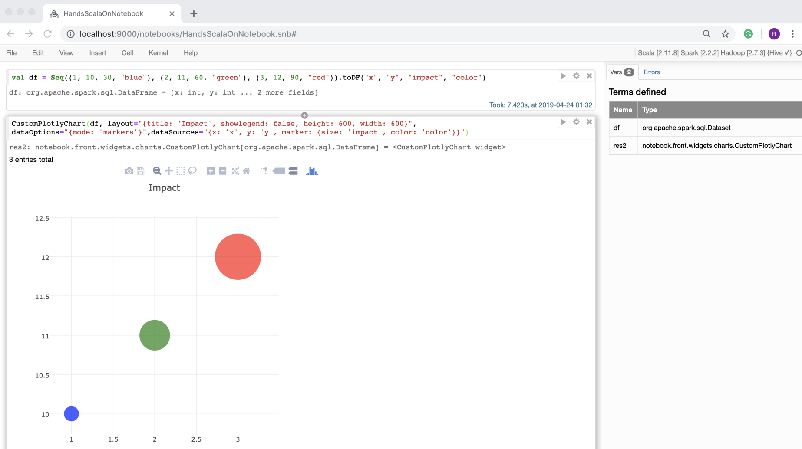

Lab 4. Data Exploration and Visualization
------------------------------------------------------

The following are the topics that we will be covering in this lab:


-   Sampling data
-   Performing ad hoc analysis
-   Finding a relationship between data elements
-   Visualizing data


Sampling data
-------------------------------


To explore large datasets, it is generally useful to work with a smaller
sample of data first. For example, from a dataset consisting of 100 million records, we could take a sample of
1,000 records and start exploring some important properties of this
data. Exploring the entire dataset would be ideal; however, the time
required to do so would increase manifold.


### Selecting the sample


Let\'s look at how we can make use of the Scala collection API to select
sample data from a dataset:


1.  Create a list of `1000` numbers using Scala\'s Range API.
    We generate a sequence of 1,000 number from `0` to
    `1000` (1,000 is excluded) first and turn it into a Scala
    `List`: 


```
scala> val data = Range(0, 1000).toList
data: List[Int] = List(0, 1, 2, 3, 4, 5, 6, 7, 8, 9, 10, 11, 12, 13, 14, 15, 16, 17, 18, 19, 20, 21, 22, 23, 24, 25, 26, 27, 28, 29, 30, 31, 32, 33, 34, 35, 36, 37, 38, 39, 40, 41, 42, 43, 44, 45, 46, 47, 48, 49, 50, 51, 52, 53, 54, 55, 56, 57, 58, 59, 60, 61, 62, 63, 64, 65, 66, 67, 68, 69, 70, 71, 72, 73, 74, 75, 76, 77, 78, 79, 80, 81, 82, 83, 84, 85, 86, 87, 88, 89, 90, 91, 92, 93, 94, 95, 96, 97, 98, 99, 100, 101, 102, 103, 104, 105, 106, 107, 108, 109, 110, 111, 112, 113, 114, 115, 116, 117, 118, 119, 120, 121, 122, 123, 124, 125, 126, 127, 128, 129, 130, 131, 132, 133, 134, 135, 136, 137, 138, 139, 140, 141, 142, 143, 144, 145, 146, 147, 148, 149, 150, 151, 152, 153, 154, 155, 156, 157, 158, 159, 160, 161, 162, 163, 164, 165, 166, 167, 168, 169, 170, 171, 172, 173, 174, 175, 176,...
```


2.  Use the Scala list\'s `take` method, select the first
    three elements of the aforementioned-generated `List`.
    This will provide another `List` with three elements:


```
scala> val first3 = data.take(3)
first3: List[Int] = List(0, 1, 2)
```

We generated a list of 1,000 integers from 0 to 999 and selected the
first three integers from this. The previous steps would always produce
the same result each time.

This implies that if the dataset remains constant, then the selected
values would always be the same and our sample has implicit bias. Let\'s
see how we can select random values:


1.  Import the `Random` class from Scala\'s `util`
    package:


```
scala> import scala.util.Random
import scala.util.Random
```


2.  Perform a random shuffle operation on the previously generated data,
    using Scala\'s random utility class\'s `shuffle` method.
    This produces another list with the same content as the original
    one; however, the position of the numbers in the new list is
    randomized and different from the original list:


```
scala> val randomizedData = Random.shuffle(data)
randomizedData: List[Int] = List(725, 225, 231, 280, 518, 818, 395, 519, 13, 648, 292, 826, 520, 885, 114, 403, 277, 218, 707, 864, 798, 575, 942, 685, 627, 95, 512, 753, 763, 923, 209, 633, 631, 743, 327, 0, 946, 147, 838, 78, 777, 473, 521, 501, 86, 590, 748, 956, 105, 963, 483, 334, 109, 5, 285, 910, 791, 102, 398, 240, 447, 493, 351, 297, 399, 365, 466, 612, 298, 529, 762, 680, 975, 253, 535, 902, 373, 36, 356, 596, 679, 717, 976, 543, 180, 894, 500, 624, 405, 754, 881, 916, 213, 768, 305, 740, 263, 422, 771, 623, 121, 989, 486, 574, 196, 987, 968, 73, 943, 662, 393, 438, 834, 714, 746, 364, 260, 139, 906, 944, 793, 485, 647, 66, 418, 909, 787, 377, 94, 25, 84, 888, 657, 23, 776, 402, 649, 472, 915, 496, 140, 155, 772, 319, 752, 964, 354, 11, 431, 413, 982, 621, 835, 468, 785, 463, ...
```


3.  Select the first three elements from the randomized list, using the
    `take` method:


```
scala> val random3 = randomizedData.take(3)
random3: List[Int] = List(725, 225, 231)
```


4.  Repeat step 2 to produce another randomized list. This randomized
    list is expected to be quite different compared to the original list
    and previously generated list:


```
scala> val randomizedDataNext = scala.util.Random.shuffle(data)
randomizedDataNext: List[Int] = List(955, 128, 857, 129, 901, 265, 535, 879, 998, 373, 601, 816, 297, 648, 624, 27, 119, 195, 868, 357, 859, 986, 569, 660, 167, 885, 416, 199, 848, 406, 751, 593, 156, 673, 333, 403, 628, 122, 775, 390, 926, 360, 513, 953, 820, 947, 867, 295, 113, 639, 897, 856, 717, 426, 865, 988, 407, 814, 110, 762, 852, 842, 940, 102, 61, 298, 815, 197, 233, 515, 318, 401, 180, 781, 262, 157, 492, 376, 747, 688, 186, 824, 961, 659, 269, 618, 819, 623, 866, 46, 557, 511, 176, 840, 800, 679, 481, 704, 551, 66, 54, 977, 732, 700, 813, 264, 625, 171, 347, 990, 290, 43, 742, 418, 836, 92, 979, 938, 369, 111, 779, 3, 613, 117, 379, 8, 764, 356, 573, 921, 893, 822, 351, 279, 164, 507, 930, 514, 805, 245, 714, 121, 694, 223, 652, 526, 755, 692, 260, 476, 105, 404, 289, 869, 5...
```


5.  Select the first three elements from the new randomized
    `List` using the `take` method:


```
scala> val random3Next = randomizedDataNext.take(3)
random3Next: List[Int] = List(955, 128, 857)
```

In this code example, we are to able to get three random values by using
the `scala.util.Random.shuffle` function. Although the
preceding example illustrated the data randomization technique, it is
not very efficient in terms of performance and it won\'t scale as the
datasets get larger and larger. It does, however, illustrate a simple
way to get random samples using Scala\'s
built-in APIs. We will look at how to efficiently get random samples
from large datasets in subsequent labs.


#### Selecting samples using Saddle


Let\'s look at a similar exercise using the
Scala Saddle library. We will be using the
CSV data
from <https://data.lacity.org/api/views/nxs9-385f/rows.csv?accessType=DOWNLOAD>.

This dataset was introduced in earlier labs. Let\'s follow these
steps to use Saddle:


1.  First, we need to define our `build.sbt`, as follows, to
    include the Saddle library dependencies. Remember to
    save `build.sbt`  as a file in your current directory:


```
scalaVersion := "2.11.12"

libraryDependencies ++= Seq(
  "org.scala-saddle" %% "saddle-core" % "1.3.4" // Saddle Dataframe like Library
)
```


2.  Start SBT in your Terminal from the same directory
    where `build.sbt`  is located and start a Scala console:


```
$ sbt
```


3.  Import `BufferedReader` and `InputStreamReader`
    from the `java.io` package:


```
scala> import java.io.{BufferedReader, InputStreamReader}
import java.io.{BufferedReader, InputStreamReader}
```


4.  Import the `saddle` package:


```
scala> import org.saddle.io._
import org.saddle.io._
```


5.  Define a Scala class called `SaddleCsvSource` that takes a
    URL string as an input argument to the constructor and extends
    `CsvSource`. The constructor establishes a connection to
    the provided URL and creates a `BufferedReader` object
    that can be used to read data from the URL, line by line:


```
scala> class SaddleCsvSource(url: String) extends CsvSource {
     | val reader = new BufferedReader(new InputStreamReader(new java.net.URL(url).openStream()))
     | override def readLine: String = {
     | reader.readLine()
     | }
     | }
defined class SaddleCsvSource
```

We have overridden the `readLine` method of the parent
`CsvSource` class. The overridden method reads a line of data
from the URL. This method automatically gets repeated when the parse
method is invoked on `CsvSource`.

 

 


6.  Create a new instance of `SaddleCsvSource` by
    supplying <https://data.lacity.org/api/views/nxs9-385f/rows.csv?accessType=DOWNLOAD>
    as the URL. This is our source data that is in CSV format and we
    want to parse this data using Saddle\'s CSV parser:


```
scala> val file = new SaddleCsvSource("https://data.lacity.org/api/views/nxs9-385f/rows.csv?accessType=DOWNLOAD")
file: SaddleCsvSource = SaddleCsvSource@3f0055eb
```


7.  Parse the aforementioned object using the `CsvParser`
    instance parse, API. This provides Saddle\'s `Frame`
    object that is used for further exploration:


```
scala> val frameOrig = CsvParser.parse(file)
frameOrig: org.saddle.Frame[Int,Int,String] =
[320 x 7]
              0 1 2 3 4 5 6
       -------- ---------------- ---------- ----------- ------------- ---------------- ----------------------
  0 -> Zip Code Total Population Median Age Total Males Total Females Total Households Average Household Size
  1 -> 91371 1 73.5 0 1 1 1
  2 -> 90001 57110 26.6 28468 28642 12971 4.4
  3 -> 90002 51223 25.5 24876 26347 11731 4.36
  4 -> 90003 66266 26.3 32631 33635 ...
scala> 
```


8.  Get the header:


```
scala> val head = frameOrig.rowSlice(0,1).rowAt(0)
head: org.saddle.Series[Int,String] =
[7 x 1]
0 -> Zip Code
1 -> Total Population
2 -> Median Age
3 -> Total Males
4 -> Total Females
5 -> Total Households
6 -> Average Household Size
scala>
```

 

 


9.  Remove the header row and attach the header back as column names:


```
scala> val frame = frameOrig.rowSlice(1, frameOrig.numRows).mapColIndex(i => head.at(i).get)
frame: org.saddle.Frame[Int,String,String] =
[319 x 7]
       Zip Code Total Population Median Age Total Males Total Females Total Households Average Household Size
       -------- ---------------- ---------- ----------- ------------- ---------------- ----------------------
  1 -> 91371 1 73.5 0 1 1 1
  2 -> 90001 57110 26.6 28468 28642 12971 4.4
  3 -> 90002 51223 25.5 24876 26347 11731 4.36
  4 -> 90003 66266 26.3 32631 33635 15642 4.22
  5 -> 90004 62180 34.8 31302 30878 2...
```


10. Get the first three records from Saddle\'s `Frame`:


```
scala> frame.head(3)
res1: org.saddle.Frame[Int,String,String] =
[3 x 7]
     Zip Code Total Population Median Age Total Males Total Females Total Households Average Household Size
     -------- ---------------- ---------- ----------- ------------- ---------------- ----------------------
1 -> 91371 1 73.5 0 1 1 1
2 -> 90001 57110 26.6 28468 28642 12971 4.4
3 -> 90002 51223 25.5 24876 26347 11731 4.36
scala> 
```


11. Get a random sample of 2% of the dataset by using Frame\'s
    `rfilter` API. Note the usage of Scala\'s random
    utility\'s `nextDouble` method. This method provides a
    uniformly distributed pseudo-random double between 0.0 and 1.0. This
    implies that roughly only 2% of the time the following condition
    will hold true if called repeatedly:
    
    -   `scala.utilRandom() < 0.02`
    


The `rfilter`, when combined with this mechanism, provides us with roughly 2% of the sample data:

```
scala> val sample = frame.rfilter(_ => scala.util.Random.nextDouble() < 0.02)
sample: org.saddle.Frame[Int,String,String] =
[6 x 7]
       Zip Code Total Population Median Age Total Males Total Females Total Households Average Household Size
-------- ---------------- ---------- ----------- ------------- --------
  7 -> 90006 59185 32.4 30254 28931 18617 3.13
 80 -> 90241 42399 33.9 20466 21933 13617 3.09
126 -> 90606 32396 33.5 15936 16460 8633 3.72
156 -> 90802 39347 34.7 20387 18960 19853 1.93
259 -> 91722 34409 34 16859 17550 10...
```

We are now able to get a sample of data conveniently using the APIs
provided by the Saddle library.

Please note the abstraction being used in this context is a rame that consists of rows and columns. It is
to be noted that every run of a sample would produce a different result.
For example:

```
scala> val sample = frame.rfilter(_ => scala.util.Random.nextDouble() < 0.02)
sample: org.saddle.Frame[Int,String,String] =
[10 x 7]
       Zip Code Total Population Median Age Total Males Total Females Total Households Average Household Size 
       -------- ---------------- ---------- ----------- ------------- ---------------- ---------------------- 
 17 -> 90017 23768 29.4 12818 10950 9338 2.53 
 18 -> 90018 49310 33.2 23770 25540 15493 3.12 
 54 -> 90062 32821 31.8 15720 17101 9155 3.55 
 90 -> 90262 69745 27.8 33919 35826 14669 4.57 
101 -> 90290 6368 45 3180 3188 2612 2.44 
131 -> 90638 49012 37.9 23520 25492 14821 3.11 
188 -> 91108 13361 45.4 6410 6951 4415 3.01 
273 -> 91755 27496 43.4 13271 14225 8760 3.12 
281 -> 91773 33119 42.5 15737 17382 11941 2.73 
311 -> 93543 13033 32.9 6695 6338 3560 3.66 
```

Although the samples are small, these, however, provide an important
insight into some of the properties of the data, such as typical median
age and average household size.  We performed the following activities
in our analysis:


1.  We started with a data resource on the internet, located
    at <https://data.lacity.org/api/views/nxs9-385f/rows.csv?accessType=DOWNLOAD>.
    This resource is in CSV format.
2.  Using a combination of Java\'s and Saddle\'s APIs, we were able to
    read this dataset.


3.  Saddle\'s API allowed us to parse the CSV data and convert this into
    a structured format of Saddle\'s frame.
4.  Saddle\'s frame allowed us to see the source data in a tabular form,
    consisting of rows and columns.
5.  We conveniently got a sample, but a randomized set of rows from the
    frame, by using the `rfilter` API and combining it with
    Scala\'s random utility\'s `nextDouble` API. 


Performing ad hoc analysis
--------------------------------------------


We will use Spark to perform some hands-on ad hoc analysis. Let\'s
create an IntelliJ project with the following Spark dependencies
added to `build.sbt`:

```
scalaVersion := "2.11.12"

libraryDependencies ++= Seq(
"org.apache.spark" %% "spark-sql" % "2.4.0", // Spark Core Library
"org.scalatest" %% "scalatest" % "3.0.5" % "test" // Scala test library
)
```

This is what it will look like:


Now, create a simple main Scala object to
explore the same dataset that we explored in the previous section:


1.  Import `SparkSession` from Spark\'s `sql`
    package. This is needed for setting up a Spark Session
    programmatically:


```
import org.apache.spark.sql.SparkSession
```


2.  Import `SparkFiles` from Spark\'s `spark`
    package. This is needed for reading data from the internet resource
    located at <https://data.lacity.org/api/views/nxs9-385f/rows.csv>:


```
import org.apache.spark.SparkFiles
```


3.  Define a Scala object called `SparkExample`, which will
    act an entry point into this program:


```
object SparkExample {
...
}
```


4.  With the `SparkExample` object, define a method called
    `getSparkSession`. This creates a new Spark session
    running in local mode and uses the builder pattern to create or get
    a Spark session. The advantage of using the builder pattern is that
    the session being created can be customized to serve very
    specialized needs:


```
def getSparkSession(): SparkSession = {
val spark = SparkSession.builder().master("local").getOrCreate()
    spark.sparkContext.setLogLevel("ERROR")
    spark
  }
```


5.  Finally, define the main method that facilitates the program to be
    executed with input arguments supplied as parameters. There are
    multiple actions taking place inside this method:
    
    a.  The Spark session is established by calling
        the `getSparkSession` method of the object.
    b.  The internet resource located
        at <https://data.lacity.org/api/views/nxs9-385f/rows.csv> is
        being added to the `SparkContext` object of
        `spark`, the Spark session.
    c.  A new Spark DataFrame is being created by fetching the internet
        resource and treating it as CSV data with a header row. Also,
        the schema of the target DataFrame is determined  by inferring
        the contents of CSV.
    d.  We print the schema of the DataFrame created.
    e.  We show a few rows from the DataFrame.
    f.  Stop the Spark Session on completion of the program.
    


```
def main(args: Array[String]): Unit = {
val spark = getSparkSession()
    spark.sparkContext.addFile("https://data.lacity.org/api/views/nxs9-385f/rows.csv")
val df = spark.read.option("header", true).option("inferSchema", true).csv(SparkFiles.get("rows.csv"))
    df.printSchema()
    df.show()
    spark.stop()
  }
```

Let\'s put all of this together as a single program. The complete code
is outlined as follows:

```
import org.apache.spark.sql.SparkSession
import org.apache.spark.SparkFiles

object SparkExample {
def getSparkSession(): SparkSession = {
val spark = SparkSession.builder().master("local").getOrCreate()
    spark.sparkContext.setLogLevel("ERROR")
    spark
  }
def main(args: Array[String]): Unit = {
val spark = getSparkSession()
    spark.sparkContext.addFile("https://data.lacity.org/api/views/nxs9-385f/rows.csv")
val df = spark.read.option("header", true).option("inferSchema", true).csv(SparkFiles.get("rows.csv"))
    df.printSchema()
    df.show()
    spark.stop()
  }
}
```

When you run the preceding example in
IntelliJ, it produces quite a bit of log information. It should output
some logs like these:


-   Pay attention to the schema Information. Note that the data types of
    the columns are inferred from the source data. Without the schema
    inference, the types of all the columns would have been string type:


```
root
 |-- Zip Code: integer (nullable = true)
 |-- Total Population: integer (nullable = true)
 |-- Median Age: double (nullable = true)
 |-- Total Males: integer (nullable = true)
 |-- Total Females: integer (nullable = true)
 |-- Total Households: integer (nullable = true)
 |-- Average Household Size: double (nullable = true)
```


-   The output from the `show` method could look something
    like this. By default, the `show` method of the DataFrame
    display is 20 rows:


```
+--------+----------------+----------+-----------+-------------+----
|Zip Code|Total Population|Median Age|Total Males|Total Females|Total Households|Average Household Size|
+--------+----------------+----------+-----------+-------------+----
| 91371| 1| 73.5| 0| 1| 1| 1.0|
| 90001| 57110| 26.6| 28468| 28642| 12971| 4.4|
| 90002| 51223| 25.5| 24876| 26347| 11731| 4.36|
| 90003| 66266| 26.3| 32631| 33635| 15642| 4.22|
| 90004| 62180| 34.8| 31302| 30878| 22547| 2.73|
| 90005| 37681| 33.9| 19299| 18382| 15044| 2.5|
| 90006| 59185| 32.4| 30254| 28931| 18617| 3.13|
| 90007| 40920| 24.0| 20915| 20005| 11944| 3.0|
| 90008| 32327| 39.7| 14477| 17850| 13841| 2.33|
| 90010| 3800| 37.8| 1874| 1926| 2014| 1.87|
| 90011| 103892| 26.2| 52794| 51098| 22168| 4.67|
| 90012| 31103| 36.3| 19493| 11610| 10327| 2.12|
| 90013| 11772| 44.6| 7629| 4143| 6416| 1.26|
| 90014| 7005| 44.8| 4471| 2534| 4109| 1.34|
| 90015| 18986| 31.3| 9833| 9153| 7420| 2.45|
| 90016| 47596| 33.9| 22778| 24818| 16145| 2.93|
| 90017| 23768| 29.4| 12818| 10950| 9338| 2.53|
| 90018| 49310| 33.2| 23770| 25540| 15493| 3.12|
| 90019| 64458| 35.8| 31442| 33016| 23344| 2.7|
| 90020| 38967| 34.6| 19381| 19586| 16514| 2.35|
+--------+----------------+----------+-----------+-------------+----
only showing top 20 rows
```

Hence, we were able to do a quick ad hoc analysis on this information to
understand some of the properties of the data and examine a few sample
records. The only assumption we made about the data is that its format
is CSV and the first record is a header record. Using Spark, we are also
able to infer the schema of the underlying
data with appropriate data types.

Spark has a comprehensive API for ad hoc analysis. For example, to get
random samples, we could do the following to get a 5% sample of rows
from the entire DataFrame:

```
df.sample(0.05).show() // 5% random sample

+--------+----------------+----------+-----------+-------------+-------
|Zip Code|Total Population|Median Age|Total Males|Total Females|Total Households|Average Household Size|
+--------+----------------+----------+-----------+-------------+-------
| 90002| 51223| 25.5| 24876| 26347| 11731| 4.36|
| 90039| 28514| 38.8| 14383| 14131| 11436| 2.47|
| 90073| 539| 56.9| 506| 33| 4| 1.25|
| 90201| 101279| 27.8| 50658| 50621| 24104| 4.16|
| 90263| 1612| 19.7| 665| 947| 0| 0.0|
| 90703| 49399| 43.9| 23785| 25614| 15604| 3.16|
| 90822| 117| 63.9| 109| 8| 2| 4.5|
| 91042| 27585| 40.7| 13734| 13851| 9987| 2.74|
| 91214| 30356| 42.5| 14642| 15714| 10551| 2.87|
+--------+----------------+----------+-----------+-------------+-------
```

We are running Spark here in local mode; however, the true power of
Spark comes from its ability to run in the distributed mode and work on
large-scale datasets. We will explore distributed features of Spark in
the upcoming labs.


Finding a relationship between data elements
--------------------------------------------------------------


Once we have a decent understanding of the data and some of its main
properties, the next step is to find a
concrete relationship between data elements. We can use some of the
well-established statistical techniques to understand the distribution
of data.

Let\'s continue with our Spark example from the previous section by
comparing `Total Population` to `Total Households`.
We can expect the two numbers to be strongly correlated:

```
println("Covariance: " + df.stat.cov("Total Population", "Total Households"))
println("Correlation: " + df.stat.corr("Total Population", "Total Households"))
```

The output from this would be something like this:

```
Covariance: 1.2338126298368526E8
Correlation: 0.9090567549637986
```


We can also look at the data in terms of n-tiles. The following code
creates 100 tiles ordered by the`Total Population` column:


1.  Create a temporary view on top of the Spark DataFrame created in the
    preceding example. Name this temporary view `tmp_data`:


```
df.createOrReplaceTempView("tmp_data")
```


2.  Run the Spark SQL on the previously
    created `tmp_data` view, which uses the window
    function, `ntile`, which does the following:
    
    -   Orders the data by total population
    -   Divides the data into 100 tiles by creating almost equally-sized
        tiles by starting from the top of the ordered data and going
        down
    -   Selects all columns from the view and additionally computed tile
        value as the tier
    
3.  Show the contents of the DataFrame output:


```
spark.sql("select *, ntile(100) over(order by `Total Population`) tier from tmp_data").show()
```


Visualizing data
----------------------------------


Graphs and charts are used to gain a better
understanding of the data relationship. We will use the following
to explore data visually:


-   Combination of Spark and Vegas viz
-   Spark Notebook


### Vegas viz for data visualization


Vegas viz is a MatPlotLib-like library for Scala and Spark. The
documentation for this library can be found
at <https://github.com/vegas-viz/Vegas>. Spark does not
contain any built-in support for data
visualization. Vegas viz provides a convenient mechanism to
add visualization to a Spark program written
in Scala.

In order to use this library with Spark,
let\'s add the following dependencies to `build.sbt`:

```
libraryDependencies ++= Seq(
"org.apache.spark" %% "spark-sql" % "2.4.0", // Spark Core Library
"org.vegas-viz" %% "vegas-spark" % "0.3.11", // Vegas Viz Library
"org.scalatest" %% "scalatest" % "3.0.5" % "test" // Scala test library
)
```

Continuing with the example from the previous section, let\'s say we
want to see, visually, the most populated ZIP (90th percentile).

Let\'s create a Scala program to do so:


1.  Import `SparkFiles` from the `spark` package and
    `SparkSession` from the `spark.sql` package.
    `SparkFiles` is needed for accessing the CSV file located
    on the internet. `SparkSession` is needed for creating a
    Spark session with a program:


```
import org.apache.spark.SparkFiles
import org.apache.spark.sql.SparkSession
```


2.  Import Vegas viz packages needed for visualization using Spark:


```
import vegas._
import vegas.sparkExt._
```


3.  Create a Scala object for an entry point into the program:


```
object SparkExample {
...
}
```


4.  Define a method that creates a local Spark session:


```
def getSparkSession(): SparkSession = {
val spark = SparkSession.builder().master("local").getOrCreate()
    spark.sparkContext.setLogLevel("ERROR")
    spark
  }
```


5.  Define the main method that is the entry point for this program:


```
def main(args: Array[String]): Unit = {
...
  }
```


6.  Implement the main method using the following steps:
    
    a.  Create a Spark session.
    b.  Add the internet source file to the Spark context.
    c.  Read the contents of the internet source CSV file as a Spark
        DataFrame, by inferring the first line as the header and
        inferring the schema from the contents of the CSV.
    d.  Create a temporary view on the DataFrame.
    e.  Run the Spark SQL on the temporary view by using the
        `ntile` window function.
    f.  Filter out the tiers that are 90 or above.
    g.  Use the `Vegas` library\'s API to create a plot of the
        filtered DataFrame using the `Zip Code` column as the
        [*x*] axis and the `Total Population`
        column as the [*y*] axis. The [*x*] axis
        data is a discrete number, whereas the [*y*] axis
        data is quantity.  Mark the plot as a bar chart.
    h.  Show the plot on a screen.
    i.  Stop the `SPark` session.
    


We implement the preceding steps using the following code:

```
val spark = getSparkSession()
    spark.sparkContext.addFile("https://data.lacity.org/api/views/nxs9-385f/rows.csv")
val df = spark.read.option("header", true).option("inferSchema", true).csv(SparkFiles.get("rows.csv"))
    df.createOrReplaceTempView("tmp_data")
val dfWithTier = spark.sql("select *, ntile(100) over(order by `Total Population`) tier from tmp_data")
val dfTier90Plus = dfWithTier.where("tier >= 90")
val plot = Vegas().withDataFrame(dfTier90Plus).encodeX("Zip Code", Nom).
      encodeY("Total Population", Quant).
      mark(Bar)
    plot.show
    spark.stop()
```

We can put all of this together and we have a single Spark program that can be executed:

```
import org.apache.spark.SparkFiles
import org.apache.spark.sql.SparkSession
import vegas._
import vegas.sparkExt._

object SparkExample {
def getSparkSession(): SparkSession = {
val spark = SparkSession.builder().master("local").getOrCreate()
    spark.sparkContext.setLogLevel("ERROR")
    spark
  }
def main(args: Array[String]): Unit = {
val spark = getSparkSession()
    spark.sparkContext.addFile("https://data.lacity.org/api/views/nxs9-385f/rows.csv")
val df = spark.read.option("header", true).option("inferSchema", true).csv(SparkFiles.get("rows.csv"))
    df.createOrReplaceTempView("tmp_data")
val dfWithTier = spark.sql("select *, ntile(100) over(order by `Total Population`) tier from tmp_data")
val dfTier90Plus = dfWithTier.where("tier >= 90")
val plot = Vegas().withDataFrame(dfTier90Plus).encodeX("Zip Code", Nom).
      encodeY("Total Population", Quant).
      mark(Bar)
    plot.show
    spark.stop()
  }
}
```

Running the preceding code will produce the following screenshot:


In the aforementioned example, we visually looked at zip codes with the
total population in the 90th percentile. Visual methods provide
intuition about properties of the data. We can easily conclude that
densely populated zip code mostly have similar total populations with
an approximate population size of 80 K.


### Spark Notebook for data visualization


Spark Notebook (<http://spark-notebook.io/>) is an open source notebook
that provides a web-based interface to perform interactive data analysis. This tool lets a user combine
Scala code, SQL queries, Markup, and JavaScript in a collaborative
manner to explore, analyze, and learn from
data. We will primarily be using this tool for data visualization; however, this can also be used for many other
purposes. There are several open source notebook solutions that are
available today. However, what is unique are the following features of
the tool:


-   Scala based
-   Excellent integration with Spark
-   Support for multiple Spark sessions that are isolated from each
    other
-   Comprehensive support for data visualization


#### Downloading and installing Spark Notebook


There are multiple ways to run Spark
Notebook. However, the most preferred way to run it is by installing it
locally on your computer. As of this writing, the most recently
supported Spark version is 2.2.0. This is sufficient for us to explore
the power of Spark Notebook to visualize data
in different forms.

The following are the download and setup instructions for macOS. This
should work in a very similar fashion for Linux OS and Windows OS:


1.  Download the ZIP
    file: <http://spark-notebook.io/dl/zip/0.8.3/2.11/2.2.2/2.7.3/true/true>.
    We are downloading Spark Notebook version 0.8.3, built with Scala
    2.11 and Spark 2.2.2. The following is a screenshot from the
    download website (<http://spark-notebook.io/>) that you can refer
    to:


 

 


2.   Unzip the downloaded ZIP file in a suitable location on your
    computer:


```
$ unzip spark-notebook-0.8.3-scala-2.11.8-spark-2.2.2-hadoop-2.7.3-with-hive.zip
```


3.  At this point, you should have a directory
    called `spark-notebook-0.8.3-scala-2.11.8-spark-2.2.2-hadoop-2.7.3-with-hive`.
    This directory contains the Spark Notebook installation. Change to
    the binary directory, where the start script is located:


```
$ cd spark-notebook-0.8.3-scala-2.11.8-spark-2.2.2-hadoop-2.7.3-with-hive/bin
```


4.  Start the Spark Notebook server, using the following command:


```
$ bash spark-notebook
```


5.  This will start the Spark Notebook server and you will see the
    output on your Terminal, similar to the following one:


```
Play server process ID is 3744
SLF4J: Class path contains multiple SLF4J bindings.
SLF4J: Found binding in 

[jar:file:/Users/rajeshgupta/Downloads/spark-notebook-0.8.3-scala-2.11.8-spark-2.2.2-hadoop-2.7.3-with-hive/lib/ch.qos.logback.logback-classic-1.1.1.jar!/org/slf4j/impl/StaticLoggerBinder.class]

SLF4J: Found binding in [jar:file:/Users/rajeshgupta/Downloads/spark-notebook-0.8.3-scala-2.11.8-spark-2.2.2-hadoop-2.7.3-with-hive/lib/org.slf4j.slf4j-log4j12-1.7.16.jar!/org/slf4j/impl/StaticLoggerBinder.class]

SLF4J: See http://www.slf4j.org/codes.html#multiple_bindings for an explanation.
SLF4J: Actual binding is of type [ch.qos.logback.classic.util.ContextSelectorStaticBinder]
[info] play - Application started (Prod)
[info] play - Listening for HTTP on /0:0:0:0:0:0:0:0:9000
```

The final line indicates that the server can
be accessed from the browser on HTTP port
`9000`. Let this server keep running.


6.  Verify that Spark Notebook is running correctly by visiting the
    landing page from your web browser by going
    to <http://localhost:9000>. You should see a screenshot similar to
    the one that follows:


#### Creating a Spark Notebook with simple visuals


To begin with, we will start by creating a
Spark Notebook with some simple visuals:


1.  From the landing page shown previously, select **New** \|
    **Scala \[2.11.8\] Spark \[2.2.2\] Hadoop \[2.7.3\] {Hive
    }** to create a Spark Notebook. Select an appropriate name
    for the notebook. The following screenshot shows the different
    prompts:


 The output should be similar to the following one  on your Terminal:

```
...
[info] application - Creating notebook at /
[info] application - save at path /HandsScalaOnNotebook.snb with message None
[info] application - listNotebooks at path /
[debug] application - content: /HandsScalaOnNotebook.snb
...
```

 


2.  You should see that `HandsOnScalaNotebook` will appear on
    the left-hand side of the screen under the **Files** tab.
    Select this notebook:


The output should be similar to the following
one on your Terminal:

```
...
[info] application - getNotebook at path HandsScalaOnNotebook.snb
[info] application - Loading notebook at path HandsScalaOnNotebook.snb
[info] application - Calling action
[info] application - Starting kernel/session because nothing for None and Some(HandsScalaOnNotebook.snb)
[info] application - Loading notebook at path HandsScalaOnNotebook.snb
...
```


3.  At this point, your Spark Notebook is running. The following
    screenshot shows how it would look in the browser with the screen
    divided into two areas:
    
    - **Code and Output Area**
    - **Variables and Errors Area**
    


4.  Let\'s create our first plot, which is a simple bar chart, by
    performing the following steps:
    
    a.  Define a Scala case class as follows in this first cell on the
        notebook, and then press [*SHIFT*] +
        [*ENTER*] to execute this cell:
    


```
case class Person(name: String, age: Int)
```


2.  
    b.  Create a `CustomPlotlyChart` instance with a sequence
        of `Person` objects as input, the type of plot as a
        bar chart, the name attribute of `Person` as the
        [*x*] axis, and the `age` attribute of
        `Person` as the [*y*] axis. Press
        [*SHIFT*] + [*ENTER*] to execute this
        cell:
    


```
CustomPlotlyChart(
 Seq(Person("James Bond", 50), Person("Jon Doe", 25), Person("Mickey Mouse", 18), Person("Foo", 33)),
 dataOptions="{type: 'bar'}",
 dataSources="{x: 'name', y: 'age'}")
```


3.  On the execution of the preceding code, the Spark Notebook\'s screen
    should look similar to the following screenshot, with a bar chart
    plotted:


As illustrated previously, using the `CustomPlotlyChart` class
of the Spark Notebook library, we are able to create a bar chart with just a single line of code. Here is the
complete code:

```
case class Person(name: String, age: Int)

CustomPlotlyChart(
  Seq(Person("James Bond", 50), Person("Jon Doe", 25), Person("Mickey Mouse", 18), Person("Foo", 33)), 
  dataOptions="{type: 'bar'}",
  dataSources="{x: 'name', y: 'age'}")
```

In the preceding example, we used a Scala-provided sequence of persons
as the data input. We could have instead used a Spark DataFrame as the
data input and would have gotten the same chart:

```
case class Person(name: String, age: Int)

val persons = Seq(Person("James Bond", 50), Person("Jon Doe", 25), Person("Mickey Mouse", 18), Person("Foo", 33)).toDF

CustomPlotlyChart(
  persons, 
  dataOptions="{type: 'bar'}",
  dataSources="{x: 'name', y: 'age'}")
```

The following is a screenshot of Spark Notebook with the aforementioned
code executed:


This clearly illustrates that we can use Scala sequences and the Spark
DataFrame as data input to the `CustomPlotlyChart` class of
the Spark Notebook library. This offers a great deal of flexibility when
using this library with data visualization.

Next, we will look at how to create more
types of charts using Spark Notebook.


#### More charts with Spark Notebook


In this section, we will look at more
examples of charts using Spark Notebook. The bar chart is certainly very
commonly used for data visualization but there are several other types
of charts that provide different insights into the data.

 

 


##### Box plot


The box plot is a classic and standardized
way of displaying the distribution of data
based on the following properties of a dataset:


-   Minimum value
-   First quartile
-   Median value
-   Third quartile
-   Maximum value


To get a good understanding of the box plot, please refer
to <https://www.khanacademy.org/math/statistics-probability/summarizing-quantitative-data/box-whisker-plots/a/box-plot-review>.

Let\'s explore this with an example:


1.  Create three separate Spark DataFrames with 20 random numbers in the
    range of 0 to 100. Label each creation of  the DataFrame as a unique
    experiment:


```
val df1 = sparkSession.range(20).map(n => (scala.util.Random.nextInt(100), "Experiment 1")).toDF("num", "experiment")

val df2 = sparkSession.range(20).map(n => (scala.util.Random.nextInt(100), "Experiment 2")).toDF("num", "experiment")

val df3 = sparkSession.range(20).map(n => (scala.util.Random.nextInt(100), "Experiment 3")).toDF("num", "experiment")
```


2.  Create a combined DataFrame by taking the union of all three
    DataFrames:


```
val df = df1.union(df2).union(df3)
```


3.  Use the box plot to display the properties of each of the three
    experiments:


```
CustomPlotlyChart(df, dataOptions="{type: 'box', splitBy: 'experiment'}", dataSources="{y: 'num'}")
```

You can run this code in Spark Notebook by executing each of the three
steps as an individual cell (using the [*SHIFT*] +
[*ENTER*] key combinations) and you will get an output that
is similar to the following screenshot:


We can see that each of the three experiments has a slightly different
distribution of data. This is expected because we are generating
pseudorandom numbers with a uniform
distribution property. The first experiment produced 20 random number
from 0 to 100. The second experiment produced another 20 numbers from 0
to 100. Assuming uniform distribution, the second experiment\'s numbers
would be different from the first one.
Similarly, the third experiment\'s numbers will be different from that
of the first and second, again due to the uniform distribution property.


##### Histogram


A histogram is a representation of the
distribution of numerical data. The data is assumed to be continuous
and grouped into a certain number of bins.
The height of each bin determines the number of occurrences within the
established range of the bin.

Let\'s explore the histogram plot with an example:


1.  Create a Spark DataFrame consisting of 1,000 random numbers with
    Gaussian distribution properties:


```
val df = sparkSession.range(1000).map(n => (n, scala.util.Random.nextGaussian())).toDF("num", "value")
```


2.  Plot histogram of random values with Gaussian distribution
    properties:


```
CustomPlotlyChart(df, dataOptions="{type: 'histogram', opacity: 0.7}", dataSources="{x: 'value'}")
```

Running the aforementioned code in Spark Notebook results in the
following screenshot:


We can easily change the axis from the [*x*] axis to
the [*y*] axis by doing the following:

```
CustomPlotlyChart(df, dataOptions="{type: 'histogram', opacity: 0.7}", dataSources="{y: 'value'}")
```

 

 

On running this code, the histogram would look like the following
screenshot:


This is the same data, now with
the inverted axis. Depending upon the use
case, either one can be used. However, the first representation that
uses the [*x*] axis is more common in practice.


##### Bubble chart


Bubble charts are generally used to represent
the impacts of outcomes by representing them
as different sized bubbles. The bigger the size of the bubble, the
greater the impact.

Let\'s explore this kind of chart with a simple example:


1.  Create a Spark DataFrame consisting of three records with different
    impacts:


```
val df = Seq((1, 10, 30, "blue"), (2, 11, 60, "green"), (3, 12, 90, "red")).toDF("x", "y", "impact", "color")
```


2.  Create a bubble chart:


```
CustomPlotlyChart(df, layout="{title: 'Impact', showlegend: false, height: 600, width: 600}",

dataOptions="{mode: 'markers'}",dataSources="{x: 'x', y: 'y', marker: {size: 'impact', color: 'color'}}")
```

When this code is run in Spark Notebook, we will see an output similar
to the following screenshot:





Bubble charts find a significant usage when we use data to communicate a
story and want to make it interesting for the target audience who might
not be familiar with in-depth details of the underlying data.

Visualizing data
----------------------------------


Graphs and charts are used to gain a better
understanding of the data relationship. We will use the following
to explore data visually:


-   Combination of Spark and Vegas viz
-   Spark Notebook


### Vegas viz for data visualization


Vegas viz is a MatPlotLib-like library for Scala and Spark. The
documentation for this library can be found
at <https://github.com/vegas-viz/Vegas>. Spark does not
contain any built-in support for data
visualization. Vegas viz provides a convenient mechanism to
add visualization to a Spark program written
in Scala.

In order to use this library with Spark,
let\'s add the following dependencies to `build.sbt`:

```
libraryDependencies ++= Seq(
"org.apache.spark" %% "spark-sql" % "2.4.0", // Spark Core Library
"org.vegas-viz" %% "vegas-spark" % "0.3.11", // Vegas Viz Library
"org.scalatest" %% "scalatest" % "3.0.5" % "test" // Scala test library
)
```

Continuing with the example from the previous section, let\'s say we
want to see, visually, the most populated ZIP (90th percentile).

Let\'s create a Scala program to do so:


1.  Import `SparkFiles` from the `spark` package and
    `SparkSession` from the `spark.sql` package.
    `SparkFiles` is needed for accessing the CSV file located
    on the internet. `SparkSession` is needed for creating a
    Spark session with a program:


```
import org.apache.spark.SparkFiles
import org.apache.spark.sql.SparkSession
```


2.  Import Vegas viz packages needed for visualization using Spark:


```
import vegas._
import vegas.sparkExt._
```


3.  Create a Scala object for an entry point into the program:


```
object SparkExample {
...
}
```


4.  Define a method that creates a local Spark session:


```
def getSparkSession(): SparkSession = {
val spark = SparkSession.builder().master("local").getOrCreate()
    spark.sparkContext.setLogLevel("ERROR")
    spark
  }
```


5.  Define the main method that is the entry point for this program:


```
def main(args: Array[String]): Unit = {
...
  }
```


6.  Implement the main method using the following steps:
    
    a.  Create a Spark session.
    b.  Add the internet source file to the Spark context.
    c.  Read the contents of the internet source CSV file as a Spark
        DataFrame, by inferring the first line as the header and
        inferring the schema from the contents of the CSV.
    d.  Create a temporary view on the DataFrame.
    e.  Run the Spark SQL on the temporary view by using the
        `ntile` window function.
    f.  Filter out the tiers that are 90 or above.
    g.  Use the `Vegas` library\'s API to create a plot of the
        filtered DataFrame using the `Zip Code` column as the
        [*x*] axis and the `Total Population`
        column as the [*y*] axis. The [*x*] axis
        data is a discrete number, whereas the [*y*] axis
        data is quantity.  Mark the plot as a bar chart.
    h.  Show the plot on a screen.
    i.  Stop the `SPark` session.
    


We implement the preceding steps using the following code:

```
val spark = getSparkSession()
    spark.sparkContext.addFile("https://data.lacity.org/api/views/nxs9-385f/rows.csv")
val df = spark.read.option("header", true).option("inferSchema", true).csv(SparkFiles.get("rows.csv"))
    df.createOrReplaceTempView("tmp_data")
val dfWithTier = spark.sql("select *, ntile(100) over(order by `Total Population`) tier from tmp_data")
val dfTier90Plus = dfWithTier.where("tier >= 90")
val plot = Vegas().withDataFrame(dfTier90Plus).encodeX("Zip Code", Nom).
      encodeY("Total Population", Quant).
      mark(Bar)
    plot.show
    spark.stop()
```

We can put all of this together and we have a single Spark program that can be executed:

```
import org.apache.spark.SparkFiles
import org.apache.spark.sql.SparkSession
import vegas._
import vegas.sparkExt._

object SparkExample {
def getSparkSession(): SparkSession = {
val spark = SparkSession.builder().master("local").getOrCreate()
    spark.sparkContext.setLogLevel("ERROR")
    spark
  }
def main(args: Array[String]): Unit = {
val spark = getSparkSession()
    spark.sparkContext.addFile("https://data.lacity.org/api/views/nxs9-385f/rows.csv")
val df = spark.read.option("header", true).option("inferSchema", true).csv(SparkFiles.get("rows.csv"))
    df.createOrReplaceTempView("tmp_data")
val dfWithTier = spark.sql("select *, ntile(100) over(order by `Total Population`) tier from tmp_data")
val dfTier90Plus = dfWithTier.where("tier >= 90")
val plot = Vegas().withDataFrame(dfTier90Plus).encodeX("Zip Code", Nom).
      encodeY("Total Population", Quant).
      mark(Bar)
    plot.show
    spark.stop()
  }
}
```

Running the preceding code will produce the following screenshot:


In the aforementioned example, we visually looked at zip codes with the
total population in the 90th percentile. Visual methods provide
intuition about properties of the data. We can easily conclude that
densely populated zip code mostly have similar total populations with
an approximate population size of 80 K.


### Spark Notebook for data visualization


Spark Notebook (<http://spark-notebook.io/>) is an open source notebook
that provides a web-based interface to perform interactive data analysis. This tool lets a user combine
Scala code, SQL queries, Markup, and JavaScript in a collaborative
manner to explore, analyze, and learn from
data. We will primarily be using this tool for data visualization; however, this can also be used for many other
purposes. There are several open source notebook solutions that are
available today. However, what is unique are the following features of
the tool:


-   Scala based
-   Excellent integration with Spark
-   Support for multiple Spark sessions that are isolated from each
    other
-   Comprehensive support for data visualization


#### Downloading and installing Spark Notebook


There are multiple ways to run Spark
Notebook. However, the most preferred way to run it is by installing it
locally on your computer. As of this writing, the most recently
supported Spark version is 2.2.0. This is sufficient for us to explore
the power of Spark Notebook to visualize data
in different forms.

The following are the download and setup instructions for macOS. This
should work in a very similar fashion for Linux OS and Windows OS:


1.  Download the ZIP
    file: <http://spark-notebook.io/dl/zip/0.8.3/2.11/2.2.2/2.7.3/true/true>.
    We are downloading Spark Notebook version 0.8.3, built with Scala
    2.11 and Spark 2.2.2. The following is a screenshot from the
    download website (<http://spark-notebook.io/>) that you can refer
    to:


 

 


2.   Unzip the downloaded ZIP file in a suitable location on your
    computer:


```
$ unzip spark-notebook-0.8.3-scala-2.11.8-spark-2.2.2-hadoop-2.7.3-with-hive.zip
```


3.  At this point, you should have a directory
    called `spark-notebook-0.8.3-scala-2.11.8-spark-2.2.2-hadoop-2.7.3-with-hive`.
    This directory contains the Spark Notebook installation. Change to
    the binary directory, where the start script is located:


```
$ cd spark-notebook-0.8.3-scala-2.11.8-spark-2.2.2-hadoop-2.7.3-with-hive/bin
```


4.  Start the Spark Notebook server, using the following command:


```
$ bash spark-notebook
```


5.  This will start the Spark Notebook server and you will see the
    output on your Terminal, similar to the following one:


```
Play server process ID is 3744
SLF4J: Class path contains multiple SLF4J bindings.
SLF4J: Found binding in 

[jar:file:/Users/rajeshgupta/Downloads/spark-notebook-0.8.3-scala-2.11.8-spark-2.2.2-hadoop-2.7.3-with-hive/lib/ch.qos.logback.logback-classic-1.1.1.jar!/org/slf4j/impl/StaticLoggerBinder.class]

SLF4J: Found binding in [jar:file:/Users/rajeshgupta/Downloads/spark-notebook-0.8.3-scala-2.11.8-spark-2.2.2-hadoop-2.7.3-with-hive/lib/org.slf4j.slf4j-log4j12-1.7.16.jar!/org/slf4j/impl/StaticLoggerBinder.class]

SLF4J: See http://www.slf4j.org/codes.html#multiple_bindings for an explanation.
SLF4J: Actual binding is of type [ch.qos.logback.classic.util.ContextSelectorStaticBinder]
[info] play - Application started (Prod)
[info] play - Listening for HTTP on /0:0:0:0:0:0:0:0:9000
```

The final line indicates that the server can
be accessed from the browser on HTTP port
`9000`. Let this server keep running.


6.  Verify that Spark Notebook is running correctly by visiting the
    landing page from your web browser by going
    to <http://localhost:9000>. You should see a screenshot similar to
    the one that follows:


#### Creating a Spark Notebook with simple visuals


To begin with, we will start by creating a
Spark Notebook with some simple visuals:


1.  From the landing page shown previously, select **New** \|
    **Scala \[2.11.8\] Spark \[2.2.2\] Hadoop \[2.7.3\] {Hive
    }** to create a Spark Notebook. Select an appropriate name
    for the notebook. The following screenshot shows the different
    prompts:


 The output should be similar to the following one  on your Terminal:

```
...
[info] application - Creating notebook at /
[info] application - save at path /HandsScalaOnNotebook.snb with message None
[info] application - listNotebooks at path /
[debug] application - content: /HandsScalaOnNotebook.snb
...
```

 


2.  You should see that `HandsOnScalaNotebook` will appear on
    the left-hand side of the screen under the **Files** tab.
    Select this notebook:


The output should be similar to the following
one on your Terminal:

```
...
[info] application - getNotebook at path HandsScalaOnNotebook.snb
[info] application - Loading notebook at path HandsScalaOnNotebook.snb
[info] application - Calling action
[info] application - Starting kernel/session because nothing for None and Some(HandsScalaOnNotebook.snb)
[info] application - Loading notebook at path HandsScalaOnNotebook.snb
...
```


3.  At this point, your Spark Notebook is running. The following
    screenshot shows how it would look in the browser with the screen
    divided into two areas:
    
    - **Code and Output Area**
    - **Variables and Errors Area**
    


4.  Let\'s create our first plot, which is a simple bar chart, by
    performing the following steps:
    
    a.  Define a Scala case class as follows in this first cell on the
        notebook, and then press [*SHIFT*] +
        [*ENTER*] to execute this cell:
    


```
case class Person(name: String, age: Int)
```


2.  
    b.  Create a `CustomPlotlyChart` instance with a sequence
        of `Person` objects as input, the type of plot as a
        bar chart, the name attribute of `Person` as the
        [*x*] axis, and the `age` attribute of
        `Person` as the [*y*] axis. Press
        [*SHIFT*] + [*ENTER*] to execute this
        cell:
    


```
CustomPlotlyChart(
 Seq(Person("James Bond", 50), Person("Jon Doe", 25), Person("Mickey Mouse", 18), Person("Foo", 33)),
 dataOptions="{type: 'bar'}",
 dataSources="{x: 'name', y: 'age'}")
```


3.  On the execution of the preceding code, the Spark Notebook\'s screen
    should look similar to the following screenshot, with a bar chart
    plotted:


As illustrated previously, using the `CustomPlotlyChart` class
of the Spark Notebook library, we are able to create a bar chart with just a single line of code. Here is the
complete code:

```
case class Person(name: String, age: Int)

CustomPlotlyChart(
  Seq(Person("James Bond", 50), Person("Jon Doe", 25), Person("Mickey Mouse", 18), Person("Foo", 33)), 
  dataOptions="{type: 'bar'}",
  dataSources="{x: 'name', y: 'age'}")
```

In the preceding example, we used a Scala-provided sequence of persons
as the data input. We could have instead used a Spark DataFrame as the
data input and would have gotten the same chart:

```
case class Person(name: String, age: Int)

val persons = Seq(Person("James Bond", 50), Person("Jon Doe", 25), Person("Mickey Mouse", 18), Person("Foo", 33)).toDF

CustomPlotlyChart(
  persons, 
  dataOptions="{type: 'bar'}",
  dataSources="{x: 'name', y: 'age'}")
```

The following is a screenshot of Spark Notebook with the aforementioned
code executed:


This clearly illustrates that we can use Scala sequences and the Spark
DataFrame as data input to the `CustomPlotlyChart` class of
the Spark Notebook library. This offers a great deal of flexibility when
using this library with data visualization.

Next, we will look at how to create more
types of charts using Spark Notebook.


#### More charts with Spark Notebook


In this section, we will look at more
examples of charts using Spark Notebook. The bar chart is certainly very
commonly used for data visualization but there are several other types
of charts that provide different insights into the data.

 

 


##### Box plot


The box plot is a classic and standardized
way of displaying the distribution of data
based on the following properties of a dataset:


-   Minimum value
-   First quartile
-   Median value
-   Third quartile
-   Maximum value


To get a good understanding of the box plot, please refer
to <https://www.khanacademy.org/math/statistics-probability/summarizing-quantitative-data/box-whisker-plots/a/box-plot-review>.

Let\'s explore this with an example:


1.  Create three separate Spark DataFrames with 20 random numbers in the
    range of 0 to 100. Label each creation of  the DataFrame as a unique
    experiment:


```
val df1 = sparkSession.range(20).map(n => (scala.util.Random.nextInt(100), "Experiment 1")).toDF("num", "experiment")

val df2 = sparkSession.range(20).map(n => (scala.util.Random.nextInt(100), "Experiment 2")).toDF("num", "experiment")

val df3 = sparkSession.range(20).map(n => (scala.util.Random.nextInt(100), "Experiment 3")).toDF("num", "experiment")
```


2.  Create a combined DataFrame by taking the union of all three
    DataFrames:


```
val df = df1.union(df2).union(df3)
```


3.  Use the box plot to display the properties of each of the three
    experiments:


```
CustomPlotlyChart(df, dataOptions="{type: 'box', splitBy: 'experiment'}", dataSources="{y: 'num'}")
```

You can run this code in Spark Notebook by executing each of the three
steps as an individual cell (using the [*SHIFT*] +
[*ENTER*] key combinations) and you will get an output that
is similar to the following screenshot:


We can see that each of the three experiments has a slightly different
distribution of data. This is expected because we are generating
pseudorandom numbers with a uniform
distribution property. The first experiment produced 20 random number
from 0 to 100. The second experiment produced another 20 numbers from 0
to 100. Assuming uniform distribution, the second experiment\'s numbers
would be different from the first one.
Similarly, the third experiment\'s numbers will be different from that
of the first and second, again due to the uniform distribution property.


##### Histogram


A histogram is a representation of the
distribution of numerical data. The data is assumed to be continuous
and grouped into a certain number of bins.
The height of each bin determines the number of occurrences within the
established range of the bin.

Let\'s explore the histogram plot with an example:


1.  Create a Spark DataFrame consisting of 1,000 random numbers with
    Gaussian distribution properties:


```
val df = sparkSession.range(1000).map(n => (n, scala.util.Random.nextGaussian())).toDF("num", "value")
```


2.  Plot histogram of random values with Gaussian distribution
    properties:


```
CustomPlotlyChart(df, dataOptions="{type: 'histogram', opacity: 0.7}", dataSources="{x: 'value'}")
```

Running the aforementioned code in Spark Notebook results in the
following screenshot:


We can easily change the axis from the [*x*] axis to
the [*y*] axis by doing the following:

```
CustomPlotlyChart(df, dataOptions="{type: 'histogram', opacity: 0.7}", dataSources="{y: 'value'}")
```

 

 

On running this code, the histogram would look like the following
screenshot:


This is the same data, now with
the inverted axis. Depending upon the use
case, either one can be used. However, the first representation that
uses the [*x*] axis is more common in practice.


##### Bubble chart


Bubble charts are generally used to represent
the impacts of outcomes by representing them
as different sized bubbles. The bigger the size of the bubble, the
greater the impact.

Let\'s explore this kind of chart with a simple example:


1.  Create a Spark DataFrame consisting of three records with different
    impacts:


```
val df = Seq((1, 10, 30, "blue"), (2, 11, 60, "green"), (3, 12, 90, "red")).toDF("x", "y", "impact", "color")
```


2.  Create a bubble chart:


```
CustomPlotlyChart(df, layout="{title: 'Impact', showlegend: false, height: 600, width: 600}",

dataOptions="{mode: 'markers'}",dataSources="{x: 'x', y: 'y', marker: {size: 'impact', color: 'color'}}")
```

When this code is run in Spark Notebook, we will see an output similar
to the following screenshot:


Bubble charts find a significant usage when we use data to communicate a
story and want to make it interesting for the target audience who might
not be familiar with in-depth details of the underlying data.


Summary
-------------------------


This lab primarily focused on data exploration and visualization
techniques to understand and establish a relationship between data
elements. We also learned how to work with samples of data and apply
randomness appropriately to select unbiased samples. Understanding
properties and the relationship of data are very important because it
helps in streamlining the data processing and simplifies the subsequent
life cycles of the data.

In the next lab, we will deep dive into statistical techniques and
hypothesis testing.
